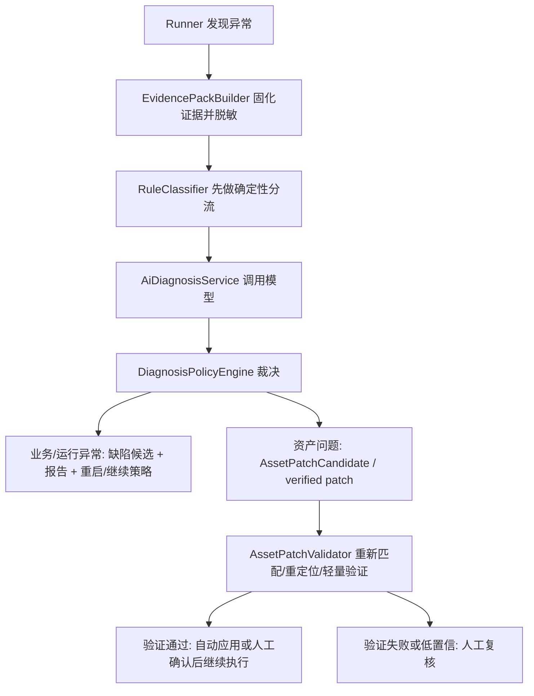

# 自动化测试平台设计

## 设计目标

1. 提供统一 Web 面板，让用户可以管理 Android / iOS 设备、预览画面、远程操作、录制路径、执行测试和查看报告。
2. 建立稳定的跨平台动作模型，屏蔽 Android 与 iOS 的底层命令差异。
3. 支持从用户手动操作到结构化测试步骤的转换，并允许步骤可视化编辑。
4. 支持测试执行的可观测性：实时进度、步骤状态、性能数据、异常事件、日志和截图。
5. 让执行报告可以回溯到设备、用例、步骤、性能采样和异常证据。
6. 设计上支持 MVP 快速落地，同时为后续 OCR、图像断言、控件定位、CI、多人协作扩展保留空间。
7. 支持平台从坐标录制回放工具升级为 PageStateFlow：以页面状态资产库为核心，维护页面识别、可操作元素、页面转移和阻断页处理。
8. StructuredFlow / Smart Recorded Flow 作为 PageStateFlow 的线性路径快照继续保留；业务图谱、目标节点路径规划、源码扫描和候选治理作为实验能力，底层状态识别、语义定位、动态等待和 RuntimeOverlay 能力复用于 PageStateFlow。

## 总体架构

### DES-001：分层架构

关联需求：REQ-001、REQ-015、REQ-020、REQ-022

建议使用以下模块边界：

| 层级 | 模块 | 职责 |
|---|---|---|
| Web UI | Dashboard | 设备列表、设备预览、远程操作、录制、步骤编辑、执行控制、报告展示 |
| API 层 | Backend API | REST API、WebSocket、认证扩展点、任务调度入口 |
| 设备编排 | Device Orchestrator | 设备发现、状态同步、设备锁、能力声明、会话管理 |
| 驱动层 | Android Driver | ADB、预览流、输入控制、性能采集、crash/ANR 日志采集 |
| 驱动层 | iOS Driver | iOS 设备发现、预览、输入控制、性能采集、crash/hang 日志采集 |
| 录制层 | Recorder | 将 Web 交互事件转换成 ActionStep，并记录截图、时间和上下文 |
| 执行层 | Test Runner / StructuredFlow Runner | 读取 legacy TestCase 或 StructuredFlow，按配置执行规则步骤，记录 expected / actual 和证据 |
| 监控层 | Metrics Collector | 执行期间按设备和目标 App 采集性能指标 |
| 异常层 | Event Collector | 捕获 crash、ANR、设备断连、命令失败、超时等事件 |
| 报告层 | Report Service | 根据 Run 原始数据生成 Web / JSON / HTML 报告 |
| 存储层 | Storage | 保存设备状态、用例、执行记录、指标、日志、截图、报告 |
| 规则层 | TestRuleCore | 统一 beforeState、action、afterExpectations、systemGuards、timing 和 evidence 的执行规则 |
| 页面资产层 | PageStateFlow Core | PageModel、PageElement、PageTransition、PageTask、PageMatcher、PathPlan、页面资产版本和页面资产治理 |
| 实验图谱层 | Graph Core / Source Scanner / Graph Runner | 业务图谱、源码扫描、目标节点路径规划和候选治理；冻结为实验能力，不作为默认主流程 |

### DES-002：推荐工程形态

关联需求：REQ-001、REQ-020、REQ-024

MVP 已确认先实现 Android 完整闭环，并增量接入 iOS 基础能力。若无明确技术栈偏好，MVP 推荐采用单仓多模块结构：

```text
Mobile-Automation/
  platform/
    apps/
      dashboard/            # Web UI
      server/               # Backend API + WebSocket + orchestration
    packages/
      shared/               # 公共类型、Step schema、工具函数
      device-driver-core/   # Driver 抽象接口
      android-driver/       # Android 实现
      ios-driver/           # iOS 实现
      runner-core/          # 测试执行器
      report-core/          # 报告模型和生成逻辑
      test-support/         # 测试工具、Driver mock、fixtures
    data/
      artifacts/            # 截图、日志、报告附件，开发环境可用
  docs/
```

已确认技术栈：

- Frontend：React + TypeScript + Vite。
- Backend：Node.js + TypeScript，方便 WebSocket、子进程、类型共享和前后端 Step schema 复用。
- Storage MVP：SQLite + 文件系统附件。
- Storage 后续：PostgreSQL + 对象存储。
- 实时通道：WebSocket。
- Android 预览：scrcpy 优先，ADB 截图轮询作为兜底方案。
- 设备命令：后端通过 driver 子模块封装，不让 UI 直接调用系统命令。
- 测试框架：Vitest 覆盖共享逻辑和后端核心逻辑，React Testing Library 覆盖 Dashboard 组件，Playwright 预留端到端测试。

候选部署方式：

| 方案 | 适合场景 | 优点 | 代价 | 建议 |
|---|---|---|---|---|
| 本地单机开发部署 | 个人开发、快速 PoC | 启动快、调试简单、设备 USB 直连最方便 | 不适合多人共享 | MVP 开发阶段推荐 |
| 局域网共享部署 | 小团队共用一台设备宿主机 | 其他人可通过浏览器访问面板 | 需要处理端口、设备占用、数据路径 | MVP 内测阶段推荐 |
| Docker Compose 服务化部署 | 后端、数据库、报告服务多模块化 | 环境可复制，后续接 PostgreSQL 更平滑 | Android ADB / USB 透传需要额外配置，macOS 上 Docker 访问 USB 不如宿主机直连方便 | 第二阶段推荐 |
| Kubernetes / 云部署 | 大规模设备农场 | 扩展性强 | 对当前目标过重，设备直连复杂 | 首版不推荐 |

候选技术栈：

| 方案 | 组成 | 优点 | 代价 | 建议 |
|---|---|---|---|---|
| TypeScript 全栈 | React + Vite + Node.js + WebSocket + SQLite | 前后端共享 Step 类型；生态流行；适合实时面板和子进程驱动 | 后端长期复杂后需要工程治理 | 首选 |
| Python 后端 | React/Vue + FastAPI + SQLite/PostgreSQL | FastAPI 写 API 很快，适合脚本和数据处理 | 前后端模型共享弱于 TypeScript；WebSocket/子进程也要额外封装 | 可选 |
| Java 后端 | React/Vue + Spring Boot + PostgreSQL | 企业后端稳定，适合大服务 | MVP 启动和本地工具链偏重 | 团队强 Java 背景时选 |
| Electron 桌面端 | React + Electron + Node.js | 本地设备控制天然方便 | 和 Web 面板/服务化方向冲突，后续共享部署弱 | 暂不推荐 |

当前决策：首版使用 `React + TypeScript + Vite + Node.js + WebSocket + SQLite + 文件系统 artifacts`，部署先做本地单机，预留局域网共享启动方式；Android 预览采用 scrcpy 优先，ADB 截图轮询兜底。

## 核心模块设计

### DES-002A：页面资产与页面内状态边界

关联需求：REQ-020、REQ-021、REQ-024

PageStateFlow 的默认资产边界按“稳定全屏页面”定义：

- PageModel 只保存可作为路径规划节点的稳定全屏页面，例如主页、班级详情、新建课堂。
- 右上角更多菜单、底部 sheet、时间选择器、权限弹窗、临时引导、局部黑条、列表中条件出现的按钮等，不作为新 PageModel 入库。
- 页面内状态应沉淀到父页面的 PageElement / PageAbility / PageTransition 中间步骤中。例如“主页右上角 + -> 添加好友 -> 添加好友页”应表达为主页上的复合能力，而不是新增“添加好友菜单页”。
- 页面匹配只负责回答“当前处于哪个稳定页面”。如果固定标题 / 关键截图区域等页面身份锚点仍命中，只是局部菜单遮挡了部分 matcher，PageMatcher 应回落匹配父页面。
- 连接边只表达跨 PageModel 的状态转移。录制动作前后识别到同一个 PageModel 时，不生成 PageTransition；该动作进入页面能力或局部变化候选，由用户在页面能力 / 连接边流程里确认。
- 公共底部导航、账号动态信息、角标、出勤数字、临时黑条等不能作为唯一 critical 页面身份锚点；它们可以作为辅助 evidence 或页面能力条件。

该规则用于避免“主页 + 更多菜单”被错误保存成“添加好友”页面，也避免局部弹层导致业务图谱节点爆炸。

### DES-003：Dashboard UI

关联需求：REQ-001、REQ-002、REQ-003、REQ-004、REQ-005、REQ-006、REQ-010、REQ-013、REQ-019

Dashboard 应包含以下页面：

| 页面 | 主要功能 |
|---|---|
| 设备列表页 | 自动发现设备，查看设备、状态、平台、能力、占用者，提供手动刷新作为立即重扫入口 |
| 设备预览页 | 实时画面、远程操作、录制、当前步骤列表、设备指标摘要 |
| 用例列表页 | 查看、新建、复制、删除、导入、导出测试用例；用例归属于 App / 业务流程 / 测试套件，不归属于单台设备 |
| 用例详情页 | 步骤编辑、目标平台、目标 App、用例配置、版本信息 |
| 执行配置页 | 选择设备、次数、循环、失败策略、采样间隔、启动 App 选项 |
| 执行详情页 | 实时进度、当前截图、步骤结果、日志流、性能摘要、异常事件 |
| 报告列表页 | 查看历史执行记录、筛选平台、设备、结果、时间 |
| 报告详情页 | 摘要、步骤、性能曲线、异常证据、附件下载 |

MVP 当前 UI 可先在“用例录制”模块内展示轻量用例库，承载已保存用例的加载、执行和删除入口；设备管理模块不展示完整用例库，只展示设备资产、能力和当前设备相关运行状态。后续进入用例管理阶段时，再把用例库升级为独立页面。

关键 UI 状态：

- loading：加载设备、用例、报告。
- empty：无设备、无用例、无报告。
- online / offline：设备状态。
- recording：录制中。
- running / paused / stopped：执行状态。
- unsupported：设备不支持当前动作。
- error：预览失败、命令失败、报告生成失败。

### DES-004：设备驱动抽象

关联需求：REQ-002、REQ-003、REQ-004、REQ-011、REQ-012、REQ-015、REQ-017、REQ-022

定义统一 Driver 接口，由 Android / iOS 分别实现。

```ts
interface DeviceDriver {
  platform: "android" | "ios";
  discover(): Promise<DeviceInfo[]>;
  getCapabilities(deviceId: string): Promise<DeviceCapabilities>;
  createSession(deviceId: string): Promise<DeviceSession>;
  closeSession(sessionId: string): Promise<void>;
  startPreview(sessionId: string): Promise<PreviewStreamInfo>;
  stopPreview(sessionId: string): Promise<void>;
  executeAction(sessionId: string, action: ActionStep): Promise<ActionResult>;
  captureScreenshot(sessionId: string): Promise<ArtifactRef>;
  collectMetrics(sessionId: string, targetApp?: TargetApp): Promise<MetricSnapshot>;
  collectEvents(sessionId: string, since?: string): Promise<DeviceEvent[]>;
  launchApp(sessionId: string, app: TargetApp): Promise<ActionResult>;
  closeApp(sessionId: string, app: TargetApp): Promise<ActionResult>;
}
```

设计要求：

- Driver 对外只暴露结构化能力，不暴露 adb、xcrun、idb 等底层命令。
- 所有 Driver 命令都必须有超时、错误码和日志。
- Driver 能力通过 `DeviceCapabilities` 上报，UI 根据能力决定按钮启用状态。
- Driver 不直接写 UI 状态，只通过事件和结果返回。

### DES-005：Android Driver

关联需求：REQ-002、REQ-003、REQ-004、REQ-011、REQ-012、REQ-017

建议调研和实现方向：

| 能力 | 候选方案 | MVP 建议 |
|---|---|---|
| 设备发现 | `adb devices -l` | 使用 ADB |
| 基础信息 | `adb shell getprop`、`wm size`、`dumpsys display` | 使用 ADB |
| 预览 | scrcpy server、minicap、截图轮询 | 优先调研 scrcpy |
| 点击 | UIAutomator2 / Appium-compatible driver、`adb shell input tap x y` fallback | MVP 已用 ADB 打通；图谱主路径后续升级为语义 driver |
| 滑动 | UIAutomator2 / Appium-compatible driver、`adb shell input swipe x1 y1 x2 y2 duration` fallback | MVP 已用 ADB 打通；图谱主路径后续升级为语义 driver |
| 文本输入 | UIAutomator2 / Appium-compatible driver、ADB Keyboard、剪贴板、`adb shell input text` fallback | MVP 支持基础文本；后续用语义 driver 提升稳定性 |
| 返回 / Home / 最近任务 | `adb shell input keyevent` | 使用 ADB |
| App 启动 | `monkey` 或 `am start` | 使用 ADB |
| App 关闭 | `am force-stop` | 使用 ADB |
| 性能 | `top`、`dumpsys meminfo`、`dumpsys gfxinfo`、`dumpsys batterystats`、`proc` | 分阶段支持 |
| crash / ANR | logcat、`/data/anr`、tombstone 权限视设备而定 | MVP 采集 logcat |

风险：

- 部分 Android 设备限制 shell 权限。
- 文本输入遇到空格、中文、特殊字符时需要专门处理。
- 预览帧率和延迟取决于方案。
- ANR 文件读取可能受权限限制，报告需标记采集失败原因。

执行驱动演进策略：

- Android Driver 分为两类通道：基础设施通道和动作执行通道。
- 基础设施通道继续使用 ADB，负责设备发现、安装卸载、启动关闭、日志、性能、截图、录屏兜底、UIAutomator dump 等。
- 动作执行通道为可插拔 `AndroidActionBackend`，按稳定性优先级选择 UIAutomator2 / Appium-compatible driver、embedded scrcpy control、ADB input 或 mock。
- 第一版实现提供 `SemanticDeviceActionRequest` 和 `AndroidHttpActionBackend`：`tap_on_element`、`input_text_to_element`、`scroll_until_visible` 会先通过 UI hierarchy / locator 解析语义目标，再调用 `performSemanticAction`。外部 driver 可通过 `ANDROID_ACTION_BACKEND=uiautomator2|appium`、`UIAUTOMATOR2_SERVER_URL`、`APPIUM_SERVER_URL`、`APPIUM_SESSION_ID` 接入；未配置时退回 UIAutomator dump + ADB input / text fallback。
- 业务图谱的 ActionPolicy 只表达动作意图和语义目标，不直接绑定某个底层命令；GraphRunService / SemanticStepResolver 负责把语义目标解析后交给 ActionBackend。
- `adb shell input` 保留为 fallback 和调试能力。使用 fallback 时必须在 StepResult / GraphEdgeResult metadata 中写入 `driverChannel=adb_input`、fallback 原因、原目标描述和执行坐标。
- 后续接入 UIAutomator2 / Appium-compatible driver 时，优先覆盖 `tap_on_element`、`input_text`、`scroll_until_visible` 和 UI idle / waitForExists；坐标型 `tap` / `swipe` 不作为新图谱主动作扩展重点。

scrcpy 多设备并发进程管理：

- 后端维护 `AndroidPreviewProcessManager`，按设备 serial 和 sessionId 管理 scrcpy 子进程。
- 每个活跃预览会话绑定一台设备、一个 scrcpy 进程、一个本地端口集合和一个流输出地址。
- 端口分配使用服务内统一 allocator，优先从配置范围内分配，例如 `27183-27283`；端口被占用时自动跳过并记录日志。
- 同一设备 MVP 阶段只允许一个活跃预览 / 录制 / 执行会话占用，避免多个 scrcpy 进程同时连接同一设备造成互相抢占。
- 不同设备可以并发启动独立 scrcpy 进程，端口、artifact 目录和 session 状态必须隔离。
- 进程启动前确认设备在线，启动后监听 stdout、stderr、exit code，并把异常转换为 `PREVIEW_START_FAILED`、`PREVIEW_STREAM_LOST` 等统一错误码。
- 用户关闭预览、会话过期、设备断连、Run 结束或服务退出时必须停止对应进程。
- 服务启动时应扫描并清理上次异常退出留下的僵尸 scrcpy 进程或失效端口占用。
- 测试执行期间的视频录制由 Runner 明确创建 `RunVideoRecorder`，可以复用当前预览进程能力，也可以单独启动录制进程；无论采用哪种方式，都必须由 runId 管理生命周期和 artifact 路径。

### DES-006：iOS Driver

关联需求：REQ-002、REQ-003、REQ-004、REQ-011、REQ-012、REQ-017

已选型与当前实现边界：

| 能力 | 当前方案 | 当前状态 |
|---|---|---|
| 设备发现 | `idevice_id --list` + `xcrun xctrace list devices` | 已支持在线设备与离线物理设备展示 |
| 基础信息 | `ideviceinfo` | 已支持设备名、型号、系统版本 |
| 预览 | `idevicescreenshot` | 已支持在线可信设备截图轮询 |
| 点击 / 滑动 | WebDriverAgent | 配置 WDA 后支持 |
| 文本输入 | WebDriverAgent | 配置 WDA 后支持 |
| Home | WebDriverAgent | 配置 WDA 后支持 |
| 最近任务 | 无稳定 WDA 系统能力 | 当前不暴露 |
| App 启动 / 关闭 | WebDriverAgent | 配置 WDA 后支持 |
| 性能 | `ideviceinfo` + 后续 Instruments/xctrace | 当前支持电量采样 |
| crash / hang | device logs、crash reports | 待支持 |
| 视频录制 | 待选型 | 待支持，当前报告记录 `video_unavailable` |

风险：

- iOS 真机控制依赖签名、开发者证书、WebDriverAgent 安装和系统权限。
- iOS 真机与模拟器能力不同，必须在设备能力中标记。
- Home、清理 App 数据、安装 IPA 等能力可能受限制。
- iOS 预览性能可能低于 Android，需要在 MVP 中接受降级方案。
- 当前物理设备路径会过滤 Mac 本机和 Simulator；Simulator 后续可单独设计 driver。

### DES-007：设备会话与设备锁

关联需求：REQ-002、REQ-010、REQ-018、REQ-022

设备会话用于管理某个用户或执行任务对设备的访问。

会话状态：

| 状态 | 说明 |
|---|---|
| idle | 设备在线且未被占用 |
| previewing | 用户正在预览设备 |
| recording | 用户正在录制 |
| running | 自动化任务正在执行 |
| paused | 执行暂停 |
| lost | 设备断连 |
| error | 会话异常 |

规则：

- 执行任务开始前必须获取设备锁。
- 录制中设备应被当前用户占用。
- 设备断连时会话进入 lost，停止下发命令。
- 后端应定期清理过期会话。
- 管理员释放设备能力作为多人版本扩展。

### DES-008：预览流和坐标映射

关联需求：REQ-003、REQ-004、REQ-016

预览流需要同时提供图像帧和元数据。

```ts
type PreviewFrame = {
  deviceId: string;
  sessionId: string;
  frameId: string;
  timestamp: string;
  imageUrl?: string;
  binary?: ArrayBuffer;
  deviceWidth: number;
  deviceHeight: number;
  orientation: "portrait" | "landscape";
  rotation: 0 | 90 | 180 | 270;
};
```

预览会话建议模型：

```ts
type PreviewSession = {
  sessionId: string;
  deviceId: string;
  platform: "android" | "ios";
  status: "starting" | "running" | "stopping" | "stopped" | "error";
  processId?: number;
  localPorts: number[];
  streamUrl?: string;
  startedAt: string;
  lastFrameAt?: string;
  errorCode?: string;
  errorMessage?: string;
};
```

预览流要求：

- 每个预览帧必须携带设备分辨率、方向、旋转角度和时间戳。
- 预览 session 断流时，Dashboard 应展示断流状态，后端应停止旧进程并允许重启。
- 预览流和手动操控必须使用同一套坐标映射，不允许前端直接拼接 adb 命令。
- 多设备预览时，前端只订阅当前选中设备的高清流；设备列表可使用缩略图或状态，不强制全部高清预览。

坐标转换：

1. 前端记录预览容器尺寸和图像实际渲染区域。
2. 用户点击预览时获取浏览器坐标。
3. 去掉 letterbox / padding 偏移。
4. 计算归一化坐标 `xRatio = x / renderedWidth`、`yRatio = y / renderedHeight`。
5. 转换到设备坐标 `deviceX = xRatio * deviceWidth`、`deviceY = yRatio * deviceHeight`。
6. 根据 rotation 修正坐标。
7. 发送结构化 action 到后端。

录制时建议同时保存：

- 设备绝对坐标。
- 归一化坐标。
- 当时设备分辨率。
- 当时方向。
- 当时截图。

回放时优先使用归一化坐标适配不同分辨率；若设备分辨率和录制分辨率差异过大，应提示风险。

### DES-009：ActionStep 模型

关联需求：REQ-005、REQ-006、REQ-007、REQ-009、REQ-016、REQ-024、REQ-034、REQ-035

所有录制和回放动作都使用统一 Step 模型。

```ts
type ActionStep = {
  id: string;
  caseId?: string;
  order: number;
  type:
    | "tap"
    | "long_press"
    | "swipe"
    | "back"
    | "home"
    | "input_text"
    | "clear_text"
    | "wait"
    | "screenshot"
    | "launch_app"
    | "close_app"
    | "tap_if_text"
    | "tap_on_element"
    | "wait_until_visible"
    | "tap_on_text"
    | "tap_on_image"
    | "scroll_until_visible"
    | "assert_image"
    | "assert_text";
  enabled: boolean;
  title?: string;
  note?: string;
  source?: "recorded" | "manual" | "imported" | "template_generated" | "system";
  params: Record<string, unknown>;
  timing: {
    delayBeforeMs?: number;
    timeoutMs?: number;
    recordedAt?: string;
    elapsedFromPreviousMs?: number;
    recordedTimestampMs?: number;
    lastDurationMs?: number;
  };
  coordinate?: {
    x?: number;
    y?: number;
    path?: Array<{ x: number; y: number }>;
    xRatio?: number;
    yRatio?: number;
    startX?: number;
    startY?: number;
    endX?: number;
    endY?: number;
    startXRatio?: number;
    startYRatio?: number;
    endXRatio?: number;
    endYRatio?: number;
    deviceWidth?: number;
    deviceHeight?: number;
    previewRenderedWidth?: number;
    previewRenderedHeight?: number;
    previewOffsetX?: number;
    previewOffsetY?: number;
    orientation?: "portrait" | "landscape";
    rotation?: 0 | 90 | 180 | 270;
  };
  context?: {
    platform: "android" | "ios";
    deviceId: string;
    appId?: string;
    packageName?: string;
    bundleId?: string;
    recorderVersion?: string;
  };
  evidence?: {
    beforeScreenshotId?: string;
    afterScreenshotId?: string;
  };
  expectations?: StepExpectation[];
  stateGuards?: {
    before?: StateAnchor[];
    after?: StateAnchor[];
    onBeforeMismatch?: "fail" | "wait" | "recover" | "continue";
    onAlreadySatisfied?: "skip" | "execute" | "pass";
  };
  failurePolicy?: {
    onFailure: "stop" | "continue" | "retry";
    retryCount?: number;
  };
};
```

Step 设计原则：

- `type` 决定 Driver 如何执行。
- `params` 保存动作特有参数。
- `coordinate` 专门保存坐标相关信息。
- `coordinate.path` 可保存滑动 / 拖拽路径采样点；点数过多时可在录制层压缩，但不能丢失起点、终点和持续时间。
- `source` 用于区分录制生成、人工编辑、导入 Flow、规则模板生成和系统自动步骤。
- `context` 保存平台、设备、App 和录制工具信息，避免同一 Flow 在跨设备回放时丢失来源。
- `timing` 保存等待、超时和录制时间信息。
- `failurePolicy` 支持单步失败策略。
- 后续新增动作时尽量新增 type 和 params，不破坏已有字段。
- 步骤卡片 UI 应展示类型图标、类型颜色、序号、关键参数、延迟 / 耗时和最近执行状态，便于快速扫读。

会话级元数据建议模型：

```ts
type RecordingSessionMetadata = {
  sessionId: string;
  recorderVersion: string;
  platform: "android" | "ios";
  deviceId: string;
  appId?: string;
  buildId?: string;
  startedAt: string;
  endedAt?: string;
  totalDurationMs?: number;
  deviceWidth: number;
  deviceHeight: number;
  orientation: "portrait" | "landscape";
  rotation: 0 | 90 | 180 | 270;
  previewRenderedWidth?: number;
  previewRenderedHeight?: number;
};
```

状态锚点建议模型：

```ts
type Rect = { x: number; y: number; width: number; height: number };

type StepExpectation =
  | {
      type: "text";
      expected: string;
      mode: "contains" | "equals" | "not_contains";
      region?: Rect;
      source?: "ocr";
    }
  | {
      type: "image";
      baselineArtifactId?: string;
      region: Rect;
      threshold: number;
    }
  | {
      type: "app_alive";
      packageName?: string;
      bundleId?: string;
    }
  | {
      type: "no_crash";
      scope: "since_run_start" | "since_previous_step" | "current_step";
    }
  | {
      type: "screen_changed";
      comparedWith: "before_step" | "previous_step";
      threshold?: number;
    }
  | {
      type: "metric_below";
      metric: "duration_ms" | "cpu" | "memory_mb" | "fps_min" | "fps_avg";
      max: number;
    }
  | {
      type: "log_not_contains";
      text: string;
      scope: "since_run_start" | "current_step";
    };

type StepExpectationResult = {
  expectationIndex: number;
  status: "passed" | "failed" | "skipped" | "unsupported" | "pending_review";
  expected: unknown;
  actual?: unknown;
  reason?: string;
  evidenceArtifacts?: ArtifactRef[];
};

type StateAnchor =
  | {
      type: "text";
      region?: { x: number; y: number; width: number; height: number };
      expected: string;
      mode: "contains" | "equals";
      ocrEngine?: "tesseract" | "local_ocr";
    }
  | {
      type: "image";
      region: { x: number; y: number; width: number; height: number };
      artifactId?: string;
      threshold: number;
    }
  | {
      type: "app";
      packageName?: string;
      bundleId?: string;
      activityName?: string;
      expectedState: "foreground" | "alive";
    }
  | {
      type: "screen_changed";
      comparedWith: "before_step" | "previous_step";
      threshold?: number;
    };

type SemanticTarget =
  | {
      type: "element";
      platform: "android" | "ios";
      locator: ElementLocator;
      fallbackCoordinate?: { xRatio?: number; yRatio?: number; x?: number; y?: number };
    }
  | { type: "text"; text: string; region?: Rect; matchMode?: "contains" | "equals" }
  | { type: "image"; artifactId: string; region?: Rect; threshold?: number }
  | { type: "region"; region: Rect; clickPoint?: { xRatio: number; yRatio: number } }
  | { type: "app"; packageName?: string; bundleId?: string; activityName?: string };

type ElementLocator = {
  strategy:
    | "android_resource_id"
    | "accessibility_id"
    | "text"
    | "class_bounds"
    | "xpath"
    | "ios_predicate";
  value: string;
  text?: string;
  className?: string;
  bounds?: Rect;
  confidence?: number;
};
```

设计说明：

- `stateGuards.before` 用于确认当前页面是否处在可执行该步骤的状态。
- `stateGuards.after` 用于确认该步骤执行后是否到达预期状态。
- `expectations` 用于表达“这一步执行完应该符合什么预期”，是真正的步骤级验证输入。
- 状态锚点服务于“流程能否走到正确位置”，不直接等同于测试结论；测试结论由步骤预期、断言步骤、异常事件和 Runner 结果综合决定。
- `tap_on_element`、`wait_until_visible`、`tap_on_text`、`tap_on_image`、`scroll_until_visible` 使用 `params.target` 描述 `SemanticTarget`。
- 坐标型 `tap` / `swipe` 继续可用，但推荐为关键步骤补充 `expectations`；必要时再补 `stateGuards` 减少设备初始状态不同导致的误回放。

### DES-010：录制流程

关联需求：REQ-005、REQ-006、REQ-014、REQ-034

录制状态机：

```text
idle -> recording -> paused -> recording -> stopped -> saved
                 \                         -> discarded
                  -> stopped -> saved
```

流程：

1. 用户进入设备预览页。
2. 用户点击开始录制。
3. 后端创建 Recording Session，设备进入 recording 状态。
4. 用户在 UI 中触发设备动作。
5. 前端先生成候选 ActionStep，并发送到后端。
6. 后端执行动作并补充结果、截图、时间信息。
7. 后端通过 WebSocket 推送步骤列表更新。
8. 用户暂停时，动作仍可执行，但不写入步骤，或 UI 禁止设备动作；该策略需确认。
9. 用户停止后进入编辑状态。
10. 用户保存为 TestCase。

建议：MVP 录制的是用户在平台中触发的动作，不录制用户直接在实体设备上的操作。若要录制实体设备真实触摸，需要额外设备事件采集能力。

状态感知录制增强：

- 录制每个步骤时保存 before / after 截图，供后续选择状态锚点。
- 录制每个步骤时自动生成候选预期，先覆盖高可靠基础校验，再按证据质量补充文本、图像或屏幕变化建议。
- 录制停止后，步骤编辑器应引导用户为关键步骤添加预期结果，例如文字、图像、App 存活、无 crash 或指标阈值。
- 用户可以从 after 截图中圈选区域，生成 OCR 文本预期或图像基准预期。
- 停止录制后，步骤编辑器应允许用户把某一步转换为语义动作，例如把原始 `swipe` 转为 `scroll_until_visible`。
- 平台可以基于截图、OCR 文本或用户手选区域生成候选锚点，但候选锚点必须由用户确认后才进入用例。
- 录制保存时应允许配置 Flow 起始状态，例如 `go_home`、`launch_app`、`restart_app`。
- 若暂未接入 OCR，MVP 可先支持截图区域锚点和 App 状态锚点，OCR 锚点随 `assert_text` 能力复用。

### DES-011：步骤编辑流程

关联需求：REQ-006、REQ-008

步骤编辑采用乐观更新或事务保存均可。MVP 建议：

1. 前端本地编辑步骤列表。
2. 用户点击保存。
3. 后端校验 Step schema、平台支持能力、坐标范围和必填参数。
4. 保存新版本 TestCase。
5. 若校验失败，返回具体步骤和字段错误。

校验规则：

- `enabled=true` 的步骤必须参数完整。
- 坐标类动作必须有坐标或归一化坐标。
- `wait` 必须有等待时间。
- `input_text` 必须有文本。
- `launch_app` 必须有 package name 或 bundle id。
- 不支持目标平台的步骤需提示用户。

### DES-012：Test Runner

关联需求：REQ-009、REQ-010、REQ-014、REQ-018、REQ-019、REQ-022、REQ-034

Test Runner 负责按配置执行测试用例快照。

执行流程：

1. 创建 TestRun。
2. 复制当前 TestCase 生成不可变快照。
3. 校验目标设备在线且能力满足。
4. 获取设备锁。
5. 根据 RunConfig / Flow 起始状态执行准备动作，例如 Home、启动 App、重启 App、清理数据后启动或安装指定包后启动。
6. 启动性能采集、异常采集和 Run 视频录制。
7. 按轮次执行步骤。
8. 每一步执行前记录状态和必要截图。
9. 若步骤配置了 `stateGuards.before`，先执行状态检查；不满足时按步骤策略等待、恢复、跳过或失败。
10. 若语义动作的目标在执行前已经满足，按 `onAlreadySatisfied` 跳过、通过或仍执行，并记录原因。
11. 调用 Driver 执行动作，或调用语义动作执行器完成查找、等待、滑动重试和点击。
12. 每一步执行完成后自动截图，写入 `StepResult.afterScreenshotId`。
13. 若步骤配置了 `stateGuards.after`，检查执行后状态并记录结果。
14. 执行步骤级 `expectations` 验证，记录每个预期的 expected、actual、状态和证据。
15. 记录 StepResult。
16. 根据步骤执行、状态锚点和预期验证结果决定继续、重试或停止。
17. 执行结束后释放设备锁。
18. 停止采集和视频录制，保留执行视频并写入 artifact；录制不可用时写入明确事件。
19. 生成报告。

执行状态机：

```text
pending -> running -> paused -> running -> passed
                           \-> failed
                           \-> stopped
                           \-> timeout
                           \-> device_lost
```

### DES-013：执行配置模型

关联需求：REQ-009、REQ-010、REQ-011、REQ-012

```ts
type RunConfig = {
  caseId: string;
  deviceIds: string[];
  mode: "once" | "repeat_n" | "loop_until_stop" | "duration";
  repeatCount?: number;
  maxDurationMs?: number;
  intervalBetweenIterationsMs?: number;
  defaultStepDelayMs?: number;
  defaultStepTimeoutMs?: number;
  failurePolicy: "stop_run" | "continue_run";
  restartAppBeforeRun?: boolean;
  restartAppBeforeEachIteration?: boolean;
  clearAppDataBeforeRun?: boolean;
  captureScreenshotOnFailure: boolean;
  collectLogsOnFailure: boolean;
  metrics: {
    enabled: boolean;
    intervalMs: number;
  };
};
```

### DES-014：性能采集设计

关联需求：REQ-011、REQ-013、REQ-014

性能采集以 TestRun 为生命周期，在执行开始后启动，结束后停止。

```ts
type MetricSample = {
  id: string;
  runId: string;
  deviceId: string;
  platform: "android" | "ios";
  iterationIndex?: number;
  stepId?: string;
  timestamp: string;
  cpuPercent?: number;
  memoryRssMb?: number;
  memoryPssMb?: number;
  fps?: number;
  networkRxBytes?: number;
  networkTxBytes?: number;
  batteryLevel?: number;
  temperatureCelsius?: number;
  appProcessAlive?: boolean;
  raw?: Record<string, unknown>;
};
```

采集策略：

- 默认按固定间隔采样。
- 执行步骤开始和结束时记录当前 stepId。
- 不同平台无法采集的字段保持为空，并在报告中标记。
- 异常发生时立即追加一次采样。

### DES-015：异常事件采集设计

关联需求：REQ-012、REQ-013、REQ-014、REQ-022

```ts
type DeviceEvent = {
  id: string;
  runId?: string;
  deviceId: string;
  platform: "android" | "ios";
  type:
    | "android_crash"
    | "android_anr"
    | "ios_crash"
    | "ios_hang"
    | "device_lost"
    | "preview_lost"
    | "command_failed"
    | "step_timeout"
    | "app_not_running"
    | "log_warning";
  severity: "info" | "warning" | "error" | "fatal";
  timestamp: string;
  iterationIndex?: number;
  stepId?: string;
  summary: string;
  detail?: string;
  artifacts?: ArtifactRef[];
  raw?: Record<string, unknown>;
};
```

事件来源：

- Driver 主动轮询。
- 命令执行结果。
- 预览流状态。
- Test Runner 超时判断。
- Metrics Collector 发现目标进程退出。
- logcat / iOS device log 分析。

### DES-016：报告生成设计

关联需求：REQ-013、REQ-014、REQ-020

报告基于 TestRun 原始数据生成，不直接依赖 UI。

报告数据结构：

```ts
type TestReport = {
  reportId: string;
  runId: string;
  status: "passed" | "failed" | "stopped" | "timeout" | "device_lost";
  summary: {
    caseName: string;
    platform: "android" | "ios" | "mixed";
    devices: DeviceInfo[];
    startedAt: string;
    endedAt: string;
    durationMs: number;
    totalIterations: number;
    passedIterations: number;
    failedIterations: number;
    totalSteps: number;
    failedSteps: number;
    eventCount: number;
  };
  configSnapshot: RunConfig;
  caseSnapshot: TestCase;
  iterationResults: IterationResult[];
  stepResults: StepResult[];
  metricsSummary: MetricsSummary;
  events: DeviceEvent[];
  artifacts: ArtifactRef[];
};
```

报告展示原则：

- 优先展示失败结论和失败位置。
- 每个异常都能跳转到对应轮次和步骤。
- 每个步骤应能展示步骤后截图；失败步骤优先展示失败现场截图。
- 性能图表可按时间线展示，也可按步骤聚合。
- 所有已录制成功的 Run 报告都应展示视频附件；失败、Crash、ANR、超时、设备断连时应突出视频中的异常时段。
- 原始 JSON 可下载。
- HTML 导出应包含必要 CSS 和附件引用。

### DES-017：存储设计

关联需求：REQ-008、REQ-014、REQ-023

MVP 存储建议：

| 数据 | 存储方式 |
|---|---|
| DeviceInfo | 内存 + 定时刷新，必要状态落库 |
| TestCase | SQLite |
| TestRun | SQLite |
| StepResult | SQLite |
| MetricSample | SQLite，长跑场景可后续迁移时序存储 |
| DeviceEvent | SQLite |
| Artifact | 文件系统 + SQLite metadata |
| Report JSON | 文件系统或 SQLite |
| Report HTML | 文件系统 |

运行时数据根目录：

- 默认：`~/.local/share/mobile-automation`
- 可配置：`DATA_DIR=/path/to/mobile-automation-data`

附件目录建议：

```text
<DATA_DIR>/artifacts/
  runs/<runId>/
    screenshots/
    logs/
    metrics/
    videos/
    reports/
```

SQLite 表结构建议：

```sql
CREATE TABLE devices (
  id TEXT PRIMARY KEY,
  platform TEXT NOT NULL CHECK (platform IN ('android', 'ios')),
  serial TEXT NOT NULL UNIQUE,
  name TEXT,
  model TEXT,
  manufacturer TEXT,
  os_version TEXT,
  width INTEGER,
  height INTEGER,
  orientation TEXT,
  status TEXT NOT NULL,
  capabilities_json TEXT NOT NULL DEFAULT '{}',
  last_seen_at TEXT NOT NULL,
  locked_by TEXT,
  active_run_id TEXT,
  created_at TEXT NOT NULL,
  updated_at TEXT NOT NULL
);

CREATE TABLE test_cases (
  id TEXT PRIMARY KEY,
  name TEXT NOT NULL,
  description TEXT,
  platform_scope TEXT NOT NULL,
  target_app_json TEXT NOT NULL DEFAULT '{}',
  tags_json TEXT NOT NULL DEFAULT '[]',
  version INTEGER NOT NULL DEFAULT 1,
  created_at TEXT NOT NULL,
  updated_at TEXT NOT NULL,
  created_by TEXT,
  updated_by TEXT
);

CREATE TABLE steps (
  id TEXT PRIMARY KEY,
  case_id TEXT NOT NULL REFERENCES test_cases(id) ON DELETE CASCADE,
  step_order INTEGER NOT NULL,
  type TEXT NOT NULL,
  enabled INTEGER NOT NULL DEFAULT 1,
  title TEXT,
  note TEXT,
  params_json TEXT NOT NULL DEFAULT '{}',
  timing_json TEXT NOT NULL DEFAULT '{}',
  coordinate_json TEXT NOT NULL DEFAULT '{}',
  screenshot_artifact_id TEXT,
  created_at TEXT NOT NULL,
  updated_at TEXT NOT NULL,
  UNIQUE(case_id, step_order)
);

CREATE TABLE runs (
  id TEXT PRIMARY KEY,
  case_id TEXT REFERENCES test_cases(id) ON DELETE SET NULL,
  status TEXT NOT NULL,
  mode TEXT NOT NULL,
  config_json TEXT NOT NULL,
  case_snapshot_json TEXT NOT NULL,
  started_at TEXT NOT NULL,
  ended_at TEXT,
  duration_ms INTEGER,
  result_summary_json TEXT NOT NULL DEFAULT '{}',
  created_at TEXT NOT NULL
);

CREATE TABLE run_iterations (
  id TEXT PRIMARY KEY,
  run_id TEXT NOT NULL REFERENCES runs(id) ON DELETE CASCADE,
  iteration_index INTEGER NOT NULL,
  status TEXT NOT NULL,
  started_at TEXT NOT NULL,
  ended_at TEXT,
  duration_ms INTEGER,
  error_code TEXT,
  error_message TEXT,
  UNIQUE(run_id, iteration_index)
);

CREATE TABLE step_results (
  id TEXT PRIMARY KEY,
  run_id TEXT NOT NULL REFERENCES runs(id) ON DELETE CASCADE,
  iteration_id TEXT NOT NULL REFERENCES run_iterations(id) ON DELETE CASCADE,
  step_id TEXT,
  step_order INTEGER NOT NULL,
  status TEXT NOT NULL,
  started_at TEXT NOT NULL,
  ended_at TEXT,
  duration_ms INTEGER,
  error_code TEXT,
  error_message TEXT,
  before_screenshot_artifact_id TEXT,
  after_screenshot_artifact_id TEXT
);

CREATE TABLE metric_samples (
  id TEXT PRIMARY KEY,
  run_id TEXT NOT NULL REFERENCES runs(id) ON DELETE CASCADE,
  iteration_id TEXT REFERENCES run_iterations(id) ON DELETE SET NULL,
  step_result_id TEXT REFERENCES step_results(id) ON DELETE SET NULL,
  device_id TEXT NOT NULL REFERENCES devices(id) ON DELETE CASCADE,
  sampled_at TEXT NOT NULL,
  metric_name TEXT NOT NULL,
  metric_value REAL NOT NULL,
  unit TEXT,
  raw_json TEXT NOT NULL DEFAULT '{}'
);

CREATE TABLE device_events (
  id TEXT PRIMARY KEY,
  run_id TEXT REFERENCES runs(id) ON DELETE CASCADE,
  iteration_id TEXT REFERENCES run_iterations(id) ON DELETE SET NULL,
  step_result_id TEXT REFERENCES step_results(id) ON DELETE SET NULL,
  device_id TEXT REFERENCES devices(id) ON DELETE SET NULL,
  type TEXT NOT NULL,
  severity TEXT NOT NULL,
  occurred_at TEXT NOT NULL,
  summary TEXT NOT NULL,
  detail TEXT,
  raw_json TEXT NOT NULL DEFAULT '{}'
);

CREATE TABLE artifacts (
  id TEXT PRIMARY KEY,
  run_id TEXT REFERENCES runs(id) ON DELETE CASCADE,
  iteration_id TEXT REFERENCES run_iterations(id) ON DELETE SET NULL,
  step_result_id TEXT REFERENCES step_results(id) ON DELETE SET NULL,
  device_event_id TEXT REFERENCES device_events(id) ON DELETE SET NULL,
  device_id TEXT REFERENCES devices(id) ON DELETE SET NULL,
  type TEXT NOT NULL CHECK (type IN ('screenshot', 'log', 'metrics', 'report_json', 'report_html', 'video')),
  name TEXT NOT NULL,
  path TEXT NOT NULL,
  mime_type TEXT,
  size_bytes INTEGER,
  retention_policy TEXT NOT NULL DEFAULT 'standard',
  created_at TEXT NOT NULL,
  deleted_at TEXT
);

CREATE INDEX idx_steps_case_order ON steps(case_id, step_order);
CREATE INDEX idx_runs_status_started ON runs(status, started_at);
CREATE INDEX idx_iterations_run_order ON run_iterations(run_id, iteration_index);
CREATE INDEX idx_step_results_run_order ON step_results(run_id, iteration_id, step_order);
CREATE INDEX idx_metric_samples_run_time ON metric_samples(run_id, sampled_at);
CREATE INDEX idx_device_events_run_time ON device_events(run_id, occurred_at);
CREATE INDEX idx_artifacts_run_type ON artifacts(run_id, type);
```

表结构约定：

- JSON 字段使用字符串存储，读写时必须通过 schema 校验，不允许业务层随意拼接。
- `runs.case_snapshot_json` 保存执行开始时的完整用例快照，报告优先读取该快照。
- `step_results.after_screenshot_artifact_id` 是每步执行后自动截图；步骤可同时关联日志和执行视频 artifact。
- `artifacts.path` 只保存相对 `<DATA_DIR>/artifacts/` 的路径，不保存本机绝对路径。
- 视频录制过程中可先写入临时文件，Run 结束后校验可播放性，并为有效视频创建 `type='video'` 的 artifact 记录。

要求：

- 文件路径不要写死本机绝对路径。
- 清理策略启动时执行一次，并按 `CLEANUP_INTERVAL_HOURS` 定时执行；默认只删除 `.tmp`、`.part`、`.partial`、`.download` 等临时残留，不删除已完成测试报告。
- 历史报告清理必须显式开启：`ARTIFACT_RETENTION_ENABLED=1`。开启后默认 passed run 保留 7 天，failed/stopped/timeout/device_lost 保留 30 天，总 artifact 空间上限 20GB。
- 清理配置：`ARTIFACT_RETENTION_ENABLED`、`PASSED_RUN_RETENTION_DAYS`、`FAILED_RUN_RETENTION_DAYS`、`MAX_ARTIFACT_STORAGE_GB`、`CLEANUP_INTERVAL_HOURS`、`ARTIFACT_CLEANUP_ENABLED=0`。
- 删除 Run 时应能清理关联附件。
- Run 通过、失败、超时、设备断连、停止或出现 Crash / ANR 时，视频均作为 report artifact 保留。
- 录制不可用或校验失败时，应创建事件或报告状态说明原因，避免报告中视频静默缺失。
- 定期清理任务按保留周期和最大空间清理历史截图、日志、视频和报告；运行中的 Run 不允许被清理。
- 清理文件系统后必须同步数据库状态，避免 orphan artifact 或 dangling reference。

### DES-018：实时通信设计

关联需求：REQ-001、REQ-003、REQ-010、REQ-019

WebSocket 事件建议：

| 事件 | 方向 | 说明 |
|---|---|---|
| `device.list.updated` | server -> client | 设备列表变化 |
| `device.status.changed` | server -> client | 单设备状态变化 |
| `preview.frame` | server -> client | 预览帧或帧引用 |
| `recording.step.created` | server -> client | 录制新增步骤 |
| `recording.status.changed` | server -> client | 录制状态变化 |
| `run.status.changed` | server -> client | 执行状态变化 |
| `run.step.started` | server -> client | 步骤开始 |
| `run.step.finished` | server -> client | 步骤结束 |
| `run.metric.sampled` | server -> client | 性能采样 |
| `run.event.detected` | server -> client | 异常事件 |
| `report.generated` | server -> client | 报告已生成 |

预览帧如果直接走 WebSocket 二进制，需要评估性能；也可以通过 HTTP 图片 URL + 事件通知刷新。

### DES-019：REST API 设计

关联需求：REQ-001、REQ-002、REQ-008、REQ-009、REQ-013、REQ-020

建议接口：

| 方法 | 路径 | 说明 |
|---|---|---|
| GET | `/api/devices` | 获取设备列表 |
| POST | `/api/devices/refresh` | 立即重扫设备；日常设备状态由后台自动发现和周期刷新维护 |
| GET | `/api/devices/:id` | 获取设备详情 |
| POST | `/api/devices/:id/sessions` | 创建设备会话 |
| DELETE | `/api/sessions/:id` | 关闭设备会话 |
| POST | `/api/sessions/:id/actions` | 执行设备动作 |
| POST | `/api/sessions/:id/recordings` | 开始录制 |
| PATCH | `/api/recordings/:id` | 暂停、继续、停止录制 |
| POST | `/api/recordings/:id/save` | 保存为用例 |
| GET | `/api/cases` | 用例列表 |
| POST | `/api/cases` | 创建用例 |
| GET | `/api/cases/:id` | 用例详情 |
| PUT | `/api/cases/:id` | 更新用例 |
| DELETE | `/api/cases/:id` | 删除用例 |
| POST | `/api/cases/import` | 导入用例 |
| GET | `/api/cases/:id/export` | 导出用例 |
| POST | `/api/runs` | 创建并启动执行 |
| GET | `/api/runs` | 执行列表 |
| GET | `/api/runs/:id` | 执行详情 |
| PATCH | `/api/runs/:id` | 暂停、继续、停止 |
| GET | `/api/reports` | 报告列表 |
| GET | `/api/reports/:id` | 报告详情 |
| GET | `/api/reports/:id/export` | 导出报告 |

### DES-020：CLI / CI 集成设计

关联需求：REQ-020

后续可提供 CLI：

```bash
mobile-automation run \
  --case login-smoke \
  --device emulator-5554 \
  --repeat 10 \
  --report json
```

CI 触发建议：

1. CI 启动 server 或连接已部署 server。
2. 调用 API 创建 TestRun。
3. 轮询 Run 状态或订阅 Webhook。
4. 下载 JSON / HTML 报告。
5. 根据 Run 状态决定 CI 成败。

### DES-021：权限与安全扩展

关联需求：REQ-021、REQ-023

MVP 若为本地单机工具，可暂不实现登录，但数据模型保留：

- `createdBy`。
- `updatedBy`。
- `lockedBy`。
- `auditLog`。

多人部署时必须补充：

- 登录认证。
- 角色权限。
- 设备锁可见。
- 管理员强制释放。
- 报告访问权限。
- 敏感日志脱敏。

### DES-022：错误码与失败策略

关联需求：REQ-010、REQ-012、REQ-022

建议统一错误码：

| 错误码 | 说明 |
|---|---|
| `DEVICE_OFFLINE` | 设备不在线 |
| `DEVICE_LOCKED` | 设备已被占用 |
| `CAPABILITY_UNSUPPORTED` | 目标动作不支持 |
| `PREVIEW_START_FAILED` | 预览启动失败 |
| `ACTION_TIMEOUT` | 动作超时 |
| `ACTION_FAILED` | 动作失败 |
| `COORDINATE_INVALID` | 坐标无效 |
| `APP_NOT_FOUND` | 目标 App 不存在 |
| `APP_NOT_RUNNING` | 目标 App 未运行 |
| `METRICS_COLLECT_FAILED` | 性能采集失败 |
| `EVENT_COLLECT_FAILED` | 异常采集失败 |
| `ARTIFACT_WRITE_FAILED` | 附件写入失败 |
| `REPORT_GENERATE_FAILED` | 报告生成失败 |

失败处理：

- 单步失败时按 Step `failurePolicy` 决定停止、继续或重试。
- 设备断连必须停止当前设备上的执行。
- 报告生成失败不应删除原始 Run 数据。
- 附件写入失败应记录事件，但不一定中止执行。

### DES-023：测试保障架构

关联需求：REQ-025

测试模块应和业务模块一起作为首版工程骨架交付。

建议测试分层：

| 层级 | 范围 | 推荐工具 | 目标 |
|---|---|---|---|
| 单元测试 | shared、runner-core、report-core、坐标工具、schema 校验 | Vitest | 快速验证纯逻辑 |
| 后端集成测试 | API、Recorder、Runner、Metrics、Event、Report | Vitest + Supertest 或 Fastify inject | 使用 Mock Driver 验证流程 |
| 前端组件测试 | 设备列表、预览页、步骤编辑器、执行详情、报告页 | React Testing Library | 验证 UI 状态和交互 |
| 端到端测试 | 录制、保存、执行、报告主流程 | Playwright | 使用 Mock Driver 跑浏览器流程 |
| 真机冒烟测试 | Android 设备发现、预览、点击、滑动、执行 | 手动或后续脚本 | 验证真实设备链路 |

建议目录：

```text
platform/packages/
  test-support/
    src/
      mock-driver/
      fixtures/
      builders/
      assertions/
```

核心测试用例：

- Step schema：合法和非法动作参数。
- 坐标转换：不同容器尺寸、设备分辨率、横竖屏、letterbox 偏移。
- Runner 状态机：once、repeat_n、loop_until_stop、pause/resume/stop。
- 失败策略：stop、continue、retry。
- Device lock：占用、释放、断连释放。
- Recorder：操作事件生成步骤，暂停状态处理。
- Report：成功、失败、设备断连、异常事件生成 HTML。
- Storage：Run 删除后 artifact 清理。

质量门禁：

- `pnpm test` 运行所有快速单元和集成测试。
- `pnpm test:unit` 运行纯逻辑测试。
- `pnpm test:e2e` 运行 Mock Driver 浏览器主流程。
- 涉及核心逻辑变更时，不允许只改实现不补测试。

### DES-024：Build Registry 与应用包管理

关联需求：REQ-026、REQ-029、REQ-030、REQ-031

平台需要新增 Build Registry，用于保存被测应用包、包元数据、安装记录和测试历史。

核心模型：

```ts
type App = {
  id: string;
  name: string;
  platform: "android" | "ios";
  packageName?: string;
  bundleId?: string;
  description?: string;
  createdAt: string;
  updatedAt: string;
};

type AppBuild = {
  id: string;
  appId: string;
  versionName: string;
  buildNumber: string;
  commitId?: string;
  branch?: string;
  channel?: string;
  downloadSource: "smb" | "upload" | "local_path" | "http_url" | "ci_artifact" | "package_service";
  downloadUrl?: string;
  localPath?: string;
  fileName: string;
  fileSizeBytes?: number;
  sha256?: string;
  parsedPackageName?: string;
  parsedBundleId?: string;
  parsedVersionCode?: string;
  parsedVersionName?: string;
  parsedMinSdk?: string;
  status: "pending" | "downloading" | "ready" | "error" | "deleted";
  errorMessage?: string;
  createdAt: string;
  updatedAt: string;
};

type AppInstallRecord = {
  id: string;
  buildId: string;
  deviceId: string;
  status: "pending" | "downloading" | "parsing" | "installing" | "verifying" | "installed" | "failed" | "uninstalled";
  currentStep?: string;
  progress?: number;
  installedVersion?: string;
  startedAt: string;
  endedAt?: string;
  errorCode?: string;
  errorMessage?: string;
};
```

设计原则：

- 包文件存储在 `<DATA_DIR>/builds/`，不要放在代码仓库中。
- 数据库只保存相对路径、元数据和校验值。
- App 是应用实体，AppBuild / AppVersion 是构建版本实体；同一个 App 下可以有多个分支、渠道和构建号。
- 推荐使用 `versionName + buildNumber + commitId` 标识一次构建；commitId 为空时至少使用 `versionName + buildNumber + branch + file sha256` 兜底。
- SMB 是 MVP 重点包来源：支持配置 SMB 目录模板和文件名解析规则，扫描最新包后登记为 AppBuild。
- CI/CD Webhook 通过 `POST /api/builds` 创建 AppBuild，可携带 triggerSmoke、smokeSuiteId、deviceIds。
- Android 首版解析 APK，可通过 `aapt` / `apkanalyzer` / `bundletool` 等工具读取 package、versionName、versionCode。
- iOS IPA 后续解析 `Info.plist`，但安装受签名、UDID、信任状态影响，必须在 capabilities 和报告中明确失败原因。
- 安装动作由 Driver 实现，Runner 只声明“执行前安装这个 build”。

建议新增表：

```sql
CREATE TABLE apps (
  id TEXT PRIMARY KEY,
  name TEXT NOT NULL,
  platform TEXT NOT NULL CHECK (platform IN ('android', 'ios')),
  package_name TEXT,
  bundle_id TEXT,
  description TEXT,
  created_at TEXT NOT NULL,
  updated_at TEXT NOT NULL
);

CREATE TABLE app_builds (
  id TEXT PRIMARY KEY,
  app_id TEXT NOT NULL REFERENCES apps(id) ON DELETE CASCADE,
  version_name TEXT NOT NULL,
  build_number TEXT NOT NULL,
  commit_id TEXT,
  branch TEXT,
  channel TEXT,
  download_source TEXT NOT NULL,
  download_url TEXT,
  file_name TEXT NOT NULL,
  file_path TEXT,
  file_size_bytes INTEGER,
  sha256 TEXT,
  parsed_package_name TEXT,
  parsed_bundle_id TEXT,
  parsed_version_code TEXT,
  parsed_version_name TEXT,
  parsed_min_sdk TEXT,
  metadata_json TEXT NOT NULL DEFAULT '{}',
  status TEXT NOT NULL,
  error_message TEXT,
  created_at TEXT NOT NULL,
  updated_at TEXT NOT NULL,
  UNIQUE(app_id, version_name, build_number, commit_id)
);

CREATE TABLE app_install_records (
  id TEXT PRIMARY KEY,
  build_id TEXT NOT NULL REFERENCES app_builds(id) ON DELETE CASCADE,
  device_id TEXT NOT NULL REFERENCES devices(id) ON DELETE CASCADE,
  run_id TEXT REFERENCES runs(id) ON DELETE SET NULL,
  status TEXT NOT NULL,
  current_step TEXT,
  progress REAL,
  installed_version TEXT,
  started_at TEXT NOT NULL,
  ended_at TEXT,
  error_code TEXT,
  error_message TEXT,
  raw_json TEXT NOT NULL DEFAULT '{}'
);
```

### DES-031：包下载、解析和安装服务

关联需求：REQ-026、REQ-029、REQ-031

建议拆分三个服务：

| 服务 | 职责 |
|---|---|
| BuildDownloadService | 从 SMB、HTTP URL、上传临时文件或本地路径把包落到 `<DATA_DIR>/builds/` |
| BuildMetadataParser | 解析 APK / IPA 元信息，更新 AppBuild parsed 字段 |
| BuildInstallService | 调用 Android / iOS Driver 安装、卸载、清理数据和版本校验 |

安装状态建议模型：

```ts
type BuildInstallState = {
  recordId: string;
  buildId: string;
  deviceId: string;
  step:
    | "idle"
    | "downloading"
    | "parsing"
    | "checking_device"
    | "uninstalling"
    | "installing"
    | "verifying_version"
    | "launching"
    | "completed"
    | "failed";
  progress: number;
  message?: string;
  errorCode?: string;
  errorMessage?: string;
  updatedAt: string;
};
```

SMB 拉包要求：

- SMB 连接配置不写入日志。
- 支持目录模板，例如按 App、分支、日期拼接。
- 支持文件名解析规则，例如提取 versionName、buildNumber、branch、channel。
- 下载完成后计算 sha256，避免重复登记同一文件。
- 下载失败时 AppBuild 状态为 `error`，并记录 errorMessage。
- Dashboard 必须展示下载、解析、安装和版本校验各阶段状态；失败时展示结构化错误码和可读错误。
- SMB 用户名、密码、域、Webhook key、CI token 等敏感配置只能从环境变量或部署配置读取，不进入代码、日志和报告。

Android 安装流程：

```text
resolve build -> verify apk metadata -> device online -> optional uninstall
  -> adb install / install-multiple -> verify package version
  -> optional launch app -> write AppInstallRecord
```

iOS 安装流程后续接入：

- IPA 解析和安装必须显式检查签名、UDID、信任状态和工具链能力。
- iOS 安装失败不应影响 Android 包管理能力。

### DES-025：测试计划与 Flow 模型

关联需求：REQ-027、REQ-028、REQ-029、REQ-032、REQ-034

测试计划用于把包、设备、流程、执行配置和质量门禁组合起来。

```ts
type TestPlan = {
  id: string;
  name: string;
  type: "smoke" | "regression" | "stability" | "performance" | "compatibility" | "exploratory";
  platformScope: "android" | "ios" | "mobile-both";
  targetApp?: TargetApp;
  deviceSelector: DeviceSelector;
  flowIds: string[];
  flowOrder: "fixed" | "shuffle" | "weighted_random";
  runConfig: RunConfig;
  qualityGate: QualityGate;
  notificationPolicy?: NotificationPolicy;
};

type SmokeSuite = {
  id: string;
  name: string;
  appId: string;
  description?: string;
  caseEntries: Array<{
    caseId: string;
    order: number;
    required: boolean;
    weight?: number;
  }>;
  deviceIds: string[];
  randomMode: "none" | "shuffle_cases" | "sampling";
  samplingCount?: number;
  passCondition: "all" | "allow_n_failures" | "required_only";
  allowedFailures?: number;
  autoBranchPatterns: string[];
  cronSchedule?: string;
  notifyWebhooks: string[];
  createdAt: string;
  updatedAt: string;
};

type FlowStartState = {
  strategy:
    | "keep_current"
    | "go_home"
    | "launch_app"
    | "restart_app"
    | "clear_data_and_launch"
    | "install_build_and_launch";
  targetApp?: TargetApp;
  buildId?: string;
  requiredAnchors?: StateAnchor[];
  timeoutMs?: number;
};

type TestFlow = {
  id: string;
  name: string;
  source: "recorded" | "visual_editor" | "json" | "yaml" | "template_generated";
  platformScope: "android" | "ios" | "mobile-both";
  tags: string[];
  appId?: string;
  buildId?: string;
  startState?: FlowStartState;
  metadata?: RecordingSessionMetadata;
  steps: ActionStep[];
  variables?: Record<string, string>;
  createdAt: string;
  updatedAt: string;
};
```

设计要求：

- `TestCase` 可以继续作为当前录制用例模型；后续 `TestFlow` 是更通用的流程表达。
- 录制生成的步骤应能保存为 Flow，也能被测试计划引用。
- `startState` 定义 Flow 执行前的站位策略，Runner 必须先完成起始状态准备，再执行步骤。
- JSON 是平台内部稳定交换格式；YAML Flow 用于人工维护和 Review。
- Flow 导入时必须经过 schema 校验，不能把任意脚本直接执行在后端。
- 冒烟套件中 `randomMode=shuffle_cases` 只打乱用例 / Flow 顺序，不打乱单个用例内部步骤。
- `randomMode=sampling` 从用例池中随机抽取 samplingCount 条执行。
- required 用例失败时，整体冒烟必须失败；非 required 用例按 passCondition 判断。
- 套件可配置 autoBranchPatterns，CI 接包时按 App + 分支规则自动触发。

建议新增表：

```sql
CREATE TABLE smoke_suites (
  id TEXT PRIMARY KEY,
  app_id TEXT NOT NULL REFERENCES apps(id) ON DELETE CASCADE,
  name TEXT NOT NULL,
  description TEXT,
  device_ids_json TEXT NOT NULL DEFAULT '[]',
  random_mode TEXT NOT NULL DEFAULT 'none',
  sampling_count INTEGER,
  pass_condition TEXT NOT NULL DEFAULT 'all',
  allowed_failures INTEGER,
  auto_branch_patterns_json TEXT NOT NULL DEFAULT '[]',
  cron_schedule TEXT,
  notify_webhooks_json TEXT NOT NULL DEFAULT '[]',
  created_at TEXT NOT NULL,
  updated_at TEXT NOT NULL
);

CREATE TABLE smoke_suite_case_entries (
  id TEXT PRIMARY KEY,
  suite_id TEXT NOT NULL REFERENCES smoke_suites(id) ON DELETE CASCADE,
  case_id TEXT NOT NULL REFERENCES test_cases(id) ON DELETE CASCADE,
  case_order INTEGER NOT NULL,
  required INTEGER NOT NULL DEFAULT 0,
  weight REAL,
  UNIQUE(suite_id, case_id)
);
```

### DES-026：结构化断言模型

关联需求：REQ-028、REQ-030

断言作为 ActionStep 的扩展类型进入统一步骤模型。

```ts
type AssertionStepType =
  | "assert_app_alive"
  | "assert_no_crash"
  | "assert_text"
  | "assert_image"
  | "assert_screen_changed"
  | "assert_metric_below"
  | "assert_metric_not_regressed"
  | "assert_log_not_contains";

type AssertionResult = {
  stepResultId: string;
  assertionType: AssertionStepType;
  status: "passed" | "failed" | "skipped" | "unsupported";
  expectedJson: string;
  actualJson: string;
  evidenceArtifacts: ArtifactRef[];
};

type AssertTextParams = {
  region?: { x: number; y: number; width: number; height: number };
  expected: string;
  mode: "contains" | "equals" | "not_contains";
  ocrEngine?: "tesseract" | "local_ocr";
};

type AssertImageParams = {
  region: { x: number; y: number; width: number; height: number };
  baselineArtifactId?: string;
  threshold: number;
};
```

断言执行策略：

- `assert_app_alive`、`assert_no_crash`、`assert_metric_below` 可优先实现，因为不依赖 OCR 或图像识别。
- `assert_text` 采用可插拔本地 OCR。默认 `OCR_ENGINE=auto`：优先调用本地 RapidOCR HTTP 服务，其次 PaddleOCR，再到 Tesseract，最后在 macOS 上兜底系统 Vision OCR；中文移动 UI 识别质量必须用真实 ClassIn 截图持续验证。
- RapidOCR / PaddleOCR 均通过本地 HTTP 服务接入，服务端协议为 `POST /ocr`，请求 `{ imageBase64, lang }`，响应 `{ text, engine, lang, width, height, boxes[] }`；`boxes[]` 必须包含 `{ text, confidence?, x, y, width, height }`，用于页面 matcher 的 OCR 区域约束。
- Server 启动时默认自动拉起 RapidOCR sidecar：当 `OCR_ENGINE=auto` 或 `OCR_ENGINE=rapid` 且 `RAPID_OCR_ENDPOINT` 使用默认本地地址时，server 会启动 `scripts/rapidocr-http-service.py`；若端口已有健康服务则复用；设置 `OCR_SIDECAR_ENABLED=0` 或 `RAPID_OCR_AUTOSTART=0` 可关闭自动启动。
- 2026-06-22 实时设备截图 benchmark 显示：RapidOCR 在 1080x2340 ClassIn 主页全屏截图上约 0.6s/张，底部导航与主功能区召回完整；PaddleOCR CPU 全屏约 13-16s/张，不适合作为运行时主 OCR；macOS Vision 约 0.8-1.8s/张，可作为 macOS fallback。
- `assert_text` 支持区域识别，减少状态栏、时间、背景文字干扰。
- `assert_image` 采用区域截图和基准图相似度比较；必须支持 threshold。
- `assert_image` 首次执行只生成 pending_review 基准图，不能自动设为 approved。
- 基准图 approved 后才参与正式对比；UI 有意变更时可手动更新基准图，旧基准图置为 superseded。
- 断言失败时应生成差异图 artifact，并在报告中并排展示实际图、基准图和差异图。
- 断言失败必须产生 StepResult，并附带截图、日志或指标证据。
- 自然语言期望结果优先进入规则模板解析流程；无法解析时只进入 `note`，不直接作为 Runner 判定条件。

Artifact baseline 字段扩展：

```sql
ALTER TABLE artifacts ADD COLUMN baseline_status TEXT;
ALTER TABLE artifacts ADD COLUMN reviewed_at TEXT;
ALTER TABLE artifacts ADD COLUMN reviewed_by TEXT;
```

baseline_status 取值：

- `pending_review`：待人工确认。
- `approved`：正式基准图。
- `superseded`：已被新基准图替代。

### DES-032：自然语言模板解析

关联需求：REQ-028

平台默认不使用大模型把自然语言转换为断言。第一版采用规则模板解析，覆盖高频、稳定、可解释的描述。

示例模板：

| 用户描述 | 候选断言 |
|---|---|
| 看到“我的课程” | `assert_text(text="我的课程")` |
| 页面出现“登录成功” | `assert_text(text="登录成功")` |
| 不能崩溃 / 无崩溃 | `assert_no_crash` |
| App 不能退出 / App 要活着 | `assert_app_alive` |
| CPU 不超过 60% | `assert_metric_below(metric="cpu", max=60, unit="%")` |
| 内存不超过 800MB | `assert_metric_below(metric="memory", max=800, unit="MB")` |
| 不能比上个包慢 10% | `assert_metric_not_regressed(metric="duration", maxRegressionPercent=10)` |
| 日志不能包含 FATAL | `assert_log_not_contains(text="FATAL")` |

解析流程：

1. 用户输入自然语言期望。
2. 前端或后端规则解析器生成一个或多个候选断言。
3. UI 展示候选断言，用户确认、编辑或删除。
4. 保存时只保存结构化断言和原始备注。
5. Runner 执行时只依据结构化断言判断结果。

模板无法识别时：

- 保存为备注。
- 提示用户手动选择断言类型。
- 不自动生成不确定断言。

### DES-027：冒烟执行编排

关联需求：REQ-026、REQ-027、REQ-029、REQ-031

新包冒烟建议采用流水线式编排：

```text
Build registered
  -> resolve artifact
  -> choose smoke plan
  -> choose devices
  -> install app
  -> verify version
  -> launch app
  -> run fixed flows
  -> run optional exploration
  -> collect metrics/events/artifacts
  -> evaluate quality gate
  -> generate report
  -> send notification
```

执行策略：

- 冒烟任务以 `TestPlanRun` 或特殊 `TestRun` 表示，关联 buildId。
- 安装失败、启动失败、版本不一致应直接标记为 smoke failed。
- 固定关键流程执行时保留视频、截图和日志；失败时突出失败证据。
- 可控探索只在固定流程通过后运行，避免基础问题被随机噪音掩盖。
- 冒烟报告需要突出包信息和质量门禁，而不是只展示步骤列表。

### DES-028：性能基线设计

关联需求：REQ-030

性能基线应该按同设备、同流程、同测试计划比较，避免跨设备误判。

```ts
type PerformanceBaseline = {
  id: string;
  appId: string;
  planId: string;
  flowId?: string;
  deviceModel: string;
  osVersion?: string;
  branch?: string;
  baselineBuildId: string;
  baselineRunId: string;
  metricsJson: Record<string, number>;
  createdAt: string;
};

type PerformanceComparison = {
  runId: string;
  baselineRunId: string;
  compareRunId: string;
  metricName: string;
  currentValue: number;
  baselineValue: number;
  deltaValue: number;
  deltaPercent: number;
  unit?: string;
  displayStatus: "better" | "worse" | "same" | "missing";
};
```

版本并排对比：

- 默认建议同 app、同 suite / case、同设备最近一次 passed run 作为基线，但用户可以手动切换。
- 报告详情页提供“与历史版本对比”入口。
- 包版本列表页支持选择两个 AppBuild 进入对比页。
- 对比表展示 CPU、内存、FPS、启动耗时、崩溃次数、ANR 次数、电量消耗、网络流量等指标。
- 当前阶段只做并排展示和变化幅度，不自动判定失败，不阻断流程。

后续阈值策略：

- 支持全局默认阈值。
- 支持测试计划覆盖阈值。
- 支持单个指标覆盖阈值。
- 同时支持绝对阈值和相对劣化阈值。

MetricSample / 聚合视图扩展：

- fpsAvg / fpsMin。
- launchTimeMs。
- crashCount / anrCount。
- networkRxBytes / networkTxBytes。
- batteryDelta。
- cpuAvg / cpuPeak。
- memoryAvg / memoryPeak。

### DES-029：任务调度与通知

关联需求：REQ-031

自动触发和人工触发统一进入调度队列。

```ts
type AutomationJob = {
  id: string;
  triggerType: "manual" | "ci_webhook" | "schedule" | "api" | "cli" | "mcp";
  buildId?: string;
  planId: string;
  status: "queued" | "running" | "passed" | "failed" | "cancelled" | "timeout";
  priority: number;
  requestedBy?: string;
  queuedAt: string;
  startedAt?: string;
  endedAt?: string;
};

type NotificationPolicy = {
  channels: Array<"webhook" | "qiwei" | "email">;
  notifyOn: Array<"passed" | "failed" | "warning" | "cancelled" | "timeout">;
  includeReportLink: boolean;
  includeFailureSummary: boolean;
};
```

调度要求：

- 队列先保证单机可靠，不急于做分布式调度。
- 设备锁是调度前置条件。
- 任务超时后必须释放设备锁并生成未完成报告。
- 通知发送失败不应改变测试结果，但要记录事件。

企业微信通知模板：

```markdown
## 冒烟测试失败
**包版本：** ClassIn Android v3.2.2 (build 1024)
**设备：** Pixel 6 (Android 13)
**结果：** 通过 18 / 失败 2 / 崩溃 1

**失败步骤：**
- [步骤 4] 进入课堂 → 断言失败（未找到文字“课堂已开始”）
- [步骤 11] 开启摄像头 → ANR in cn.eeo.classin

**报告：** http://host/api/reports/run_xxx/html
```

REST API 扩展：

| 方法 | 路径 | 说明 |
|---|---|---|
| GET | `/api/apps` | App 列表 |
| POST | `/api/apps` | 创建 App |
| GET | `/api/apps/:id` | App 详情 |
| GET | `/api/apps/:id/builds` | App 版本列表 |
| POST | `/api/apps/:id/builds` | 手动创建版本，支持上传 / SMB 拉取 |
| POST | `/api/builds` | CI/CD Webhook 接包，平台自动匹配 App |
| POST | `/api/apps/:id/builds/:buildId/install` | 安装指定版本到设备 |
| DELETE | `/api/apps/:id/builds/:buildId/install/:serial` | 从设备卸载指定 App |
| GET | `/api/smoke-suites` | 冒烟套件列表 |
| POST | `/api/smoke-suites` | 创建冒烟套件 |
| PUT | `/api/smoke-suites/:id` | 更新冒烟套件 |
| POST | `/api/smoke-suites/:id/runs` | 触发冒烟执行 |
| GET | `/api/runs/:id/baseline-compare` | 版本性能并排对比 |
| POST | `/api/artifacts/:id/approve-baseline` | 人工确认基准图 |
| GET | `/api/schedules` | 调度任务列表 |
| POST | `/api/schedules` | 创建定时调度 |
| DELETE | `/api/schedules/:id` | 删除定时调度 |
| GET | `/api/tooling/context` | 对外工具读取平台能力、版本和可用接口 |
| POST | `/api/jobs/:id/cancel` | 取消队列中或运行中的任务 |

### DES-033：外部工具接口与 AI 仓库导航

关联需求：REQ-031、REQ-033

外部工具接口不单独创造一套业务逻辑，而是封装平台现有 REST API、任务队列和通知服务。MCP / CLI / Agent 只能作为调用入口，不能绕过平台约束。

建议接口分层：

| 层级 | 职责 |
|---|---|
| REST API | 平台权威接口，负责鉴权、校验、设备锁、任务队列、报告生成 |
| Tool Adapter | 把 REST API 包装为 CLI / MCP / Agent 可调用工具 |
| Repo Context | `.ai/` 导航文件，帮助 AI 和维护者理解仓库，不保存业务需求正文 |

建议 MCP / CLI 工具能力：

- `list_apps`：查询 App 列表。
- `list_builds`：查询 AppBuild 列表。
- `trigger_smoke_run`：传入 buildId、suiteId、deviceIds 发起冒烟。
- `get_run_status`：查询 Run / Job 状态。
- `get_report_link`：返回 HTML 报告链接。
- `cancel_job`：取消任务。
- `send_run_notification`：按通知策略重发结果通知。

工具调用要求：

- 所有工具必须返回结构化 ID，例如 `appId`、`buildId`、`jobId`、`runId`、`reportUrl`。
- 所有工具必须通过同一套权限、设备锁、任务队列和失败策略。
- 工具 schema 不暴露 secret 字段；密钥只从服务端配置读取。
- 工具错误必须包含 `errorCode`、`message` 和可选 `details`。

`.ai/` 建议结构：

```text
.ai/
  repo-profile.yml
  context-guide.md
```

`repo-profile.yml` 建议包含：

- 仓库定位和生命周期。
- 技术栈和平台范围。
- 模块职责和关键入口。
- 构建 / 测试命令。
- 上游 / 下游依赖。
- 高风险变更边界。

`context-guide.md` 建议包含：

- 新维护者阅读顺序。
- 常见任务应该先看哪些文件。
- 不能修改或需要谨慎修改的边界。
- 真实设备验证和 Mock Driver 验证方式。

约束：

- `.ai/` 只做导航，不复制 `requirements.md`、`design.md`、`tasks.md` 正文。
- Spec 仍放在 `docs/product/mobile-automation-platform/spec/`。
- `.ai/` 变更需要和 README 推荐阅读顺序保持一致。

### DES-030：可控随机探索与稳定性探索设计

关联需求：REQ-032

稳定性探索作为固定流程和目标页面执行后的补充能力，不能替代冒烟主流程、PageStateFlow 目标执行或 StructuredFlow 回归用例。它的定位是启动 App 后持续探索安全动作，发现 crash、ANR、黑屏、卡死、App 退出、未知页面和不可恢复状态，并把可疑页面 / 动作产出为 draft 候选。

```ts
type ExplorationConfig = {
  enabled: boolean;
  seed?: string;
  maxDurationMs: number;
  maxActions: number;
  allowedActions: Array<"tap" | "swipe" | "back" | "input_text" | "wait">;
  strategy: "conservative" | "balanced" | "aggressive";
  candidateSources: Array<"page_asset" | "ocr_text" | "visual_region" | "random_safe_region">;
  startFlowId?: string;
  launchAppBeforeStart: boolean;
  rootPageRefs?: string[];
  blacklistedRegions?: Array<{ xRatio: number; yRatio: number; widthRatio: number; heightRatio: number }>;
  dangerousTextPatterns: string[];
  appExitPolicy: "back_to_app" | "restart_app" | "stop";
  stopOnCrash: boolean;
  stopOnAnr: boolean;
  stopOnBlackScreen: boolean;
  stopOnUnknownPageStuck: boolean;
};
```

探索要求：

- 探索候选优先级为：临时页 / 阻断页处理规则、已保存 PageElement / PageAbility、带区域的 OCR 文本、视觉候选区域、随机安全区域。
- 保守策略只执行已保存页面能力和低风险 OCR 候选；平衡策略允许视觉候选；激进策略才允许随机安全区域。
- 每一步都必须重新采集 Observation，记录当前 PageModel、匹配分数、动作来源、候选过滤原因和异常状态。
- 发现新页面、新元素或新边时只写入 draft / candidate，不能自动进入 active 页面资产。
- 危险文案、危险区域和危险页面必须默认过滤，尤其是删除、退出登录、注销、支付、发布、提交、确认删除；Dashboard 在默认危险词之外按 packageName 本地保存补充危险词，切换回同一包时合并默认词并回显。
- 每次探索必须记录 seed 和动作序列。
- 探索路径应能转换成普通 Flow，用于失败复现。
- 报告中展示探索阶段和固定流程阶段的边界。
- 黑名单区域用于避开退出登录、支付、删除数据等危险操作。
- 当跳到桌面、系统页或其他 App 时，按 `appExitPolicy` 恢复或停止，并在报告中标记；默认 `back_to_app`，即优先返回目标 App。
- 当连续多步识别为未知页、黑屏、无画面变化或 App 无响应时，按停止条件结束并保存证据。
- App 内回退通过轻量页面签名栈实现：进入新页面时压入父页面签名；达到 `maxDepth`、当前页无候选或需要离开叶子页时生成 `backtrack` 候选执行返回；返回后从栈中弹出父页面，并在父页面标记已覆盖入口为 `path_explored`。
- 动作后等待应采用动态稳定策略：先做短延迟，再轮询 Observation；若识别到 `加载中`、`正在加载`、`loading` 或 ProgressBar 等加载态，应继续等待，直到页面脱离加载态并出现稳定的有意义页面签名或达到上限。
- 当候选动作执行后回到同一有意义页面签名时，探索器应在该页面签名下标记该候选为 `repeated_no_change` 并跳过，签名需过滤状态栏、时间日期、纯数字和运行时长等动态噪声。
- 第一版可以复用 PageStateFlow 自动探索的 Observation、OCR、截图、PageMatcher 和报告证据管线，但必须作为独立“稳定性探索”入口和独立 Run 类型展示。

第一版实现设计：

- 后端新增 `StabilityExplorer` 服务，复用 `AutomationDeviceDriver`、`ObservationService`、`RunArtifactService` 和 Storage，不混入资产录制自动探索接口。
- API：`POST /api/stability-explorations` 创建稳定性探索 run；现有 `GET /api/runs/:id`、`POST /api/runs/:id/stop` 负责查询和停止。
- RunConfig 使用 `runKind=stability_exploration` 和 `stabilityExploration` 配置快照记录 packageName、startMode、seed、策略、最大时长、最大动作数、允许动作、App 外策略、回退策略、最大深度和危险词。
- 起始方式支持 `launch_app`、`current_state`、`restart_app`，默认 `restart_app`。`current_state` 不下发启动命令，先采集 Observation 并校验前台包等于目标包；不满足时写入 `start_state_failed` 并停止，避免用户希望从当前页探索时被静默重启。
- 每轮探索先执行 RuntimeInterceptor 临时页处理规则；命中已保存稳定页面资产时，优先把该页面已录入 PageAbility 转成探索候选，普通 OCR / 视觉 / 随机候选只作为兜底。
- 默认回退策略为 `shallow`、默认最大深度为 4；Dashboard 可切换 `none`、`shallow`、`depth_first`，其中第一版 `shallow` 和 `depth_first` 都按最大深度回溯，后续再扩展候选穷尽顺序差异。
- 每次动作后通过动态 post-action wait 等待页面稳定，避免 H5 / WebView 尚在加载时就把加载文案当作下一轮可点击候选。
- 每个探索动作写入普通 `StepResult`，并在 `metadata.stabilityExploration` 中记录 actionIndex、候选来源、候选标签、当前包、过滤候选和 OCR 文本摘要。
- 同一页面内因无实质变化被跳过的候选应进入 `skippedCandidates`，`skipReason=repeated_no_change`，便于从报告回溯为什么没有继续点击同一目标。
- 已进入并回退的父页面入口应进入 `skippedCandidates`，`skipReason=path_explored`，便于从报告回溯覆盖路径。
- 报告层新增“稳定性探索摘要”，展示目标包、seed、策略、动作进度、App 外策略、过滤候选和最近动作。
- Dashboard 新增独立导航项“稳定性探索”，展示设备选择、目标包、策略配置、执行提示、停止按钮和报告入口。

### DES-034：步骤级预期验证与状态感知回放设计

关联需求：REQ-009、REQ-027、REQ-028、REQ-029、REQ-032、REQ-034、REQ-035

步骤级预期验证是固定流程自动化测试的核心能力。状态感知回放是让步骤更稳定执行的辅助机制。两者共同解决“每一步执行后是否符合预期，以及设备是否处在执行该步骤所需的状态”。

核心对象关系：

| 对象 | 作用 |
|---|---|
| `FlowStartState` | 定义用例 / Flow 执行前如何站位 |
| `StepExpectation` | 描述某一步执行后应该满足的预期结果 |
| `StepExpectationResult` | 记录预期验证的 expected、actual、状态和证据 |
| `StateAnchor` | 描述当前屏幕、App 或操作结果是否满足某个可识别状态 |
| `SemanticTarget` | 描述语义动作要寻找和操作的目标 |
| `stateGuards.before` | 步骤执行前的页面 / App 状态要求 |
| `stateGuards.after` | 步骤执行后的页面 / App 状态要求 |
| `AssertionStep` | 独立断言步骤，可与普通动作步骤的 `expectations` 共存 |

执行前站位流程：

```text
load Flow snapshot
  -> acquire device lock
  -> apply FlowStartState
  -> capture start screenshot
  -> verify requiredAnchors
  -> start metrics/events/video
  -> execute steps
```

`FlowStartState` 执行策略：

- `keep_current`：不主动改变设备状态，只记录开始截图和设备上下文；适合问题复现。
- `go_home`：执行 Home 后校验系统首页或目标锚点；适合桌面固定入口。
- `launch_app`：启动目标 App 后校验 App 存活、前台状态或首屏锚点。
- `restart_app`：关闭目标 App 后重新启动；失败时记录关闭 / 启动阶段。
- `clear_data_and_launch`：清理目标 App 数据后启动；平台不支持时返回 `unsupported_start_state`。
- `install_build_and_launch`：先安装指定 AppBuild，再启动并校验版本；依赖包管理能力。

语义动作执行策略：

```text
for each enabled step:
  capture before screenshot
  evaluate before anchors
  if step is optional conditional action:
    evaluate condition target
    if condition matched:
      execute conditional action
    else:
      mark StepResult as skipped and continue
  if already satisfied and step is idempotent:
    mark skipped_already_satisfied
  else:
    execute raw or semantic action
  capture after screenshot
  evaluate after anchors
  evaluate step expectations
  persist StepResult and guard results
```

第一版条件步骤：

```ts
type TapIfTextStep = ActionStep & {
  type: "tap_if_text";
  params: {
    text: string;
    mode?: "contains" | "equals" | "not_contains";
    timeoutMs?: number;
    intervalMs?: number;
    lang?: string;
  };
  coordinate: {
    x?: number;
    y?: number;
    xRatio?: number;
    yRatio?: number;
  };
};
```

- `tap_if_text` 用于“有弹窗就点、没弹窗就跳过”的稳定流程分支。
- Runner 先截图并执行 OCR；命中 `params.text` 后按坐标点击。
- 未命中时 StepResult 状态为 `skipped`，`errorCode=CONDITION_NOT_MET`，不触发 `stopOnFailure`。
- 条件执行结果写入 `StepResult.metadata.condition`，包含 expected、actual、matched、attempts、action 和 evidenceArtifactIds。
- `skipped` 是可选步骤的正常结果，不计入失败步骤；报告必须单独统计跳过步骤。

步骤预期输入方式：

- 自动候选：录制动作完成后，平台基于 before / after 截图、异常事件、App 响应、屏幕差异和 OCR 文本生成候选 `StepExpectation`。
- 表单选择：用户从 `text`、`image`、`app_alive`、`no_crash`、`screen_changed`、`metric_below`、`log_not_contains` 等类型中选择并填写参数。
- 截图圈选：用户在 before / after 截图上框选区域，生成 OCR 文本预期或图像预期。
- 常用模板：平台提供“看到文本”“不应崩溃”“页面发生变化”“耗时小于 N ms”等模板。
- 自然语言备注：平台通过规则模板解析为候选预期，必须由用户确认后才保存为 `StepExpectation`；无法解析时只保存到 `note`。

自动候选预期可靠性分级：

| 等级 | 类型 | 默认策略 | 说明 |
|---|---|---|---|
| P0 | `no_crash`、`app_alive` | 默认启用 | 每步基础健康检查，可靠性高，是主流程回归的底线 |
| P1 | `screen_changed`、执行前状态校验 | 按动作类型建议或启用 | 点击、返回、输入、滑动后可判断页面是否有合理变化，但不能单独证明业务正确 |
| P2 | OCR 文本、局部截图相似度 | 生成候选，用户确认后启用 | 适合页面标题、关键按钮、固定区域；需避开动态列表、状态栏、时间和性能浮层 |
| P3 | 全屏截图像素比对 | 不默认启用 | 误报风险高，只作为诊断证据或用户显式配置 |

候选生成规则：

1. 所有动作步骤默认生成 `no_crash` 和 `app_alive`。
2. 对 `tap`、`back`、`input_text`、`swipe` 等可能改变画面的动作，若 before / after 差异超过阈值，可生成 `screen_changed`。
3. OCR 只在识别到短且稳定的新增关键文字时生成 `text` 候选；低置信、过长文本、疑似动态列表文本不自动启用。
4. 图像候选只针对用户圈选区域或后续自动识别出的稳定区域；没有 approved baseline 前进入 `pending_review`。
5. 生成候选时应记录来源、置信度、是否默认启用和生成原因，便于用户在步骤编辑器中理解和调整。

步骤预期验证策略：

- 同一步多个 `expectations` 默认全部通过才算步骤通过。
- `pending_review` 用于图像基准图首次生成但尚未人工确认的场景。
- `unsupported` 不应被静默当作通过，报告必须展示缺少的能力。
- 验证失败时，Runner 根据步骤 failurePolicy 和 RunConfig 决定停止、继续或重试。
- `expectations` 可复用 DES-026 的结构化断言执行器；区别是 `expectations` 绑定在动作步骤后，`assert_*` 是独立步骤。

语义动作建议参数：

```ts
type WaitUntilVisibleParams = {
  target: SemanticTarget;
  timeoutMs: number;
  pollIntervalMs?: number;
};

type TapOnTextParams = {
  text: string;
  region?: Rect;
  matchMode?: "contains" | "equals";
  timeoutMs?: number;
};

type TapOnElementParams = {
  target: Extract<SemanticTarget, { type: "element" }>;
  timeoutMs?: number;
  fallback?: "fail" | "coordinate" | "retry";
};

type TapOnImageParams = {
  target: SemanticTarget;
  timeoutMs?: number;
};

type ScrollUntilVisibleParams = {
  target: SemanticTarget;
  direction: "up" | "down" | "left" | "right";
  maxAttempts: number;
  swipeDistanceRatio?: number;
  settleMs?: number;
};
```

推荐实现顺序：

1. Android first：先支持 `FlowStartState` 的 `keep_current`、`go_home`、`launch_app`、`restart_app`。
2. 先支持 App 状态锚点和截图区域锚点，再复用 OCR 能力支持文本锚点。
3. 先在步骤编辑器里允许用户把原始 `swipe` 转成 `scroll_until_visible`，并手动选择目标截图区域。
4. OCR 可用后补 `tap_on_text`、`wait_until_visible` 和文本目标的 `scroll_until_visible`。
5. 接入 DES-035 的 Android UIAutomator 语义定位候选后，再补 `tap_on_element` 和失败后步骤修复。
6. iOS 语义定位等 WDA / Appium source 能力稳定后再对齐。

报告展示要求：

- 报告步骤中展示起始状态策略和起始状态校验结果。
- 每个步骤展示用户配置的预期结果、实际结果、验证方式和状态。
- 每个步骤展示 before / after 状态锚点检查结果。
- 条件步骤展示命中 / 未命中、OCR expected / actual、尝试次数和证据截图。
- 跳过动作时展示 `skipped_already_satisfied` 和命中的目标。
- 恢复或滑动重试时展示尝试次数、每次截图或最终截图。
- 失败时区分 `expectation_failed`、`start_state_failed`、`before_anchor_failed`、`semantic_target_not_found`、`after_anchor_failed` 和普通 Driver 命令失败。

与断言和随机能力的边界：

- 步骤预期是测试判定的一部分；状态锚点是执行定位和恢复机制，不应单独代表测试通过。
- 独立断言步骤适合表达“无需动作，只验证当前状态”的检查；动作步骤的 `expectations` 适合表达“这个动作执行完应该满足什么”。
- 冒烟套件的 shuffle / sampling 只改变 Flow 或用例顺序，不应打乱单个 Flow 内部的状态依赖步骤。
- 可控随机探索应从固定 Flow 的稳定终点开始，不能替代固定 Flow 的步骤预期验证。

### DES-035：语义定位录制与步骤修复设计

关联需求：REQ-005、REQ-006、REQ-007、REQ-009、REQ-016、REQ-028、REQ-034、REQ-035

语义定位的目标是把录制得到的原始坐标动作增强成更稳定、可解释、可修复的目标动作。平台必须保留坐标 fallback，但不应把坐标作为长期稳定回归的唯一表达。

定位优先级：

| 优先级 | Target | 生成方式 | 适用范围 |
|---|---|---|---|
| P0 | `element` | Android UIAutomator dump / 后续 iOS WDA source | 有稳定控件 id、accessibility、text 或 class + bounds 的页面 |
| P1 | `text` | OCR 截图识别 | 稳定标题、按钮文字、弹窗文字 |
| P2 | `image` / `region` | 用户截图圈选、基准图匹配 | 自绘 UI、图片按钮、无控件树区域 |
| P3 | `coordinate` | 原始录制坐标和归一化坐标 | 快速录制、临时调试、fallback |

录制时目标候选生成流程：

```text
record tap / long_press
  -> save coordinate context and screenshots
  -> android: dump UI hierarchy
  -> find smallest clickable / meaningful node containing tap point
  -> score element locator candidates
  -> OCR around tap point if element target is weak
  -> allow user to select screenshot region if text target is weak
  -> persist candidates with confidence and fallback coordinate
```

元素候选评分建议：

| 信号 | 权重建议 | 说明 |
|---|---|---|
| resource-id / accessibility id | 高 | 优先作为稳定 locator |
| text / content-desc | 中 | 文案稳定时可用；动态文案降权 |
| className + bounds | 低 | 只作为 fallback 或诊断 |
| XPath | 低 | 易随层级变化失效，不作为默认推荐 |
| 动态列表项 / 重复文本 | 降权 | 必须提示用户风险 |

Dashboard 交互设计：

- 步骤卡片展示当前目标类型：坐标、元素、文字、图像 / 区域、条件分支。
- “条件分支”入口应显示为“看到文字则点击，否则跳过”，归入插入步骤菜单，不作为每个步骤的普通快捷按钮。
- 用户点击“转换目标”后，可在候选列表中选择元素、文字、图像 / 区域或继续保留坐标。
- 用户可打开截图圈选模式，从 before / after 截图选择 OCR 区域、图像基准区域或点击区域。
- 每个候选必须展示生成来源、可靠性、失败风险和 fallback 坐标。
- 已保存用例中，关键步骤若仍是 raw 坐标且缺少 expectations，应提示“建议补充语义目标或预期验证”。

Runner 执行设计：

- `tap_on_element`：获取当前 UI 层级，按 locator 查找元素，点击元素 bounds 中心或配置偏移；未找到时记录 `semantic_target_not_found`。
- `tap_on_text`：截图后 OCR，按文字匹配区域点击中心；未找到时记录 OCR actual 和截图。
- `tap_on_image`：在指定区域或全屏查找相似图像，匹配成功后点击目标中心；失败时记录相似度和差异证据。
- `tap_if_text`：只处理可选分支；命中则点击，未命中则 skipped，不计入失败。
- 如果步骤配置了 coordinate fallback，Runner 必须在结果中记录“使用了 fallback”，避免报告误以为语义定位成功。
- 语义定位成功后仍必须执行 expectations；定位成功不是测试通过结论。
- Android `tap_on_element` 的执行通道应优先使用元素级 driver 的 wait / click 能力；如果当前只具备 UIAutomator dump + ADB input，则必须把它标记为 `semantic_resolved_to_adb_input`，说明“定位是语义的，实际点击通道仍是 ADB fallback”。
- Android `input_text` 应逐步迁移到元素级 driver 的 setText / sendKeys 能力；ADB Keyboard、剪贴板和 `adb shell input text` 保留为 fallback，并记录输入通道。
- PageStateFlow 目标执行的快速路径使用 `executionProfile=fast_visual`：优先执行用户确认的 `tap_on_image` / 相对截图区域动作，页面匹配只依赖截图重点区域、带相对区域的 OCR 文本和页面资产 matcher；Observation 采集关闭 UI tree，避免每一步都触发 UIAutomator dump / WDA source。
- `fast_visual` 不会删除 UIAutomator / WDA 能力。它只改变目标页面执行的默认采集和动作偏好；旧 StructuredFlow、元素候选生成、调试诊断、`tap_on_element` fallback 和部分历史用例仍可显式使用 UI tree。

失败修复设计：

- 报告中 `semantic_target_not_found`、`image_threshold_not_met`、`ocr_text_not_found` 应提供失败截图和原目标描述。
- 用户可以从失败报告进入步骤修复，基于失败截图重新选择元素、文字或区域目标。
- 修复后的用例应生成新版本或保留修改记录，避免覆盖历史报告中的原始目标。

平台范围：

- Android first：先用 UIAutomator dump 实现元素候选和 `tap_on_element`。
- iOS follow-up：WDA 签名和 source 能力稳定后，再通过 WDA / Appium source 生成 iOS element locator。
- 不使用大模型把自然语言直接转为 locator；自然语言只能通过规则模板生成候选并由用户确认。

### DES-036：业务图谱核心模型设计（frozen / experimental upper layer）

关联需求：REQ-036、REQ-027、REQ-034、REQ-035

业务图谱上层已经降级为实验能力。它不替代现有设备、Driver、报告、artifact 和 StructuredFlow 能力；当前保留价值主要是沉淀“业务状态和业务动作”的底层原语，供 StructuredFlow 的 StateMatcher、ActionPolicy、RuntimeOverlay、Observation、动态等待、Runtime Interceptor 和报告证据复用。

当前冻结约束：

- 不再新增以“穷尽全 App 全局可达图”为目标的产品主流程。
- 不再要求录制保存时写入全局 BusinessGraph；录制主产物应是 StructuredFlow。
- 不再默认扩展图谱版本发布、自动晋级、全局路径治理和目标节点测试规格库。
- 保留已有模型、API、测试和实验 Dashboard 入口，避免破坏已实现能力。

核心类型建议：

```ts
type BusinessGraph = {
  id: string;
  appId: string;
  targetApp: {
    androidPackageName?: string;
    iosBundleId?: string;
  };
  platformScope: "android" | "ios" | "mobile-both";
  name: string;
  status: "draft" | "active" | "deprecated";
  activeVersionId?: string;
  createdAt: string;
  updatedAt: string;
};

type BusinessGraphVersion = {
  id: string;
  graphId: string;
  version: number;
  sourceSummary: string[];
  status: "draft" | "active" | "archived";
  createdAt: string;
};

type BusinessNode = {
  id: string;
  graphVersionId: string;
  key: string;
  name: string;
  nodeType: "root" | "page" | "business_state" | "terminal";
  tags: string[];
  status: "draft" | "active" | "deprecated" | "rejected";
  matchers: StateMatcher[];
  defaultExpectations: StepExpectation[];
  metadata?: Record<string, unknown>;
};

type OperationEdge = {
  id: string;
  graphVersionId: string;
  fromNodeId: string;
  toNodeId: string;
  key: string;
  name: string;
  intent: string;
  status: "draft" | "active" | "deprecated" | "rejected";
  source: "source_scan" | "exploration" | "manual_recording" | "manual_edit" | "imported" | "ai_draft";
  preconditions: StepExpectation[];
  actionPolicies: ActionPolicy[];
  expectations: StepExpectation[];
  failurePolicy: FailurePolicy;
  reliabilityScore?: number;
};

type StateMatcher = {
  id: string;
  type: "activity" | "route" | "fragment" | "resource_id" | "accessibility_id" | "text" | "ocr_text" | "image_region" | "semantic_image_region" | "package" | "bundle_id" | "custom";
  value: string;
  weight: number;
  threshold?: number;
  region?: Rect;
  platformScope?: "android" | "ios" | "mobile-both";
  source?: GraphAssetSource;
};

type ActionPolicy = {
  id: string;
  priority: number;
  action: ActionStep;
  fallback: boolean;
  source?: GraphAssetSource;
  reliabilityHint?: "high" | "medium" | "low";
};
```

`appId` 是平台内部资产 ID，用于关联 App、版本、套件、报告和权限；`targetApp` 是设备侧真实被测对象，Android 必须提供 package name，iOS 必须提供 bundle id。RoutePlanner、GraphRunner、包安装 / 启动 / 清理和报告都应优先使用 `targetApp`，不能通过 `appId` 猜测包名。

图谱资产隔离规则：

- 任何录制、探索、源码扫描或手工导入生成的节点 / 边，都必须归属到一个明确的 `BusinessGraph`，并继承该图谱的 `targetApp` 约束。
- Android 录制写入图谱前，before / after Observation 的 `packageName` 或 UI 元素 package 必须属于 `targetApp.androidPackageName`；iOS 后续同理校验 `bundleId`。
- 当前页面在系统桌面、系统设置、权限弹窗宿主、其他 App 或无法确认归属时，不允许写入目标 App active / draft 图谱，只能记录为本次录制提示或运行 evidence。
- Observation 缺少 package / bundle、activity / route、resource-id / accessibility id、可见文本、OCR 等有效状态信号时，应跳过图谱写入并给出 `INSUFFICIENT_OBSERVATION`，不能创建“未知节点-未知未知”一类无治理价值节点。

状态识别设计：

```text
collect Observation
  -> activity / package / route
  -> UI tree / WDA source
  -> OCR texts
  -> screenshot / image regions
  -> event summary
score all active BusinessNode matchers
  -> pick node above threshold
  -> if multiple, use highest score and tie-breaker
  -> if none, current node = unknown
```

评分原则：

- activity / route / bundle 等结构化信号权重高。
- resource-id / accessibility id 权重高。
- 稳定文案权重中等。
- OCR 文本权重中等或偏低，必须保留置信度和截图证据。
- 图像区域适合自绘 UI，但需要人工确认和阈值。
- 单一 matcher 不应作为复杂节点的唯一判断依据，除非维护者显式配置为强匹配。
- 页面身份必须至少具备一个页面专属证据，例如标题栏相对区域内的 `text` / `ocr_text`、非公共导航区域的 `image_region`、业务主体截图区域、resource-id / accessibility-id / route 等。无区域约束的全屏 OCR / UI 文本只能作为辅助召回，不能单独把页面判定为已匹配。
- 底部 Tab、通用导航栏、固定全局按钮区等公共区域不得作为页面身份 critical matcher；它们应沉淀为 `PageElement` / `PageTransition` 的操作入口。识别当前页面时，如果命中的视觉 / 语义区域属于公共导航，必须同时命中标题区或页面主体等页面专属证据。
- `ocr_text` / `text` 若作为页面标题或固定区域依据，必须携带相对 `region`，匹配时只允许 OCR / UI 文本框与该区域足够重叠后命中，避免“消息”在底部 Tab 出现时误判为消息页。Dashboard 展示时只显示可读文字，保存值使用 `ocr_text:文案@region(x,y,width,height)`；用户修正 OCR 误识别文字时必须保留原相对区域。
- 同一圈选区域同时生成 `image_region` 和 `semantic_image_region` 时，`image_region` 是视觉基线强校验；`semantic_image_region` 默认非 critical，只用于动态数字、角标、账号数据变化时补强召回，不应覆盖明显不同的标题 / 按钮视觉基线。

动作策略稳定性规则：

- active 图谱主动作只能选择语义动作或 App 动作，例如 `tap_on_element`、`tap_on_text`、`tap_on_image`、`launch_app`、`close_app`、`back`、`input_text`、`wait`。
- 坐标型 `tap`、`long_press`、`swipe` 可以保留在 legacy flow、手工调试和 fallback ActionPolicy 中，但不能作为 active 图谱的 primary ActionPolicy。
- 如果某条边只有坐标动作，RoutePlanner / ExecutionPlan 应返回 `UNSTABLE_COORDINATE_ACTION` 阻断错误，提示补充 resource-id、文本、accessibility id 或图像定位。
- 运行时 resolver 可把语义动作解析成设备坐标执行，但坐标是执行结果，不是图谱资产的稳定定位依据。
- RoutePlanner 后续计算路径权重时，应把 `driverChannel` 稳定性纳入评分：元素级 driver / WDA 优先，OCR / image 次之，ADB input 坐标 fallback 降权。

存储建议：

```text
business_graphs
business_graph_versions
business_nodes
state_matchers
operation_edges
edge_preconditions
edge_action_policies
edge_expectations
graph_asset_sources
graph_observations
route_plans
route_plan_edges
```

版本与报告：

- active 图谱修改必须生成新 graphVersion 或保留变更记录。
- BusinessGraph 是 App 级总图谱，BusinessGraphVersion 是图谱资产版本；AppBuild / AppVersion 是被测包版本。二者不能混用：同一个 App 的多个包版本可以共享大部分图谱，但每个节点 / 边都应记录 `firstSeenBuild`、`lastVerifiedBuild`、`compatibleVersionRange`、`deprecatedInBuild` 等兼容元数据。
- 新包验证时，不应直接覆盖 active 图谱；运行中发现的新节点 / 边先进入 candidate / draft，连续验证通过且符合自动晋级策略后，发布为新的 graphVersion。
- 当某个包版本改变页面结构或业务预期时，应优先通过 RuntimeOverlay 验证本次变化；确认稳定后再把节点 matcher、边 expectation 或兼容范围合并进正式图谱版本。
- Run 必须保存 routePlanSnapshot，不能只保存 graphVersionId。
- 报告展示时优先使用 routePlanSnapshot，避免图谱后续编辑影响历史报告解释。

### DES-037：多来源图谱生成设计（frozen / experimental upper layer）

关联需求：REQ-037、REQ-005、REQ-027、REQ-032、REQ-035

多来源图谱生成已经冻结为实验能力。SourceScanner、ExplorationEngine、Recorder-to-Graph、Candidate Pipeline、自动去重、运行时验证和置信度评估保留设计和已有实现，但不再作为当前产品默认主线继续扩张。

当前冻结约束：

- 新功能不得默认增加源码扫描建图、自动探索建图或候选自动晋级范围。
- 若后续需要源码 / 探索能力，应优先作为 StructuredFlow 的候选状态、候选语义动作或候选预期推荐，不强制生成全局图谱。
- 人工治理页不应成为当前主流程；维护成本必须低于直接维护 StructuredFlow。

```text
SourceScanner / ExplorationEngine / Recorder / ManualEditor / AI Draft
  -> CandidateGraphAsset
  -> Dedup and merge suggestion
  -> Runtime validation
  -> Confidence scoring
  -> Auto promotion or exception review queue
  -> Active graph version candidate
```

源码扫描器设计：

```ts
interface SourceScanner {
  platform: "android" | "ios";
  scan(input: SourceScanInput): Promise<SourceScanResult>;
}

type SourceScanInput = {
  appId: string;
  repoPath?: string;
  workspace?: SourceWorkspace;
  platform: "android" | "ios";
  includePatterns?: string[];
  excludePatterns?: string[];
};

type SourceWorkspace = {
  id: string;
  appId: string;
  platform: "android" | "ios" | "mobile-both";
  roots: SourceWorkspaceRoot[];
  dependencyHints?: SourceDependencyHint[];
};

type SourceWorkspaceRoot = {
  providerType: "local_fs" | "source_index" | "artifact";
  repo?: string;
  branch?: string;
  module?: string;
  path?: string;
  artifactCoordinate?: string;
  priority: number;
};

type SourceScanResult = {
  nodes: CandidateNode[];
  edges: CandidateEdge[];
  matchers: CandidateMatcher[];
  sources: GraphAssetSource[];
  warnings: SourceScanWarning[];
};
```

源码 Provider 设计：

```ts
interface SourceProvider {
  providerType: "local_fs" | "source_index" | "artifact";
  listFiles(input: SourceProviderInput): Promise<SourceFileRef[]>;
  readFile(ref: SourceFileRef): Promise<string>;
  findSymbols?(query: SourceSymbolQuery): Promise<SourceSymbolRef[]>;
  getDependencyGraph?(input: SourceDependencyInput): Promise<SourceDependencyRef[]>;
}
```

- `local_fs`：扫描服务端本机可访问的源码目录，适合本地开发机和 CI workspace。
- `source_index`：通过可插拔源码索引服务补齐本地缺失的远程模块源码、跨仓引用和符号上下文，适合主工程 + 多子工程 + 远程源码依赖场景。
- `artifact`：从 Gradle cache / Maven / AAR、iOS framework、构建产物中读取 manifest、resources、R.txt、navigation XML、Info.plist、storyboard、strings 或有限字节码 / 符号线索；该 provider 只能作为补充，不应承诺源码级业务图谱质量。
- 扫描器应消费统一的 SourceProvider 输出，保持 deterministic graph candidate 生成逻辑；不应让大模型直接生成正式图谱。

多仓 Workspace 发现：

- Android：读取 `settings.gradle(.kts)`、`build.gradle(.kts)`、`gradle.properties`、version catalog、`includeBuild`、submodule 路径和 Maven / AAR 坐标，生成本地模块、远程源码模块和 artifact 依赖清单。
- iOS：读取 `.xcodeproj` / `.xcworkspace`、`Package.swift`、Podfile、Cartfile、project.pbxproj、Info.plist、localized resources，生成主 target、extension、Swift Package、Pod、framework 和资源依赖清单。
- Provider 解析出的所有文件和符号都必须带 repo / branch / module / artifact / file / line / confidence，后续验证和报告可追溯。
- 如果某个依赖只有二进制没有源码，只能生成低置信候选和 capability warning；不能伪装为完整源码扫描。

Android first 扫描范围：

- AndroidManifest：package、launcher activity、exported activities、deep links。
- Navigation XML：destination、action、deeplink。
- Compose NavHost：route 常量、composable route、navigate 调用。
- Activity / Fragment：class 名、title、startActivity、fragment transaction。
- Router / DeepLink：自研路由表、路径常量、跳转调用。
- layout XML：resource-id、contentDescription、text、clickable。
- strings.xml：页面标题、按钮文案、关键文本。
- Kotlin / Java 点击事件：setOnClickListener、onClick、navigate、startActivity。

iOS 扫描范围：

- Info.plist：bundle id、URL scheme、universal link、scene 配置、入口能力。
- AppDelegate / SceneDelegate：启动入口、rootViewController、deep link 分发。
- UIKit：UIViewController、UITabBarController、UINavigationController、present / push、target-action、gesture recognizer。
- SwiftUI：NavigationStack、NavigationLink、sheet、fullScreenCover、TabView、route enum。
- Storyboard / XIB：scene、segue、view controller id、accessibilityIdentifier、label、button title。
- Coordinator / Router：路由表、页面枚举、跳转函数、deeplink 映射。
- Localizable.strings：页面标题、按钮文案、关键业务文本。

扫描边界：

- 扫描器只读源码，不写入业务仓库。
- 扫描结果必须带 source file、line 或 symbol，便于自动验证、审计和异常治理。
- 扫描器只生成候选，不直接进入 active 图谱。
- 扫描器不能保证路径可达，必须通过运行时验证。
- 远程索引、MCP 或代码搜索工具只能作为源码上下文 provider，不能绕过候选生成、运行时验证、置信度评估和 active 图谱发布流程。

自动验证与晋级设计：

```text
CandidateGraphAsset
  -> build validation route
  -> execute on selected devices or simulator/emulator pool
  -> collect Observation before / after
  -> verify from matcher, action, to matcher, expectations
  -> score stability and evidence
  -> auto-promote / keep draft / exception queue
```

建议评分因子：

| 因子 | 说明 |
|---|---|
| source_signal | 源码命中强度，例如 manifest / route / accessibility id / stable resource id 高于普通文本。 |
| runtime_pass_rate | 多次运行是否稳定通过。 |
| matcher_stability | StateMatcher 是否能稳定识别唯一节点，是否出现 multiple candidates。 |
| transition_stability | from -> action -> to 是否稳定达成。 |
| fallback_penalty | 是否依赖坐标 fallback、OCR 模糊匹配或图像低阈值。 |
| cross_device_coverage | 是否在目标设备组或不同分辨率上通过。 |
| cross_version_stability | 是否跨包版本仍稳定。 |
| health_guard | 执行期间是否无 crash / ANR / hang 且 App 可响应。 |
| evidence_completeness | 是否具备截图、UI tree / WDA source、OCR、日志和耗时证据。 |

自动晋级策略：

- 高置信候选：多次运行验证通过、唯一状态命中、无异常、证据完整，可自动晋级到待发布 active 版本。
- 中置信候选：运行通过但来源弱、依赖 fallback 或跨设备不足，保留 draft 并继续自动补跑验证。
- 低置信候选：不可达、状态冲突、动作目标不稳定、动态文本 / 图像噪声高，进入异常治理队列。
- 人工治理页只展示异常项、冲突项和高风险变更，不展示所有原始候选。

自动探索设计：

- ExplorationEngine 复用 Driver、UI tree、OCR、截图和异常采集。
- 探索动作必须受 seed、最大时长、最大动作数、黑名单区域、可恢复起点约束。
- 探索生成 CandidateNode / CandidateEdge / BlockingRuleCandidate。
- 探索过程中 crash / ANR / 设备断连必须生成报告，不继续污染图谱。

录制转图谱设计：

- Recorder 继续保留线性路径，但每个动作前后额外采集 Observation。
- 每次动作应表达为 `beforeNode + actionPolicy + afterNode + expectations`，并尝试插入 / 合并到当前 App 的 BusinessGraphVersion，而不是只生成孤立线性步骤。
- 若 before / after 能识别为现有节点，则生成或复用 CandidateEdge / OperationEdge；边的前置条件默认指向 beforeNode，后置预期默认指向 afterNode。
- 若 before / after 不能识别但 Observation 信号充分，则生成 CandidateNode draft；若 Observation 不属于目标 App 或信号不足，则跳过图谱写入，只在录制步骤上展示原因。
- 录制得到的坐标只作为 ActionPolicy 的 fallback。

去重和合并：

- 候选节点按 activity / route、关键 resource-id、关键文本和截图相似度计算相似度。
- 相似度高时提示“合并到已有节点”。
- 候选边按 from/to、动作意图、目标 locator 和后置状态计算相似度。
- 被拒绝的候选应保留来源和原因，避免重复提示。

### DES-038：目标节点路径规划与图谱执行设计（frozen / experimental upper layer）

关联需求：REQ-038、REQ-009、REQ-010、REQ-012、REQ-014、REQ-034

目标节点路径规划和 GraphRunner 已降级为实验能力。已实现的两阶段 bootstrap、TransitionWaitPolicy、StateMatcher 质量门禁、RuntimeOverlay 和图谱报告诊断可继续作为底层能力参考；当前主线执行应以 DES-042 PageStateFlow、DES-041 StructuredFlow 快照和 TestRuleCore 为准。

当前冻结约束：

- `/api/graph-runs`、RoutePlanner、GraphRunner 和图谱 Dashboard 入口不作为默认产品工作流。
- 新的 AI / CI 接口优先围绕 Flow 触发，而不是 graph target node。
- 未来若重新启用图谱路径执行，RoutePlan 必须先转换为 TestRuleStep，再进入统一执行适配层。

路径规划器：

```ts
type RoutePlan = {
  id: string;
  graphVersionId: string;
  appId: string;
  targetApp: {
    androidPackageName?: string;
    iosBundleId?: string;
  };
  targetNodeId: string;
  startNodeId?: string;
  strategy: "most_stable" | "shortest" | "smoke" | "performance";
  edges: RoutePlanEdge[];
  assumptions: string[];
  unresolvedIssues: RoutePlanIssue[];
  snapshot: unknown;
};

interface RoutePlanner {
  identifyCurrentNode(observation: Observation, graph: BusinessGraphVersion): NodeMatchResult;
  planRoute(input: RoutePlanInput): RoutePlan;
}
```

两阶段规划：

```text
phase 1: observe
  -> collect package / activity / ui tree / OCR / screenshot
  -> detect current node against active graph
  -> if matched and inside target app: plan from current node
  -> otherwise run bootstrap strategy

phase 2: bootstrap and re-observe
  -> launch / restart / clear data / install / login-required / return-to-root
  -> collect Observation again
  -> detect bootstrap node
  -> plan from detected node to target
```

- GraphRunService 不应在未知状态下直接假定 root 已经成立。
- App 外、系统桌面、其他应用、无法识别页面、未登录页、强阻塞态都属于 bootstrap 前状态，不属于业务主图的普通节点。
- bootstrap 策略必须产出独立 evidence，包含执行动作、前后 Observation、识别结果和失败原因。
- 如果 bootstrap 后仍无法识别起点，应以 `failedAt.phase=start_state` 或 `device` 失败，不应继续盲点后续业务边。
- 如果 bootstrap 后仍处于目标 App 内但无法识别业务节点，系统应把当前 Observation 沉淀为 `runtime-discovered` / `needs-review` 草稿节点和 `runtime-unknown-node-candidate-*.json` artifact；重复观察同一未知页面时复用同一草稿节点并更新最近 artifact、观测次数和最近观测时间。若当前页存在可交互候选控件，系统可以同步生成“runtime draft node -> 本次目标节点”的 `source=exploration` 草稿边，候选动作优先选择 clickable / longClickable / focusable 且具备 resource-id、content-desc 或文字的控件。runtime 草稿节点和草稿边默认不参与 RoutePlanner，只有补齐 matcher、边和状态并升级为 active，才能由 RoutePlanner 自然计算恢复 / 目标路径。
- 如果 bootstrap 后识别到的节点不是 root，而是 active 图谱中的其他合法节点，RoutePlanner 应从该实际节点规划到目标节点。
- 如果当前节点已知但目标节点不可达，应记录 `TARGET_NODE_UNREACHABLE` 路径缺口，而不是生成硬编码恢复路径。系统应输出 `route-gap-exploration-*.json` artifact，包含当前节点、目标节点、RoutePlan issue、当前 Observation 摘要和可定位动作候选；同时可以把最高置信候选沉淀为 `source=exploration` 的 draft edge。draft edge 必须排除当前起点节点的状态锚点，且默认不参与 RoutePlanner；后续只有把候选验证后补成节点 / 边并升级为 active，RoutePlanner 才能计算出新路径。

第一版路径规划：

- 使用 BFS 从 startNode 到 targetNode。
- startNode 未知时不再直接退回 root；必须先通过 start strategy / bootstrap 重新 Observation，识别到 active 节点后再规划。仍无法识别时终止本次执行并沉淀未知节点候选。
- 过滤 status 非 active 的节点 / 边。
- 过滤当前平台不支持的边。
- 检测不可达、循环、缺 matcher、缺 actionPolicy、缺 targetApp 包绑定、坐标-only 动作策略。
- 对不可达路径生成可治理的探索资产：候选动作优先来自 resource-id、accessibility-id/content-desc、文字和 bounds，不把裸坐标动作作为稳定业务边。

后续权重：

- edge 历史通过率。
- edge 平均耗时。
- fallback 使用次数。
- 最近失败次数。
- 是否 smoke / required。
- 是否依赖登录态、账号角色或网络数据。

图谱执行器：

```text
for edge in routePlan.edges:
  observe current state
  assert current state matches edge.from
  run interceptors until no blocking state
  check fromNode.defaultExpectations + edge.preconditions
  resolve action policy by priority
  execute selected action
  poll observation until waitPolicy is satisfied
  capture evidence
  verify edge.expectations + toNode.defaultExpectations and edge.to state
  if mismatch:
    recover / retry / replan / fail
```

动态等待策略：

```ts
type TransitionWaitPolicy = {
  timeoutMs: number;
  pollIntervalMs: number;
  stableSampleCount: number;
  treatLoadingAsPending?: boolean;
  blockerPolicy?: "intercept_then_continue" | "fail";
  deviationPolicy?: "continue_polling" | "replan" | "fail";
};
```

- 动作完成后不能只做固定 sleep + 单次截图判断；必须在 timeout 窗口内重复采集 Observation。
- 只有连续 `stableSampleCount` 次命中同一目标节点，且后置预期通过，才判定边成功。
- loading、动画、网络等待等中间态应继续 polling；Runtime Interceptor 可在 polling 期间处理阻塞弹窗。
- 如果 polling 期间明确识别到其他 active 节点，应按 deviationPolicy 记录偏离、重规划或失败。
- 每次 polling 的关键 Observation 摘要、命中候选和最终判定必须进入 step metadata；报告默认展示最终结果，调试模式展示 polling 明细。
- waitPolicy 默认由平台提供，OperationEdge 可覆盖；例如打开页面类边默认 8-15s，普通 tab 切换 3-5s，包安装 / 冷启动类边更长。

状态偏离处理：

| 偏离类型 | 处理策略 |
|---|---|
| 当前节点不是 edge.from | 重新识别；若在已知节点，尝试从当前节点重规划；否则回根节点 |
| 阻塞弹窗 | Runtime Interceptor 处理后重试当前边 |
| action target not found | 尝试下一个 ActionPolicy；全失败则失败 |
| 后置状态未到达 | 等待稳定、重试边、恢复或失败 |
| crash / ANR | 立即标记失败，保留视频、日志、截图 |
| 性能劣化 | 标记性能守护失败，可按策略阻断或仅告警 |

第一版偏离治理边界：

- 已实现后置状态未到达时的有限 observe retry，次数来自 `OperationEdge.failurePolicy.retryCount`。
- 每次偏离记录 `phase`、expected / actual node、attempt、action、message 和 recordedAt。
- `recoverTo=replan` 已支持第一版真实恢复：当 after observation 能明确匹配某个 active BusinessNode，GraphRunService 会从该实际节点到原 targetNode 重新调用 RoutePlanner，生成临时恢复 ExecutionPlan，并继续执行。
- 第一版恢复最多自动重规划 1 次，避免循环；恢复步骤在 metadata 中写入 `recoveryAttempt`、`recoveryReasonDeviationId`，并进入 `graph-execution-result.json`、HTML 报告和 Dashboard。
- 如果恢复成功，Run 总体可以判定通过；原偏离步骤仍按 failed step 落库，边级质量统计继续暴露该边不稳定，避免恢复成功掩盖图谱质量问题。
- Runtime Interceptor 第一版已接入 GraphRunService 观测管线：每次 `observe(precondition/state_transition)` 前后使用同一套截图、UIAutomator 和 OCR Observation 证据识别阻塞文本，并自动点击常见确认类按钮。
- 第一版内置文本规则包括 `允许`、`知道了`、`稍后`、`跳过`、`取消`；每次图谱观测最多处理 2 轮，处理后重新采集 Observation。若仍存在阻塞态，执行会按现有 fromNode / action / toNode 验证失败，不无限循环。
- Runtime Interceptor 处理记录写入 `step.metadata.graph.interceptors`，包含 phase、ruleId、ruleName、matchedText、tap action 和 handledAt，并在 HTML 报告和 Dashboard 图谱详情中展示“运行时清障”。
- Runtime Interceptor 不改变 BusinessGraph 节点 / 边结构，弹窗、权限、升级提示等仍不进入业务主图。
- `recoverTo=previous_node/root` 第一版只记录 `recover_required`，避免在没有可验证恢复路径时把设备带到更混乱的状态。
- 偏离记录必须进入 `graph-execution-result.json`、step metadata、`GET /api/graph-runs/:runId`、HTML 报告和 Dashboard 图谱详情。

状态识别消歧：

- `page` 节点可以表示页面外壳；`business_state` 节点表示同一页面 / Activity 内的稳定业务位置、Tab 态或浮层。
- 节点 matcher 必须组合 package / activity / resource-id / text / content-desc / OCR / image 等证据，避免只靠单个常见文本。
- 当多个节点的归一化分数接近时，StateDetector 应比较命中权重和 matcher 证据完整度，优先具体业务状态；仍无法区分时才返回 `multiple_candidates`。
- 报告必须展示候选节点的 score、matchedWeight、totalWeight、命中 matcher 和未命中 matcher，方便解释为什么某个节点胜出。

状态识别质量门禁：

- active 图谱节点不得只依赖单一弱证据，例如单个 OCR 文本、单张截图或常见按钮文案。
- 推荐 matcher 组合按确定性从高到低为 package / bundle id、activity / view controller、fragment / route、resource-id / accessibility id、className、可见文本、OCR、图像区域。
- 每个 active 节点应声明最低匹配阈值和关键 matcher；`StateMatcher.critical=true` 表示该 matcher 是节点成立的关键条件。关键 matcher 未命中时即使总分接近也必须返回低置信或 multiple_candidates，并在 `NodeMatchQuality.missingCriticalMatcherIds` 中展示缺失项。
- RoutePlanner 在遇到目标路径中存在低置信节点时，应在 assumptions / unresolvedIssues 中暴露；`most_stable` 策略优先选择历史识别稳定、关键 matcher 完整、fallback 少的路径。

报告增强：

- RoutePlan 概览：目标节点、起点节点、策略、规划路径。
- Edge result：每条边的 from/to、动作策略、是否 fallback、预期、实际。
- Node match result：每个节点识别分数、命中的 matcher、未命中的关键 matcher。
- Deviation result：偏离、恢复、重规划和重试记录。
- Evidence：截图、视频时间点、日志、OCR、UI tree、性能采样。

### DES-039：动态预期覆盖与 AI / CI 接入设计

关联需求：REQ-039、REQ-020、REQ-031、REQ-033

动态预期覆盖采用 overlay 模型，不直接修改 active 图谱。

```ts
type RuntimeOverlay = {
  id?: string;
  targetNodeId?: string;
  nodeExpectationOverrides?: NodeExpectationOverride[];
  edgeExpectationOverrides?: EdgeExpectationOverride[];
  performanceGuard?: PerformanceGuard;
  note?: string;
};

type TriggerNodeTestRequest = {
  appId: string;
  buildId?: string;
  buildPath?: string;
  deviceIds?: string[];
  deviceGroupId?: string;
  targetNodeId: string;
  routeStrategy?: "most_stable" | "shortest" | "smoke" | "performance";
  overlay?: RuntimeOverlay;
  notification?: NotificationConfig;
};
```

接口分层：

| 入口 | 定位 |
|---|---|
| REST API | 平台核心入口，Dashboard、CI、CLI、MCP 都复用 |
| CLI | 本地脚本、CI shell、开发者手动触发 |
| MCP Adapter | 给 Codex / Claude / AI Agent 使用的工具适配层 |
| Webhook | 构建系统或包服务触发 |

MCP 工具建议：

- `list_apps`
- `list_graph_nodes`
- `get_node_detail`
- `trigger_node_test`
- `get_run_status`
- `get_report`
- `get_failure_evidence`

第一版实现边界：

- `@mobile-automation/mcp-adapter` 是 REST-only adapter，不直接启动 MCP server。
- Adapter 内部只调用 `/api/graphs`、`/api/graph-runs` 等平台 REST API。
- MCP wrapper 描述层导出 `mobileAutomationMcpTools` 和 `createMobileAutomationMcpToolHandlers()`；接入具体 MCP SDK 时只注册这些工具定义和同名 handler，不允许直连数据库、直接操作 driver 或绕过 GraphRunService。
- 这样 AI / CI 调用链与 Dashboard / CLI 一致，天然复用设备锁、任务队列、执行视频、每步截图、性能采样、失败证据和 HTML 报告。
- MCP tool schema 不包含 token、secret、password、credential、apiKey 等敏感字段；服务地址和鉴权信息必须走环境变量或部署 Secret。

结构化反馈：

```ts
type NodeTestResult = {
  runId: string;
  status: "queued" | "running" | "passed" | "failed" | "cancelled";
  failedAt?: {
    nodeId?: string;
    edgeId?: string;
    phase: "start_state" | "precondition" | "action" | "state_transition" | "expectation" | "crash" | "anr" | "performance" | "device";
  };
  reason?: string;
  reportUrl?: string;
  screenshots?: string[];
  videoUrl?: string;
  logs?: string[];
  actual?: Record<string, unknown>;
};
```

实现口径：

- `POST /api/graph-runs` 启动目标节点执行后立即返回 `nodeTestResult` 初始结构，同时保留 `run`、`routePlanId`、`executionPlanId`、`graphVersionId` 和 `targetResolution` 兼容现有 Dashboard。
- `GET /api/graph-runs/:runId` 返回同一 `nodeTestResult` 结构，供 Dashboard、CLI、MCP adapter 和 CI 统一消费。
- `nodeTestResult.evidence` 使用可直接访问的 artifact URL 数组，避免外部调用方再解析 legacy artifacts。
- `nodeTestResult.actual` 汇总步骤数、通过 / 失败步骤数、最新 phase、最新节点和失败预期数，作为 AI / CI 的机器可读反馈。
- 如果 RuntimeOverlay 声明 `targetNodeId`，GraphRunService 必须校验它与本次请求目标节点一致；不一致时在创建 run 之前阻断。

图谱状态查询：

- `GET /api/graph-runs/:runId` 返回图谱运行语义摘要，供 Dashboard、CLI、CI、MCP adapter 统一消费。
- 非图谱 run 返回 404，避免调用方误把 legacy run 当作目标节点执行结果。
- Dashboard 执行详情必须优先消费该接口展示图谱语义，不再在前端从 legacy run metadata 二次推断图谱结果。
- 返回结构必须包含：
  - `status`、`active`、`caseName`、`deviceSerial`、`startedAt`、`endedAt`
  - `graphVersionId`、`targetNodeId`、`targetNodeName`
  - `route[]`：每条边的 edgeId / edgeKey / fromNode / toNode
  - `failedAt`：失败 step、edge、node、phase、code、message、首个阻断 expectation 的 expected / actual / reason
  - `reportUrl`、`screenshots[]`、`videos[]`、`logs[]`、`failureEvidence[]`
  - `steps[]`：每个图谱步骤的 status、phase、runtimeOverlay、beforeMatch、afterMatch、expectationResults、artifactIds
  - `steps[].recoveryAttempt` / `steps[].recoveryReasonDeviationId`：标识该步骤是否来自偏离后的恢复路径

图谱质量统计：

- `GET /api/graphs/:versionId/quality?limit=120` 基于最近 graph runs 生成质量摘要，不由前端临时解析 legacy metadata。
- 统计粒度包含：
  - node：按 `toNodeId` 汇总目标节点执行次数、通过次数、失败次数、通过率、最近 run、最近报告和最近失败原因。
  - edge：按 `edgeId` 汇总路径边执行次数、通过次数、失败次数、通过率、最近 run、最近报告和最近失败原因。
  - recovery：按节点 / 边汇总恢复尝试次数和恢复成功次数，用于识别“最终通过但路径不稳定”的目标。
- 该接口只读取 `runs.stepResults.metadata.graph`、run status 和 report path，不直接依赖 Dashboard 状态；后续 CLI、MCP adapter、CI 质量门禁都复用该接口。
- Dashboard 业务图谱页必须在目标节点选择区展示最近执行质量：暂无数据、最近通过率、恢复成功趋势、最近失败报告入口。该信息只作为路径稳定性提示，不阻塞目标节点执行。

图谱报告第一版：

- HTML report 新增“业务图谱执行”区，独立于 legacy 步骤表。
- 顶部摘要展示 Graph Version、Start Node、Target Node、Graph Steps、RuntimeOverlay 数量和 Failed At。
- 路径区展示从起点到目标节点的节点链路。
- 步骤表展示 edgeKey、from/to node、phase、before/after node match、action policy、fallback policy、预期分组和证据。
- node match 需展示候选节点 score、matchedWeight / totalWeight、matcher 命中 / 未命中和 reason；action policy 需展示 id、优先级、fallback、reliabilityHint、action type、params、timing 和 coordinate。
- 偏离恢复步骤必须展示“恢复路径 / 第 N 次重规划”，并保留来源偏离 id。
- 预期分组必须区分：
  - 图谱默认预期：来自 BusinessNode.defaultExpectations 或 OperationEdge.expectations。
  - 动态预期：来自 RuntimeOverlay，本次 Run 有效。
  - 系统护栏：no_crash、app_alive 等运行时默认保障。
- 报告仍保留通用视频、截图、性能和异常事件区；图谱报告区只负责解释业务语义。

目标节点验证语义：

- 当 `RoutePlan.startNodeId === RoutePlan.targetNodeId` 时，`ExecutionPlan` 不应为空，而应生成一个 `target.validation` noop 步骤。
- `target.validation` 步骤不下发设备动作，`fromNode` 和 `toNode` 都指向目标节点。
- Runner 执行该步骤时先采集 Observation、确认当前节点仍匹配目标节点，然后验证目标节点 defaultExpectations、RuntimeOverlay node expectations 和系统守卫。
- 该步骤必须产出普通 step result、截图、expectationResults、runtimeOverlay metadata、graph-execution-result 和 HTML 报告；失败阶段应为 `expectation` 或 `system_guard`，而不是直接通过或跳过。

状态预期锚点优先级：

1. UI hierarchy / accessibility 中的 resource-id、content-desc / accessibility id、className、可见文本组合。
2. OCR 文本和区域 OCR。
3. 图像基准 / 区域截图相似度。
4. 坐标只能用于 legacy 录制、调试和 fallback，不应作为 active 图谱的主验证锚点。

AI 使用约束：

- AI 传入的 overlay 只作为本次执行判定依据。
- AI 生成的节点、边、matcher、actionPolicy 默认是 draft。
- API 返回必须区分路径失败和预期失败，避免 AI 把环境问题误判为代码问题。
- 所有工具调用必须经过设备锁、包校验、任务队列和报告生成。

性能守护：

- RuntimeOverlay 可启用 `performance_not_regressed`。
- 第一版支持调用方传显式基线：`metric`、`baseline` / `baselineValue`、`tolerancePercent`。
- 后续升级为默认按同设备、同目标节点、同路径策略、最近 passed build 作为基线。
- 第一版可只报告劣化，也可按 expectation `blocking` 策略阻断；默认阻断。

状态预期：

- RuntimeOverlay 支持 `state_is`，用于表达“本次执行最终必须处在某个业务节点”。
- `state_is` 只在 GraphRunner 中生效，因为它依赖当前 active graph version 和 Observation 管线。
- 参数支持 `nodeId` / `expectedNodeId`、`nodeKey` / `expectedNodeKey`、`nodeName` / `expectedNodeName`。
- 当 `state_is` 参数包含 `nodeId` 时，`nodeId` 是唯一权威页面身份；`nodeKey` / `nodeName` 只作为报告展示信息，不得因为用户改名、历史 runtime key 或旧页面名残留导致状态判断失败。只有缺少 `nodeId` 时，执行器才使用 `nodeKey` / `nodeName` 作为兼容约束。
- legacy 线性回放遇到 `state_is` 应返回 unsupported，而不是用 OCR 或坐标猜测。

### DES-040：v1 / v2 兼容迁移设计

关联需求：REQ-040、REQ-025、REQ-036、REQ-038、REQ-039

v2 图谱能力采用旁路新增和适配复用的迁移方式。v1 线性录制回放继续作为 Legacy Flow 能力存在，v2 Business Graph 作为新的执行内核逐步接入。两者共享底层设备、Driver、Artifact、Report、Expectation Evaluator 和任务队列能力，但外部 API、核心模型和执行报告语义保持隔离。

产品语义迁移：

- legacy “用例库”升级为结构化录制用例库，承载历史线性 TestCase、问题复现脚本和新 Smart Recorded Flow。
- v2 主心智从“维护全局 App 图谱 / 任意目标节点规划”收敛为“维护一条条高质量可复用结构化录制流程”：每条流程都有起点、终点、步骤状态、语义动作、预期和异常清障。
- BusinessGraph / StateMatcher / ActionPolicy / RuntimeOverlay 不再作为产品主入口，而作为结构化录制用例的底层状态建模、步骤验证、语义定位和证据解释能力。
- 每次执行保存的是 FlowSnapshot、StepExecutionResult 和 ExecutionResult；历史报告不能依赖后续用例编辑或底层图谱资产变更。

迁移分层：

```text
Dashboard
  -> Legacy Recorder / Case Library / Run UI
  -> Graph Manager / Target Node Run UI

REST API
  -> /api/cases + /api/runs                 legacy flow
  -> /api/graphs + /api/graph-runs          graph flow

Execution
  -> AutomationRunner                       legacy linear steps
  -> GraphRunner -> RoutePlan -> RuleSteps  graph execution

Shared infrastructure
  -> Device Lock / Driver / Artifacts / Report / Metrics / Events
```

兼容边界：

| 能力 | v1 保留方式 | v2 接入方式 |
|---|---|---|
| 设备发现 / 预览 / 控制 | 继续走现有 Driver 和 preview API | 复用 Driver，不改变预览控制链路 |
| 录制保存 | 继续保存 TestCase + ActionStep | 额外可生成 CandidateNode / CandidateEdge |
| 用例执行 | 继续走 `/api/runs` + AutomationRunner | 新增 `/api/graph-runs` + GraphRunner |
| 步骤预期 | 继续作为 StepExpectation 执行 | 复用为 node / edge expectation |
| 条件弹窗 | v1 作为 `tap_if_text` 条件步骤 | v2 收敛为 Runtime Interceptor / BlockingRule |
| 报告 | legacy report 不改变入口 | graph report 增加 RoutePlan、Node、Edge 结果 |
| CLI | 保留 `runs/run/status/report` | 增加 `graph run/status/report` |

v1 到 v2 的转换桥：

```ts
type LegacyCaseGraphCandidate = {
  sourceCaseId: string;
  sourceCaseName: string;
  candidateNodes: CandidateNode[];
  candidateEdges: CandidateEdge[];
  unresolvedSteps: Array<{
    stepId: string;
    reason: "missing_before_observation" | "missing_after_observation" | "unknown_state" | "unsupported_action";
  }>;
};
```

第一版实现口径：

- 新增 `POST /api/cases/:id/import-graph`，把已保存 TestCase 转为 draft BusinessGraphVersion。
- 转换结果不自动设为 active，也不改变原 TestCase；原用例仍可通过 `/api/runs` 回放。
- 每个启用步骤生成一条 draft OperationEdge；每步后的占位状态生成 draft BusinessNode，metadata 必须保存 sourceCaseId、sourceStepId、sourceStepOrder、原始 params / coordinate / timing。
- `tap_on_element` / `tap_on_text` / `tap_on_image` 等语义动作作为主 ActionPolicy；纯坐标 `tap` / `long_press` / `swipe` 只作为 fallback policy，并进入 unresolvedSteps 提醒后续补 matcher。
- 录制时自动生成的 `no_crash` / `app_alive` 不写入业务预期，因为 GraphRunner 会自动添加系统护栏；文字、图像、状态等业务预期可以转为 node / edge expectations 和 matcher 候选。
- Dashboard 用例库提供“转图谱”入口；成功后跳转业务图谱页查看 draft 资产。

转换流程：

```text
legacy test case
  -> collect or read step before / after Observation
  -> identify beforeNode / afterNode
  -> convert action to ActionPolicy candidates
  -> attach source screenshot and step metadata
  -> produce draft graph candidates
  -> user review and merge
```

实现顺序：

1. 先冻结 v1 兼容测试，覆盖录制、保存、执行、报告和设备控制主流程。
2. 新增 `graph-core` 类型和纯函数，不接入 Dashboard 主入口。
3. 新增 graph storage 和 graph API，不迁移旧数据。
4. 新增 RoutePlanner 和 GraphRunner 的 Mock Driver 闭环。
5. 新增 v1 -> candidate graph 转换，不自动发布 active 图谱。
6. 最后再接 Dashboard 图谱管理和目标节点执行入口。

防退化策略：

- v2 新包应尽量位于 `platform/packages/graph-core`、`platform/packages/graph-runner`、`platform/packages/source-scanner` 等独立模块。
- server 层新增 graph routes 时，应保持 legacy run routes 的 request / response 兼容。
- report-core 新增 graph report section 时，应保证 legacy report fixtures 仍能生成。
- Dashboard 新增图谱入口时，不能把用例录制和用例库入口移除；如需调整导航，必须先通过组件测试覆盖。
- 每个 v2 任务完成前必须运行 `pnpm test:unit`，涉及 Dashboard 时运行 dashboard typecheck / build 或现有等价命令。

### DES-041：结构化录制用例设计

关联需求：REQ-041、REQ-034、REQ-035、REQ-039、REQ-040

结构化录制用例是 PageStateFlow 的线性路径快照能力。它复用现有状态识别、语义定位、预期验证、Runtime Interceptor、视频截图和报告能力，但不要求平台维护全 App 全局可达图谱。每条用例是一条有限范围的、可编辑的、可复用的局部流程。

核心模型：

```ts
type TestRuleStep = {
  id: string;
  order: number;
  title: string;
  enabled: boolean;
  beforeState: FlowStateAnchor;
  action: ActionStep;
  afterExpectations: StepExpectation[];
  systemGuards: StepExpectation[];
  timing?: {
    transitionTimeoutMs?: number;
    pollIntervalMs?: number;
    stableSampleCount?: number;
  };
  source?: {
    sourceType: "structured_flow" | "business_graph" | "manual_recording" | "manual_edit" | "imported" | "ai_overlay";
    sourceId?: string;
    recordedAt?: string;
    deviceSerial?: string;
  };
  artifacts?: Record<string, unknown>;
  createdAt: string;
};

type StructuredFlow = {
  id: string;
  appId: string;
  appName: string;
  platform: "android" | "ios";
  targetApp: {
    androidPackageName?: string;
    iosBundleId?: string;
  };
  appVersion: {
    displayVersion: string;
    buildNumber?: string;
    versionCode?: string;
    compatibleRange?: string;
  };
  name: string;
  startState: FlowStateAnchor;
  endState: FlowStateAnchor;
  role?: string;
  startStrategy: "keep_current" | "launch_app" | "restart_app" | "clear_data_and_launch" | "install_build_and_launch";
  steps: StructuredFlowStep[];
  status: "draft" | "active" | "deprecated";
  createdAt: string;
  updatedAt: string;
};

type StructuredFlowStep = TestRuleStep;

type FlowStateAnchor = {
  id: string;
  name: string;
  matchers: StateMatcher[];
  screenshotAnchor?: {
    artifactId: string;
    region?: Rect;
    threshold: number;
  };
  expectations?: StepExpectation[];
};
```

命名和版本：

- 默认用例名由 `App名-版本号-起点-终点-用户名称` 生成，例如 `ClassIn-5.0.8-教师首页-新建课堂-创建课堂冒烟`。
- `displayVersion` 用于 UI 展示；`versionCode` / `buildNumber` 用于精确包版本判断；`compatibleRange` 用于允许多个小版本复用同一条用例。
- 执行时如果设备上安装版本不在 compatibleRange 内，默认进入 warning，需要用户确认、CI 显式 override 或先运行包安装策略。

录制流程：

```text
start recording
  -> collect before Observation
  -> user performs action
  -> build semantic action target from UI tree / OCR / screenshot
  -> collect after Observation
  -> generate beforeState anchor
  -> generate afterExpectations
  -> attach no_crash / no_anr / app_alive system guards
  -> append StructuredFlowStep
  -> user saves as StructuredFlow
```

录制规则：

- 录制时必须校验 Observation 属于当前目标 App；系统桌面、其他 App 或信号不足时不生成正式步骤状态，只提示用户重新进入目标 App 或补充起始策略。
- 点击类动作优先生成 `tap_on_element`；如果点击点命中多个控件，优先最小 clickable / longClickable 控件，resource-id / content-desc / text 置信度高于 OCR 和坐标。
- `tap_on_text` 必须自动生成“目标文字可见”的前置条件；`tap_on_element` 必须自动生成“目标元素存在”的前置条件，优先使用 resource-id，其次 content-desc / text，并继承 `occurrence`。执行器需要在动作前动态等待该前置满足，不能直接按顺序盲点。
- 动作后如果采集到 after Observation，录制器必须从新增页面信号中自动提取“到达页锚点”作为后置预期，优先选择标题 / toolbar / header 类 resource-id + 文本，其次选择新增关键文本或 content-desc。`screen_changed` 只能作为弱候选，不能替代“已到达目标页面”的业务预期。
- 到达页锚点必须过滤列表状态、角标、标签、时间、计数等瞬态信号。例如 resource-id 包含 status / state / tag / badge / time / count，或文本为“已结束 / 进行中 / 热门 / 更多”等状态类短文案时，不得自动生成强后置预期；若 OCR 识别到页面标题而 UI hierarchy 只暴露列表状态，应优先使用 OCR 标题。
- 重新采集 after Observation 时，录制器必须替换旧的自动到达页预期（`recording_arrival_*`），避免早期误识别出的瞬态文本继续污染当前步骤。
- 当多个候选元素拥有相同 resource-id、content-desc 或 text 时，录制器必须按视觉顺序（从上到下、从左到右）写入 `occurrence`，例如第二个 `content-desc="course Photo"` 记录为 `desc=course Photo#2`。回放时 locator 必须同时使用稳定属性和 `occurrence` 定位当前页面中的第 N 个匹配元素；坐标只保留为 fallback 证据，不能作为重复元素的主区分方式。
- 未能生成稳定语义目标时可以保存坐标 fallback，但该步骤必须标记为 low reliability，并在保存前提示“建议修复为元素 / 文字 / 图像目标”。
- 录制完成保存时生成 StructuredFlow；可以同时保留 legacy TestCase 快照用于回溯，但后续主执行入口应使用 StructuredFlow。

执行流程：

```text
load StructuredFlow
  -> verify app package / bundle and app version
  -> apply startStrategy if needed
  -> for each enabled step until target step:
       wait beforeState
       run Runtime Interceptor
       resolve ActionPolicy
       execute action
       poll Observation until afterExpectations pass
       capture screenshot / metrics / logs
       record expected / actual
  -> generate HTML report and machine-readable result
```

执行规则：

- 执行动作成功不等于步骤成功；只有 afterExpectations、systemGuards 和可选性能守护通过，步骤才通过。
- 每一步必须动态等待后置预期，不允许只依赖固定延迟。
- 如果 beforeState 不满足，执行器可以按策略等待、执行 startStrategy、提示从前置步骤开始或失败；不能盲目下发动作。
- Runtime Interceptor 在每步 beforeState 和 afterExpectations 等待期间都可运行；处理后必须重新采集 Observation 并继续验证当前步骤。
- 可以指定 `stopAtStepId` 或 `stopAtStateId`，执行到该中间步骤 / 状态即判定本次 Run 完成。

用例库 UI：

- 用例库是主导航核心模块之一，提供列表、搜索、筛选、详情、版本信息、最近结果和操作入口。
- 筛选维度至少包括 App、平台、版本范围、起点、终点、状态、最近通过 / 失败、标签。
- 用例详情页展示结构化步骤：beforeState、语义动作、afterExpectations、systemGuards、截图和最近执行结果。
- 用户可以在面板上修改某一步预期、禁用步骤、替换语义目标、指定执行到中间步骤、复制用例为新版本。

外部接口：

```text
GET  /api/flows
GET  /api/flows/:id
POST /api/flows
PATCH /api/flows/:id
POST /api/flows/:id/runs
GET  /api/flow-runs/:runId
GET  /api/flow-runs/:runId/report
```

`POST /api/flows/:id/runs` 支持：

- `deviceSerial`
- `appBuildId` 或 `expectedAppVersion`
- `startStrategy`
- `stopAtStepId` / `stopAtStateId`
- `runtimeOverlay`
- `notification`

MCP adapter 应新增或调整工具：

- `listFlows`
- `getFlowDetail`
- `runFlow`
- `getFlowRunStatus`
- `getFlowReport`
- `getFlowFailureEvidence`

与业务图谱能力的关系：

- BusinessNode / StateMatcher 可作为 FlowStateAnchor 的底层表达；OperationEdge / ActionPolicy 可作为 StructuredFlowStep 的动作表达。
- 全局 BusinessGraph 不再是第一阶段产品目标；源码扫描、自动探索和候选图谱治理降级为辅助能力，用于给结构化用例提供候选状态、候选动作和候选预期。
- 目标节点执行入口可以保留为实验 / 高阶能力，但不应替代结构化用例库主入口。
- 底层执行必须收敛到 `TestRuleStep`：StructuredFlow 直接保存 TestRuleStep；未来 Graph RoutePlan 只需要把 OperationEdge / ActionPolicy 转换成 TestRuleStep，再交给同一执行适配层。
- `TestRuleStep` 到可执行 `ActionStep` 的转换由服务端单独适配，不应散落在 StructuredFlowRunner、GraphRunService 或 Dashboard 中。该适配必须统一处理 beforeState preconditions、afterExpectations、systemGuards、动态等待 timing、来源 metadata、以及历史坏数据过滤。

### DES-042：PageStateFlow 页面状态资产设计

关联需求：REQ-042、REQ-034、REQ-035、REQ-039、REQ-041

PageStateFlow 是当前主要项目目标。它把长期资产从“线性脚本”或“全局业务图谱”收敛为 App 级页面状态资产库。系统的核心职责是识别页面、抽取页面可操作元素、学习动作结果、规划可执行路径，并把每次执行变成可解释报告。

核心模型：

```ts
type PageStateLibrary = {
  id: string;
  appId: string;
  appName: string;
  targetApp: {
    androidPackageName?: string;
    iosBundleId?: string;
  };
  versionScope: {
    firstSeenVersion?: string;
    lastVerifiedVersion?: string;
    compatibleRange?: string;
  };
  status: "draft" | "active" | "deprecated";
  createdAt: string;
  updatedAt: string;
};

type PageModel = {
  id: string;
  libraryId: string;
  key: string;
  name: string;
  ai: AiReadableAssetInfo;
  type: "business_page" | "page_variant" | "blocking_page" | "system_page";
  platformProfiles: PlatformPageProfile[];
  commonMatchers: PageMatcher[];
  screenshotAnchors: ScreenshotAnchor[];
  elements: PageElement[];
  tasks: PageTask[];
  metadata?: Record<string, unknown>;
  status: "draft" | "active" | "deprecated";
  source: "manual_mark" | "recording" | "exploration" | "source_scan" | "imported" | "ai_suggested";
  createdAt: string;
  updatedAt: string;
};

type PlatformPageProfile = {
  id: string;
  pageId: string;
  platform: "android" | "ios" | "mobile-both";
  versionScope?: {
    firstSeenVersion?: string;
    lastVerifiedVersion?: string;
    compatibleRange?: string;
    deprecatedInVersion?: string;
  };
  matchers: PageMatcher[];
  dumpArtifactId?: string;
  sourceSummary?: {
    activityName?: string;
    routeName?: string;
    viewControllerName?: string;
    topTexts?: string[];
    topResourceIds?: string[];
    topAccessibilityIds?: string[];
  };
  status: "draft" | "active" | "stale" | "needs_update" | "deprecated";
  confidence: "high" | "medium" | "low";
};

type PageMatcher = {
  id: string;
  kind:
    | "package"
    | "bundle"
    | "activity"
    | "route"
    | "view_controller"
    | "resource_id"
    | "accessibility_id"
    | "content_desc"
    | "text"
    | "ocr_text"
    | "image_region"
    | "semantic_image_region";
  value: string;
  weight: number;
  critical?: boolean;
  region?: Rect;
  semanticArea?: VisualSemanticArea;
  coordinateSpace?: CoordinateSpace;
  threshold?: number;
};

type VisualSemanticArea =
  | "top"
  | "content"
  | "bottom"
  | "unknown";

type CoordinateSpace = "screen" | "app_viewport" | "region";

type PageElement = {
  id: string;
  pageId: string;
  key: string;
  name: string;
  ai: AiReadableAssetInfo;
  supportedActions: Array<"tap" | "long_press" | "swipe" | "input_text" | "scroll_until_visible" | "wait_until_visible">;
  locatorProfiles: ElementLocatorProfile[];
  boundsHint?: Rect;
  reliability: "high" | "medium" | "low";
};

type ElementLocatorProfile = {
  id: string;
  elementId: string;
  platform: "android" | "ios" | "mobile-both";
  locatorCandidates: LocatorCandidate[];
  status: "draft" | "active" | "stale" | "needs_update" | "deprecated";
};

type LocatorCandidate = {
  kind: "resource_id" | "accessibility_id" | "content_desc" | "text" | "ocr_text" | "image_region" | "coordinate_fallback";
  value: string;
  priority: number;
  confidence?: number;
  occurrence?: number;
  parentAnchor?: string;
  neighborAnchor?: string;
  region?: Rect;
};

type PageTransitionCompoundStep = {
  order: number;
  actionKind: "wait" | "tap" | "scroll" | "long_press" | "input";
  locator: string;
  elementLabel: string;
  semanticArea?: VisualSemanticArea;
  coordinateSpace?: CoordinateSpace;
  waitTimeoutMs?: number;
  intervalMs?: number;
};

type PageTransition = {
  id: string;
  libraryId: string;
  key: string;
  ai: AiReadableAssetInfo & {
    naturalLanguageSummary: string;
    successCriteriaSummary: string;
    failureHint?: string;
  };
  sourcePageId: string;
  elementId?: string;
  action: ActionStep;
  outcome:
    | { type: "navigate"; targetPageId: string }
    | { type: "compound_navigation"; targetPageId: string; compoundSteps: PageTransitionCompoundStep[] }
    | { type: "show_inline_state"; stateName: string; expectations: StepExpectation[]; followUpActions?: ActionStep[] }
    | { type: "local_state_change"; stateName: string; expectations: StepExpectation[] }
    | { type: "no_visible_change"; expectations: StepExpectation[] };
  afterExpectations: StepExpectation[];
  timing?: {
    transitionTimeoutMs?: number;
    pollIntervalMs?: number;
    stableSampleCount?: number;
  };
  status: "draft" | "active" | "deprecated";
};

type PageTaskFieldType =
  | "text_input"
  | "picker_select"
  | "toggle_set"
  | "subpage_edit"
  | "submit"
  | "tap"
  | "wait";

type PageTaskStep = {
  id: string;
  order: number;
  elementId?: string;
  fieldType: PageTaskFieldType;
  label?: string;
  valueParamKey?: string;
  desiredStateParamKey?: string;
  text?: string;
};

type PageTask = {
  id: string;
  pageId: string;
  name: string;
  status: "draft" | "active" | "deprecated";
  steps: PageTaskStep[];
  createdAt: string;
  updatedAt: string;
};

type AiReadableAssetInfo = {
  targetRef: string;
  displayName: string;
  aliases: string[];
  description: string;
  businessDomain?: string;
  roles?: string[];
  intentTags: string[];
  examples?: string[];
};
```

跨平台复用模型：

- `PageModel.key` 是跨平台逻辑页面 key。`home` 只应该有一份 PageModel；Android 和 iOS 的识别信息分别存放在 `PlatformPageProfile`。
- `PageElement.key` 是跨平台逻辑元素 key。`create_lesson_button` 只应该有一份 PageElement；人工圈选的视觉区域、OCR 文案和滚动容器配置优先作为通用定位依据。Android 的 resource-id、content-desc 和 iOS 的 accessibility id / label 只能放在平台 profile / debug evidence 中，不作为跨平台主定位。
- `PageTask` 归属于单个 PageModel，用来描述页面内部的表单任务、选择器任务和提交任务。它只引用该页面已有 PageElement 或 wait 条件，不生成跨页边，也不创建新的 PageModel。PageTask 引用的输入框、checkbox、主按钮如果属于固定表单语义控件，应使用运行时结构定位；历史圈选区域只可作为 `searchHintRegion`。
- `commonMatchers` 和 `mobile-both` profile 存放跨端通用证据，例如 OCR 标题、页面主要截图区域、页面语义描述和稳定图像区域。
- 平台录入 iOS 页面时，应先按逻辑 key、页面名称、通用 OCR、截图区域相似度和人工确认提示搜索已有 PageModel；命中后更新 iOS profile，不默认创建新逻辑页面。
- 平台必须允许用户合并误创建的跨端重复页面，并把 transitions、elements、history 和 reports 迁移到保留的逻辑 key 下。

页面资产录入规则：

- 这条规则同时约束人工录入、AI 录入、自动探索草稿转正和后续批量导入。任何入口保存 PageModel / PageElement / PageTransition 前都必须按同一套白名单校验。
- PageModel 正式页面身份只允许使用跨平台可理解证据：用户确认的 `ocr_text`（必须尽量带 `region`、`semanticArea`、`coordinateSpace`）、用户圈选并持久化 baseline artifact 的 `image_region`、同区域派生的非 critical `semantic_image_region`、以及人工维护的页面名称 / targetRef / aliases / description 等 AI 可读语义。
- 以下信号不得写入正式 PageModel identity matcher，也不得显示为普通“页面匹配依据”：Android `package`、`activity`、`resource-id`、`content-desc`、`accessibility-id`、`className`、UIAutomator 文本、iOS `bundleId`、view controller、WDA source、accessibility id / label、`android.view.*`、`XCUIElementType*`、`user avatar`、`icon`、`search` 等技术或通用 accessibility 标签。
- 平台字段可以保留在 raw observation、debug evidence、PlatformPageProfile 或候选区，用于排障、低优先级辅助和后续平台专属优化，但不能成为 PageMatcher 判定“当前在哪里”的正式身份依据。
- `confirmedUiTexts` 只能作为候选 / 原始采集文本或人工修正来源；保存时不能生成正式 `text` matcher。若某段文字确实要成为页面身份，必须以 OCR 依据保存，格式建议为 `ocr_text:文案@region(x,y,width,height)`。
- `confirmedOcrTexts` 也必须经过平台噪声过滤。形如 `resource-id:*`、`package:*`、`class:*`、`android.*`、`XCUIElementType*` 的字符串即使被误填到 OCR 字段，也必须被拒绝，不能包装成正式 OCR matcher。
- 截图重点区域是当前最推荐的页面身份基准：用户只圈固定、跨账号稳定的标题栏、固定入口、底部固定区或业务骨架区域；动态账号名、组织名、课程名、班级名、出勤数字、角标、广告和临时黑条应通过 `ignoreRegions` 或不圈选来规避。
- PageElement / PageTransition 的主动作优先使用人工圈选的 `image-region`、`tap_on_image`、`tap_on_text`、`input_text`、`scroll_candidate`、`grid_candidate` 和复合 micro-step。`tap_on_element` / `android_uiautomator` / WDA selector 只能作为历史兼容或平台专属 fallback，不作为新核心流程默认策略。
- 登录、注册、搜索、表单填写等固定语义控件不得把录入时的矩形区域作为执行真相。手机号 / 邮箱输入框、密码输入框、协议勾选、主登录按钮、搜索输入框、表单主按钮等应优先保存为 `runtime-locator:*` + `locatorKind=structural_locator` + `coordinateSpace=runtime`，并补充 `structuralLocator` 描述角色、邻近 OCR、placeholder、敏感输入校验和 `fallbackPolicy=no_region_center_fallback`。历史圈选区域只能迁移到 `searchHintRegion` 或 debug evidence，用于提示运行时搜索范围和人工排障，不得写入 `region`，也不得作为最终点击、输入或验证区域。
- `launch_app` / `close_app` 使用 package / bundle 属于 App 启动上下文，不属于页面身份；允许保留。
- 资产库普通列表和详情页默认只展示正式页面身份、页面能力、连接边和 AI 可读信息；raw visible texts、resource ids、accessibility ids、UI tree / WDA source 只能折叠到“原始采集与调试信息”。

AI 可理解资产模型：

- `targetRef` 是 AI / CI 调用的稳定目标引用，格式建议为 `app.page.<pageKey>`、`app.element.<pageKey>.<elementKey>`、`app.transition.<transitionKey>` 或 `flow.<flowKey>`。
- `displayName`、`aliases`、`description`、`intentTags` 用于自然语言检索和消歧；这些字段应优先使用用户可理解的中文业务语言，而不是底层控件名。
- `examples` 保存典型 AI 指令，例如“进入新建课堂页”“打开发布活动菜单”“点击第一个班级”。
- AI 可读字段和执行字段分离：AI 用这些字段理解目标，执行器仍然必须使用 PageMatcher、LocatorCandidate 和 TestRuleStep，不能用自然语言直接驱动设备。

页面内状态建模规则：

- `PageModel` 只保存稳定业务页面或页面变体。右上角菜单、底部面板、局部黑条、Toast、加载态、权限弹窗等不默认保存为独立页面资产。
- 页面内菜单 / 弹窗如果是触达目标页面的必要中间步骤，应作为 `PageTransition.outcome=show_inline_state` 或 transition micro-step 保存，包含等待条件、可见文本 / 控件、下一步动作和成功预期。
- 如果页面内状态只是跨页导航的中间态，应优先建模为 `compound_navigation`，例如“点击主页右上角 + -> 等待菜单文字出现 -> 点击添加好友 -> 到达添加好友页”。这种中间菜单不进入 PageMatcher 当前页识别，不作为独立 PageModel 参与路径规划，但 compound micro-step 必须进入执行报告。
- 非阻断动态状态，例如 ClassIn 主页“上课中黑条”，应作为父页面的可选状态证据或条件动作维护。页面识别必须依赖用户确认的稳定区域和稳定 matcher，不应因为黑条出现 / 消失、班级名变化而创建新页面。
- 阻断权限框、升级提示、公告弹窗、选择学科等临时页由 Runtime Interceptor / BlockingRule 处理；只有它们本身成为明确业务目标时，才考虑升级为独立 blocking page。
- 后端可以继续读取历史 `assetKind=overlay` / `page-overlay` 数据用于兼容和迁移，但 Dashboard 资产录制入口不再提供“保存浮层”控件；旧浮层命中时应作为页面内上下文展示，并迁移到页面能力或连接边 micro-step。

页面任务建模规则：

- PageTask 用于页面内的一组能力编排，例如 `创建课堂`、`发布公开课`、`编辑课堂信息`、`账号密码登录`。默认情况下它不是页面之间的连接边，PathPlanner 不直接使用 PageTask 搜索路线。
- 当 PageTask 本身完成跨页面导航时，应建立一条 PageTransition 引用源页面的 `taskId`：例如 `登录 --账号密码登录--> 主页`。该连接边只记录 `taskMode=source_page_navigation`、`taskId` 和目标 PageModel；执行计划展开时再读取源 PageModel 的 PageTask steps。这样登录页仍按“页面能力 -> 页面任务 -> 连接边”三层维护，连接边不复制手机号输入框、密码输入框、协议勾选和登录按钮的底层 locator。
- PageTaskStep 一期执行方式：
  - `text_input`：引用输入型 PageElement。运行时先按 PageElement 的 locator 重新定位：`runtime-locator:*` 走结构定位 / OCR placeholder / 输入框形态；`image-region` 走 OCR、模板或视觉候选重定位；没有运行时重定位证据时失败，不按历史区域中心输入。如果本次 `runtimeParams[valueParamKey]` 或步骤固定 `text` 有值，则清空并输入该值，否则跳过该步骤，保留页面默认值。Android fallback 会优先用 ADB Keyboard 的 `ADB_CLEAR_TEXT` / `ADB_INPUT_TEXT` 通道，执行后必须再次截图并用 OCR 或敏感输入策略验证目标文本确实落在运行时定位到的输入控件中，否则该步骤失败。
  - `tap` / `submit`：引用按钮型 PageElement。运行时转成 `tap_on_image`、`tap_on_text` 或 `runtime-locator:*` 结构点击；历史 `region` / `searchHintRegion` 只能限定搜索，不得作为最终点击坐标。
  - `wait`：不要求 elementId，按 `text` 或 `runtimeParams[valueParamKey]` 执行 `wait_until_state`；如果没有等待文本则跳过。
  - `picker_select`：引用选择器入口 PageElement；只有本次提供 `runtimeParams[valueParamKey]` 或步骤固定 `text` 时才执行。执行时先点击入口打开选择器，再通过 OCR 在选择器区域查找目标值，支持空格归一和 `45` + `分钟` 分裂框合并，命中后点击目标值并点击 `confirmText`（默认 `确定`）。未提供参数时保留页面默认选择。
  - `toggle_set`：引用开关 PageElement；只有本次提供 `desiredState` / `desiredStateParamKey` 或步骤固定 `text` 时才执行布尔状态设置。未提供参数时保留页面默认开关；若当前状态未知且目标是关闭，默认安全跳过，避免把关闭态误点成开启态。
  - `subpage_edit`：先保留模型字段；只有本次提供对应运行参数或步骤固定 `text` 时才进入次级编辑。完整次级页面 PageTask / subtask 执行策略补齐后再开放更多录入。
- PageTask 执行有两种入口：目标页任务由 RuntimeOverlay 指定 `targetTaskId`，GraphRunService 先按 PageTransition 规划到目标 PageModel，再在 ExecutionPlan 尾部追加该 PageTask 的步骤；源页导航任务由 PageTransition action params 指定 `taskMode=source_page_navigation` + `taskId`，GraphRunService 在执行该边时把源 PageTask 展开为多步 ActionStep，最后一个 submit / tap 步骤继承该边的目标页面预期。
- PageTask 的运行参数是可选覆盖项，来自 RuntimeOverlay，例如 `lessonName=自动化课堂`、`duration=45分钟`、`recordClassroom=off`。未传的参数不视为错误，对应字段步骤会被跳过并保留目标页面默认值；传了哪个参数才动态修改哪个字段。这些参数只进入本次 ExecutionPlan、StepResult metadata 和报告，不回写页面资产库。
- 如果 PageTask 引用的 PageElement 被删除或状态废弃，保存 / 执行应提示任务步骤不可用；不得静默降级为旧坐标或旧 UIAutomator locator。

目标解析流程：

```text
AI / CI input target
  -> if targetRef exists: resolve exact PageModel / PageElement / PageTransition / StructuredFlow
  -> else semantic search displayName + aliases + description + intentTags
  -> rank candidates with app, platform, role, version and recent quality
  -> if one high-confidence candidate: return executable target
  -> if multiple candidates: return disambiguation list
  -> if no candidate: return route target not found with suggested page asset creation
```

目标解析规则：

- 精确 targetRef 优先于自然语言匹配。
- 自然语言匹配必须返回候选列表和匹配原因，例如命中别名、业务域、意图标签或页面描述。
- 多候选时不得执行；API / MCP 必须返回 `needs_disambiguation`，并包含候选 targetRef、名称、描述、平台覆盖情况和最近质量。
- 目标解析结果必须写入 run metadata 和报告，便于 AI 复盘“我要求执行什么，平台实际执行到哪里”。
- 页面资产编辑 UI 必须允许用户维护 AI 可读字段，避免后续 AI 调用只能依赖自动生成的薄弱摘要。

页面识别流程：

```text
collect Observation
  -> filter by target package / bundle
  -> score PageMatcher groups
  -> reject single weak signal matches
  -> rank candidates by critical matcher, weight and screenshot region
  -> return matched PageModel / low-confidence candidates / unknown
```

识别规则：

- package / bundle 只能作为上下文，不足以证明业务页面。
- activity / route / view controller、resource-id / accessibility id、UI tree / WDA source 只能作为平台 profile、debug evidence 或历史兼容信号；新录入的正式 PageModel 身份不得依赖这些平台字段。
- 用户确认的稳定截图区域、带相对区域约束的 OCR 标题 / 固定文字、以及同区域的轻量语义图像签名为正式页面身份强信号。
- OCR 可以作为弱信号或区域强信号；两个以上弱信号可兜底，但必须过滤常见按钮文案、状态标签、时间数字、平台 id 和技术标签。
- image_region 只允许用户圈选的稳定区域参与强匹配，整屏截图相似度只能作为辅助证据。
- 用户圈选标题栏、主按钮或固定模块后，系统必须保存该区域的相对位置；从区域内提取出的 OCR 文本只能在同一相对区域内命中，不能因为同样文字出现在底部列表、弹窗、广告或动态内容里就判定为同一页面。UI tree / WDA 文本只作为候选和调试，不生成正式页面身份。
- 页面资产的唯一坐标标准是“屏幕截图相对坐标 + 语义区域 + 坐标空间”。`region` 继续保存用户当时圈选的原始相对矩形，`coordinateSpace` 标记其来源（当前默认 `screen`），`semanticArea` 只保留四个大区：`top`（顶部标题栏 / 固定顶部区）、`content`（中间内容 / 可滚动主体区）、`bottom`（底部固定导航 / 固定底部区）、`unknown`。后续匹配和执行不能只把 `x/y/width/height` 当成绝对真理，必须结合语义区域、文本、视觉结构、结构定位和邻域漂移搜索。`region_center` 只允许作为录入证据、调试信息和失败修复建议，不再作为默认执行兜底。
- 新录入数据不再接受旧的细分语义区值，例如 `top_bar`、`top_action_area`、`bottom_action_bar`、`bottom_navigation`、`list_container`。当前资产量较少，历史异常数据按“删除后重新录入”处理，不做兼容映射和自动迁移，避免旧分类继续污染页面匹配和执行模型。
- 带区域的 `ocr_text` matcher 必须优先按原始区域命中；如果 OCR 引擎升级、状态栏 inset 或截图采集导致框位小幅漂移，可以在同一 `semanticArea` 内做受控漂移匹配。跨语义区域出现的同文案不得命中，例如底部 Tab 的“消息”不能证明当前是消息页，内容区的“新建公开课”也不能证明标题栏页面身份成立。历史 `text` matcher 只用于兼容，新增资产不得再用 UI tree 文本作为正式身份。
- image_region 允许配置 `ignoreRegions` 屏蔽重点区域内部的不稳定子区域，例如状态栏、动态课程条、账号名、班级名、未读数、时间或广告 banner。视觉评分应在屏蔽后再计算，避免页面主体稳定但动态内容变化导致误判；没有 baseline artifact 的截图区域只能作为 metadata 和人工编辑证据，不得自动成为 critical matcher。
- image_region 匹配时必须自动屏蔽与系统顶部状态栏 / 系统底部导航栏重叠的像素；这属于比较阶段的 mask，不改变用户保存的原始截图区域和 baseline artifact。截图重点区域不应因为换设备后时间、电量、状态栏高度或导航栏样式变化而直接失败。
- image_region 不得只按固定百分比裁剪做一次比较；识别器需要围绕用户圈选区域生成邻域候选 crop，并选取局部视觉相似度最高者，允许小幅设备 inset、截图缩放或采集坐标漂移。候选搜索范围必须受控，避免把页面其它相似区域误当成同一锚点。
- semantic_image_region 是截图重点区域的轻量语义 matcher：同样绑定用户圈选的相对区域，但评分优先使用区域内 OCR / UI tokens、布局区域和签名 hash，而不是全量像素一致性；它用于提升“同一底部 tab / 标题栏 / 固定模块，但角标、数字、账号数据变化”的召回。系统自动生成的 semantic_image_region 默认不设为 critical，只作为强类型加分和兜底；用户明确确认后可升级为关键 matcher。
- 当前 PageMatcher 的视觉比较采用局部灰度 SSIM + aHash / dHash 组合分数，轻量语义区域采用 OCR tokens + layout region + signature hash；ORB / template-search、多截图样本和 OpenCLIP / SigLIP embedding 服务可作为后续可选增强，但不能替代用户确认的强基准。
- 如果多个页面候选分数接近，结果必须标记 `multiple_candidates`，不得直接执行危险动作。
- 当目标平台缺少 profile 时，识别器可以使用 `mobile-both` profile 或 `commonMatchers` 做跨平台视觉 fallback；结果必须标记 `cross_platform_visual_fallback`，置信度最高只能为 medium。
- 一旦目标平台 profile 存在且状态为 active，应优先使用平台 profile；跨平台 fallback 只作为补充证据，不应覆盖平台专属 matcher。
- 当前第一版 PageMatcher 已抽为 server 独立模块：输入 Observation 和页面资产 graph version，先过滤 confirmed active PageModel，再补充截图重点区域 `image_region` / `semantic_image_region` 相似度，最后复用 `detectNode` 质量门禁；截图区域 matcher 会持久化 baseline artifact、区域 rect、ignoreRegions 和轻量语义签名，识别时由 PageMatcher 统一生成 `Observation.imageRegions`，并自动应用系统栏 mask、局部结构相似和邻域漂移搜索；保存链路会过滤 package、activity、resource-id、accessibility-id、className、UI tree 文本等平台信号，正式 matcher 只保留 portable OCR / visual evidence；返回值必须携带 `matcherDiagnostics`，包括 matchedEvidence、missingEvidence、topCandidate 和候选摘要。Dashboard 必须优先展示该诊断，不能根据高分 draft candidate 自行判定“已匹配”。

页面学习流程：

```text
recording step / current page mark / exploration event
  -> collect before Observation
  -> identify or draft source PageModel
  -> resolve PageElement locator candidates
  -> execute user action
  -> collect after Observation
  -> identify or draft outcome PageModel / inline state
  -> build PageTransition candidate
  -> promote active only when confidence policy passes
```

学习规则：

- Observation 不属于目标 App 时，不得写入目标 App 的 active 页面资产。
- 信号不足时不能生成“未知-未知”资产；只能生成 run evidence 或低价值 draft，并提示缺失哪些信号。
- 页面资产不得因为 package + activity + resource-id + UI tree 文本同时命中而自动进入 active；这些只能证明平台上下文。active PageModel 必须至少有一条用户确认的 portable visual / OCR 身份依据，例如区域 OCR 或带 baseline 的截图重点区域。
- 低置信、跨版本冲突、同名页面冲突、坐标-only 动作、依赖 OCR-only 的关键跳转必须进入治理队列。
- 页面元素 locator 候选必须保留来源证据，用户可在 UI 中调整优先级和强弱基准。
- 当新 Observation 与已有逻辑 PageModel 的 commonMatchers 高度相似，但缺少当前平台 profile 时，系统应提示“补充该页面的 iOS / Android profile”，而不是创建新的逻辑页面。
- 当 App 改版导致某个 profile 连续执行失败，系统应把失败的 matcher、locator 或 transition 标记为 `stale` / `needs_update`，并保留旧版本范围，等待用户编辑或重新录入。

路径规划：

```text
target = PageModel | PageElement action | StructuredFlow
  -> identify current PageModel
  -> if outside app: apply startStrategy and re-identify
  -> if current page is known but target is unreachable: back up to 3 times, re-identify, then re-plan from the first reachable page
  -> if target is StructuredFlow: validate first step beforeState
  -> if target is PageModel / PageElement: search active PageTransition graph
  -> if a PageTransition action references source_page_navigation taskId: expand source PageTask steps into the edge execution
  -> if RuntimeOverlay.targetTaskId exists: append target PageTask steps after reaching target PageModel
  -> emit PathPlan with pages, actions, expectations and risks
```

规划规则：

- PathPlan 不应假设必须从 root 开始；如果当前页面可识别且存在路径，应从当前页面规划。
- 如果当前页面可识别但到目标不可达，PathPlan preview 和 GraphRun 启动前应执行受控起点恢复：仅在命中目标 App 内 active 页面资产且非登录 / 非阻断 / 非低置信状态时，最多执行 3 次 `back`，每次重新采集 Observation 并用 PageMatcher 识别当前页；一旦新页面到目标可达，即以该页面作为起点继续规划。主页 / 首页 / root 这类根入口不可达时不得继续 `back`，应直接返回 route gap 提示补录从主页到目标的连接边；如果任一次 `back` 后离开目标 App，应立即停止恢复并返回 `START_BACK_RECOVERY_FAILED`，不得继续启动 App 或退到桌面。恢复过程写入 `startRecovery` 和 `start_state_failed` 诊断事件，避免让用户录入“添加好友 -> 发布活动”这类无业务意义的直连边。
- 返回能力只作为运行期恢复策略参与规划，不沉淀为普通业务边；页面资产和连接边仍只维护正向业务能力，例如 `主页 -> 添加好友`、`主页 -> 发布活动`，执行 `添加好友 -> 发布活动` 时由受控 `back` 先回到可达父页面再继续走正向边。
- 目标页面测试的 route-plan preview 默认使用 `fast_visual`：预检时关闭 UI tree，只采集截图和 OCR 进行 PageMatcher / 起点恢复；如果预检已经识别出可达起点，graph-run 请求会携带该 `startNodeId`，执行线程在 `fast_visual` 下信任该起点并跳过重复起点识别。
- 默认完整模式仍会在 graph-run 启动时重新做 runtime start detection，用于处理 App 外、未知页、登录态缺失、阻断态等安全场景；只有 `fast_visual` 且来自预检的 `startNodeId` 才允许跳过重复起点识别。
- `compound_navigation` 执行时应把主动作和 `compoundSteps` 展开为同一个 PageTransition 内的 micro-step 序列：先执行用户圈选的 PageElement 动作，再按顺序执行等待文字 / 点击文字 / 点击区域等中间步骤，最后再动态等待目标 PageModel。任一 micro-step 失败时，该 PageTransition 失败，报告必须显示失败发生在哪个 micro-step。
- `grid_candidate` 用于动态列表 / 两列网格这类“候选入口”。如果点击某个候选项进入下游页面后，后续路径失败，例如班级详情没有创建课堂入口，执行器应按策略返回候选源页面并把 `candidateIndex` 加一，重试同屏下一个候选；每次重试都必须记录 `grid_candidate_downstream_failed`、回退动作和候选序号。跨屏滚动翻页候选可作为后续增强。
- `grid_candidate` 同时支持参数化指定候选。PageElement / PageTransition 可以把 `scrollProfile.targetKind` 设为 `item_text`，把 `scrollProfile.targetQuery` 设为 `{{className}}` 这类运行期模板；目标执行表单的“目标项 / 班级名”支持直接输入 `班级四十二号`，也支持 `className=班级四十二号` 这类键值格式，外部 API 继续通过 `RuntimeOverlay.runtimeParams` 传入参数。ExecutionPlan 只在本次运行中把模板替换为真实值，不修改 active graph 资产；如果历史资产仍是 `targetKind=nth_item`，但本次运行传入了 `className`，执行计划会临时升级为 `targetKind=item_text + targetQuery=className`。执行时先在人工圈选的列表 / 网格区域内 OCR 查找目标文本，根据文本中心推导所在网格 cell，再点击该 cell 的安全点；找不到时按 `scrollProfile.direction` / `scrollStepPercent` 滑动容器并重试。只要存在参数化 `targetQuery`，最终未命中就返回 `target_not_found`，不得 fallback 到第一个候选或普通 `candidateIndex` 点击。非参数化 `grid_candidate` 才适用“任选候选 / 下游失败后尝试下一个”的策略。
- PageStateFlow 新增一层轻量结构抽象：`locatorKind` 区分 `text_locator`、`visual_locator`、`structural_locator` 和 `collection_item_locator`；PageElement 可记录 `dynamicMasks` 排除头像、昵称、数字、业务标题等动态内容；列表 / 网格类页面可以保存 `dynamicRegion`、`itemTemplate` 和 `parameterMapping`，把“班级列表中的某个班级卡片”表达为参数型能力，而不是把每个真实班级都录成一个固定 PageElement。当前阶段先落模型、录入、持久化、回显和执行参数透传，不一次性实现完整的班级列表参数化探索规划器。
- 当路径缺失时，返回 route gap：缺失 source page、target page、transition 或 matcher，而不是伪造固定路径。
- PathPlan 可以保存为 StructuredFlowSnapshot，用于回归和历史报告解释；后续页面资产变化不得改变历史报告。
- 执行过程仍通过 TestRuleCore：PageTransition 会转换为 `beforeState -> action -> afterExpectations -> systemGuards -> evidence`。
- 目标 PageTask 的步骤也必须转换为 TestRuleStep / ActionStep，并复用同一套 evidence、artifact、StepResult 和报告链路。PageTask step 的 `runtimeOverlay` metadata 必须记录 `pageTaskId`、`pageTaskName`、`pageTaskStepId`、`runtimeParamKeys`。

Dashboard 信息架构：

- 保留“用例录制”模块：用于录制 StructuredFlow 路径快照，继续服务固定回归、问题复现和执行到中间步骤。
- 保留“用例库”模块：用于管理、搜索、编辑和执行 StructuredFlow。
- 新增“资产录制”模块：左侧复用设备预览和远程操作，右侧展示当前页面识别结果、截图重点区域、OCR 候选、可操作元素、连接边和 AI 可读信息；Android / iOS profile 和 UI tree / WDA source 只作为折叠调试信息。
- 资产录制的页面详情页签包含“页面匹配 / 页面能力 / 连接边 / 页面任务 / AI 说明”。其中“页面任务”只展示和维护当前页内任务，必须优先列出已保存任务，支持新增、编辑、删除；新增任务只能选择当前页已保存的手工 PageElement 作为步骤元素。
- 资产录制保存 PageModel 时必须执行确认依据校验：`confirmedOcrTexts` 或带 baseline artifact 的 `screenshotRegions` 至少命中一类，否则服务端拒绝保存。`confirmedMatchers` 只接受 portable `ocr_text` 等白名单类型；`confirmedUiTexts`、package、activity、resource-id、accessibility-id、className 等平台 / UI tree 信号不会生成正式页面身份 matcher。运行期自动生成的候选 matcher 只用于展示和人工确认，不会自动进入 active PageModel。
- 新增“目标执行”模块：提供目标输入框、候选列表、消歧信息、路径预览、route gap 提示和执行入口。
- “页面资产库”主模块：展示 App、页面列表、页面详情、页面截图、匹配规则、元素列表、转移列表、版本兼容和最近验证结果。
- 页面资产库的删除操作采用软删除：Dashboard 调用 `DELETE /api/graphs/:versionId/assets/nodes/:nodeId`，服务端把确认过的 PageModel 节点状态置为 `deprecated`，资产摘要默认过滤 deprecated 节点；物理删除和引用迁移后续由治理工具处理。
- “识别当前页面”入口：从设备当前 Observation 匹配 PageModel；未知时允许生成 draft PageModel；跨端相似时提示更新已有 PageModel 的当前平台 profile。
- 页面详情必须支持编辑页面名称、逻辑 key、Android / iOS profile、matcher 权重、截图区域、元素 locator、转移预期、版本兼容范围和状态。
- 页面详情必须支持编辑 AI 可读信息：targetRef、别名、业务描述、业务域、角色、意图标签和示例指令。
- “录制”模块：专注操作和学习，每步展示 source page、action element、outcome page / inline state 和 transition expectation。
- “用例库”模块：展示 StructuredFlow 路径快照，支持执行、编辑、执行到中间步骤和临时预期覆盖。
- “实验图谱”入口继续保留，但明确标记 experimental，不作为默认工作流。

资产录制模块交互：

```text
select device
  -> preview current screen
  -> click "开始录入 / 识别当前页面"
  -> collect Observation
  -> match existing PageModel candidates
  -> show screenshot + OCR + visual candidates + folded raw/debug evidence
  -> user edits page key/name/AI info/portable matchers/elements/main region
  -> save as new PageModel or update platform profile
```

资产录制一期只要求人工确认沉淀页面和页面内可操作元素，不在同一个页签内同时确认“去哪里”。

- “页面能力”页签一期实际定位为当前页面可操作元素管理：
  - 当前页先录入 PageElement：用户选择 `tap` / `scroll` / `long_press` / `input`，在当前页面截图上圈选区域，填写元素名称、出现条件、locator 类型、必要的动态 mask / 结构定位证据和滚动容器信息后保存。
  - 手工标注区域必须保存为相对坐标 `image-region:x,y,width,height` locator，并写回源 PageModel 的 `assetRecordingManualElements`；重新识别该页面时，已保存元素优先显示为“已录入可操作元素”。
  - 已录入元素列表优先展示，用户可以编辑或删除；每个条目应展示自动裁剪到操作区域附近的截图缩略图，避免把整张手机截图压缩到不可读。编辑时表单直接展开在当前条目内，不跳到列表底部；列表底部提供“+ 添加可操作元素”入口。没有已录入元素时列表显示 `0 个元素` 和空态，不自动展开表单；用户点击添加后才出现一个编辑态条目，保存成功后回到已录入列表。
  - PageElement 可以保存“结果草稿”，但该草稿不等于正式 PageTransition。结果草稿至少包括：`navigate`（一次动作直接跳转页面）、`compound_navigation`（先打开菜单 / 弹层 / 中间状态，再继续操作后跳转页面）、`show_inline_state`（出现页面内菜单、弹窗、选择器等状态）、`local_state_change`（选择 / 确认后局部内容变化或状态消失）、`no_visible_change`（无明显视觉变化）。`navigate` / `compound_navigation` 可先保存目标页面草稿（targetNodeId / targetLabel）和结果说明，便于后续连接边流程复用；但保存 PageElement 时仍不创建正式 PageTransition。例如“点右上角加号 -> 弹出菜单 -> 点添加好友 -> 跳转添加好友页”应先把右上角加号记录为 `compound_navigation` 草稿；“点时长 -> 弹出时长选择框 -> 选择并确认后弹窗消失”应记录为 `show_inline_state` 或 `local_state_change`，不单独建页面。
  - 系统从 UI tree / OCR / scrollable 推断出的动作候选默认不展示为主流程，只作为后续“辅助发现 / 高级模式”能力；默认录入以人工确认的截图区域和元素信息为准。
  - 只保存 PageElement 不创建 PageTransition；可以保存结果草稿、目标页面草稿和说明，但不进入路径规划。
  - 页面能力类型当前收敛为 `fixed_tap`、`scroll_candidate`、`grid_candidate`、`conditional_tap`。`fixed_tap` 表示顶部 / 底部等固定区域的稳定点击；`scroll_candidate` 表示在 `content` 区域内需要滚动查找的目标；`grid_candidate` 表示两列 / 多列候选入口；`conditional_tap` 表示仅当某个视觉条件出现时才可点击。
- PageTransition 连接边改为独立流程：
  - 用户先完成页面和可操作元素录入，再在连接边流程中选择起点页面、选择该页面的 PageElement、执行动作、确认目标页面 / 页面内状态 / 无可见变化，最终保存为 PageTransition。一期已在资产录制详情内落地为独立“连接边”页签：从当前页已保存 PageElement 选择动作，搜索 / 选择目标 PageModel，保存 navigate PageTransition，并展示 / 删除当前页已录入连接边。
  - 同一个 PageElement 可以被多个 PageTransition 复用，例如“右上角加号”只作为主页元素保存一次，连接边流程再描述“点击加号 -> 等待更多菜单出现 -> 点击添加好友 -> 到达添加好友页”等复合转移。
  - `navigate` 结果只允许从已保存 PageModel 中选择目标页面；源页面和目标页面都已确认保存时，连接边流程创建 `manual_edit / active` PageTransition，active navigate transition 才可进入 PathPlan / `planRoute`。
  - `compound_navigation` 结果也必须绑定已保存目标页面，并保存 `compoundSteps`。一期面板支持“等待某个文字出现 -> 点击该文字”的复合步骤表单，服务端会把它转换为 `wait_until_state` + 语义点击 micro-step；这种复合边可以进入 PathPlan / graph-run。
  - `show_inline_state`、`local_state_change`、`no_visible_change` 需要保存页面内状态描述、等待条件和证据；在 inline/local outcome schema 完整前，不进入默认路径规划。
- `tap_on_image` 一期执行策略为：如果 action params 或 PageElement 带有人工确认的 `region`，执行器必须先读取 `targetText` / `text`、`semanticArea`、`visualLocator`、`locatorKind` 和结构证据，在当前截图 OCR、crop hash/template、视觉候选或结构候选中重定位目标，命中后点击运行时目标中心或安全点。找不到目标文字、模板或结构候选时不得再按人工区域中心点兜底点击，必须失败并在报告 / 修复 UI 中暴露 `runtime_relocation_required`、记录区域、记录中心点和定位证据缺失原因。这样换设备、状态栏高度变化或布局小改版时不会发生“看似执行了但点错区域”的假阳性。
- 对于 `availability=after_scroll` 且 `semanticArea=content` 的 `tap_on_image`，执行器不得直接按旧坐标点击。它必须先在当前 OCR 布局中查找 `targetText`；若不可见，应按页面内容区的显露策略进行受控滑动，例如先回到内容区顶部 / 上方入口，再重新截图和 OCR 定位目标文字，命中后点击运行时 OCR 框中心。超过最大显露尝试或视觉 / 结构重定位失败后，应报告目标不可见或需要修复 locator，不得退回人工区域中心点。
- 滑动区域不能按固定点击点表达，应保存为 `ScrollContainerProfile`：容器类型（单列列表 / 两列网格列表 / 横向 TabBar / 横向卡片或轮播 / 普通滚动区域）、滚动方向（vertical / horizontal）、布局列数、目标匹配方式（item 文案 / OCR 文案 / 语义名称 / 第 N 个 item / 图像区域）、目标 query 和找到后动作（点击列表项 / 点击 item 内控件 / 只验证出现）。例如首页班级卡片区是 `grid_list + vertical + columns=2 + targetKind=item_text + afterFoundAction=tap_item`，顶部“全部班级 / 我是教师 / 我是学生 / 待处理”是 `tab_bar + horizontal + targetKind=item_text + afterFoundAction=tap_item`。
- 动态业务数据不得保存成页面身份，也不应保存成多个重复 PageElement。对于“进入指定班级”“搜索指定课程”“输入指定手机号”等场景，资产里保存模板化 query / value，例如 `targetQuery={{className}}` 或输入值 `{{phone}}`；运行时由 `RuntimeOverlay.runtimeParams` 注入真实参数。报告只记录使用过的参数 key 和执行结果，避免把账号、班级、课程标题等业务数据误沉淀为长期资产。
- 如果可滚动目标是图标、图片按钮或其它没有稳定 OCR 文案的视觉元素，应录成 `scroll_candidate` + `targetKind=image_region`。用户圈选目标样本后，系统保存 `targetQuery=image-region:x,y,width,height` 和所在 `content` 容器；执行时循环“截图 -> 在内容区按图像区域 / 轻量视觉签名查找 -> 找到后执行 `afterFoundAction` -> 找不到则按配置滑动”，直到命中、触底或达到最大尝试次数。
- 只有 `className` 的控件候选，例如 `class: android.view.View`，不能作为稳定 PageElement locator。它只能作为诊断信息；若该区域确实需要操作，必须优先补充用户圈选的 image region、OCR 文案、邻近视觉锚点、滚动容器配置或人工语义说明后再确认；resource-id / accessibility-desc 只能作为平台 fallback 或调试线索。
- 后续 PageTransition 编辑器应继续补齐多步连接边录制、inline state / local state 专用保存模型、条件 micro-step、滚动翻页候选闭环、转正 / 弃用和批量治理。

目标执行模块交互：

```text
input target text or targetRef
  -> TargetResolver returns candidates
  -> if none: show "未录入" + jump to asset recording
  -> if multiple: show disambiguation list
  -> if one: identify current page and plan path
  -> show route preview and risks
  -> execute after confirmation
  -> report result
```

目标执行模块应复用 AI 目标解析能力；人和 AI 的输入都走同一 TargetResolver，避免 UI 和 MCP 两套目标语义。

受控探索录制规划：

- 入口可以放在资产录制模块的高级模式，不作为一期默认入口。
- 探索必须配置目标 App、起始页面、最大动作数、最大时长、允许动作类型、危险动作黑名单、退出条件和是否允许跨页面。
- 探索结果只生成 draft PageModel / PageTransition / PageElement，等待自动验证或人工确认。
- 探索必须保留 seed、动作序列、截图、日志和失败证据，方便复现和撤销。

报告和治理：

- 跨平台视觉 fallback 执行时，报告必须展示 fallback 原因、使用的截图区域 / OCR / 图像证据、缺失的平台 profile 信息和补录建议。
- PageStateFlow 目标执行报告必须用结构化字段解释每一步：本步执行的 PageElement / action type / ability type / 候选序号、动作前后分别匹配到的 PageModel 和分数、复合 micro-step 列表、重试 / 回退原因、失败原因。报告不能只展示底层 edge id 或一段不可读 metadata。
- 页面资产库应展示每个 PageModel 的 Android / iOS 覆盖情况，例如 Android active、iOS missing、mobile-both low confidence。
- 版本改版导致失败时，报告必须能跳转到对应 PageModel / PageElement / PageTransition 的编辑入口。
- AI / CI 触发的执行报告必须展示 input target、resolved targetRef、候选消歧过程、最终 PathPlan 和失败证据。

与 Runtime Interceptor 的关系：

- blocking_page 类型可以由 Runtime Interceptor 规则处理。
- Runtime Interceptor 命中后不改变主 PathPlan，只重新采集 Observation 并继续等待当前 PageTransition 的 outcome。
- 选择学科、权限、升级、公告等临时页面应优先配置为 BlockingPage / RuntimeInterceptor，而不是主业务页面路径中的必经节点。

与跨平台 Observation 的关系：

- Android 原生、Android Compose、Flutter、iOS 的 PageModel 身份统一优先使用 OCR / image_region / semantic_image_region。activity、UIAutomator hierarchy、resource-id、content-desc、semantics、WDA source、accessibility id / label 和 view controller 只作为平台上下文、候选发现、调试证据或显式 fallback。
- Android Compose / Flutter 如暴露 semantics / accessibility，可用于提示 PageElement 候选；如果没有暴露，仍按人工圈选区域、OCR 和滚动容器建模，不影响 PageModel 识别主线。
- iOS 后续接入同样按 OCR / image_region 复用已有逻辑页面；WDA source 和 accessibility label 不能让 iOS 创建一份新的逻辑 PageModel，除非用户明确确认这是新页面。
- PageModel schema 不绑定具体技术栈，平台差异由 Observation provider 和 locator resolver 处理。

### DES-043：缺陷候选与 TAPD 提报集成设计

关联需求：REQ-043、REQ-012、REQ-013、REQ-014、REQ-031、REQ-033、REQ-039、REQ-042

TAPD 提报不属于 Runner 判定链路。Runner 只负责产生可信执行结果和证据；Defect Service 监听或读取 Run 结果，生成缺陷候选，再按策略进入人工审核或自动提交。

总体流程：

```text
Run finished / failed
  -> collect failure evidence from report artifacts
  -> build DefectCandidate
  -> compute DefectFingerprint
  -> deduplicate against existing candidates / submissions
  -> apply filing policy
  -> disabled: store candidate only if configured
  -> manual_review: show candidate in Dashboard
  -> auto_create: submit to TAPD when confidence policy passes
  -> write submission state back to report and external API result
```

核心模型：

```ts
type DefectCandidate = {
  id: string;
  runId: string;
  appId: string;
  targetApp?: TargetApp;
  appVersion?: string;
  buildId?: string;
  platform: "android" | "ios";
  deviceId: string;
  title: string;
  summary: string;
  failureType:
    | "crash"
    | "anr"
    | "app_not_responsive"
    | "expectation_failed"
    | "path_failed"
    | "visual_diff_failed"
    | "performance_regression"
    | "device_lost"
    | "flaky_threshold_reached";
  severity: "fatal" | "serious" | "normal" | "prompt" | "advice";
  priority: "urgent" | "high" | "medium" | "low" | "insignificant";
  fingerprint: DefectFingerprint;
  evidence: DefectEvidence;
  status:
    | "draft"
    | "pending_review"
    | "ignored"
    | "linked_existing"
    | "submitted"
    | "duplicate_candidate"
    | "submit_failed";
  tapd?: DefectSubmission;
  createdAt: string;
  updatedAt: string;
};

type DefectFingerprint = {
  value: string;
  appKey: string;
  versionScope?: string;
  platform: "android" | "ios";
  deviceFamily?: string;
  entryRef?: string;
  pageRef?: string;
  stepRef?: string;
  failureType: string;
  errorCode?: string;
  stackSignature?: string;
  expectationSignature?: string;
  screenshotHash?: string;
};

type DefectEvidence = {
  reportUrl: string;
  runId: string;
  flowRef?: string;
  targetRef?: string;
  pathPlanSummary?: string[];
  reproSteps: string[];
  expected?: string;
  actual?: string;
  screenshots: string[];
  videoUrl?: string;
  logs: string[];
  crashStack?: string;
  anrTrace?: string;
  metrics?: Record<string, unknown>;
  deviceInfo: DeviceInfo;
};

type TapdConfig = {
  enabled: boolean;
  mode: "disabled" | "manual_review" | "auto_create";
  workspaceId: number;
  defaultModule?: string;
  defaultOwner?: string;
  defaultCc?: string[];
  severityMapping: Record<DefectCandidate["failureType"], DefectCandidate["severity"]>;
  priorityMapping: Record<DefectCandidate["failureType"], DefectCandidate["priority"]>;
  labels: string[];
  customFields?: Record<string, string>;
  autoCreatePolicy?: {
    allowFailureTypes: DefectCandidate["failureType"][];
    minRepeatCount?: number;
    minFailureRate?: number;
    requireCrashStack?: boolean;
  };
};

type DefectSubmission = {
  provider: "tapd";
  workspaceId: number;
  bugId?: string;
  bugUrl?: string;
  mode: "manual_review" | "auto_create";
  state: "not_submitted" | "submitted" | "failed";
  submittedAt?: string;
  errorMessage?: string;
};
```

候选生成规则：

- `crash` / `anr` 优先使用异常采集事件生成候选，标题和 fingerprint 以进程、异常类型、stack top frames、App 版本和业务入口为核心。
- `expectation_failed` 使用失败步骤的 beforeState、action、afterExpectation、actual Observation、截图和 OCR / UI tree 差异生成候选。
- `path_failed` 使用 TargetResolver、PathPlan、route gap、实际页面链路和失败 PageTransition 生成候选。
- `visual_diff_failed` 使用实际图、基准图、差异图、圈选区域、阈值和匹配分数生成候选。
- `performance_regression` 使用指标名、当前值、基线值、阈值、设备和 App 版本生成候选；默认进入人工审核。
- `flaky_threshold_reached` 只能由同一 fingerprint 的历史失败聚合生成，不应由单次失败直接生成。

去重和状态流：

```text
new candidate
  -> same fingerprint submitted: duplicate_candidate / link existing
  -> same fingerprint pending: merge evidence into existing candidate
  -> ignored fingerprint within suppression window: ignored
  -> otherwise create pending_review or auto submit
```

- 去重表必须保存 fingerprint、首次出现、最近出现、出现次数、关联 TAPD bugId、状态和 suppressUntil。
- 追加证据时不得覆盖历史 Run；应按 runId 增量记录 reportUrl、截图、日志和发生时间。
- 自动提报失败时写入 retryable integration event；用户可以在 Dashboard 重试。

TAPD payload 映射：

- title：`[平台][App 版本] 失败类型 + 业务位置 + 简短实际结果`。
- description：Markdown / HTML 兼容内容，包括复现路径、预期、实际、设备、App、报告、附件、fingerprint、runId。
- severity / priority：由 failureType、是否阻断关键路径、是否稳定复现、是否 crash / ANR 映射。
- module / owner / cc / custom fields：来自 TapdConfig、测试计划、App 配置或手工选择。
- attachments：优先上传关键截图、差异图、crash / ANR 文本；视频和完整 HTML 报告可使用链接。

API 设计：

| 方法 | 路径 | 说明 |
|---|---|---|
| GET | `/api/defects/candidates` | 查询缺陷候选队列 |
| GET | `/api/runs/:runId/defects` | 查询某次执行关联的缺陷候选和 TAPD 状态 |
| POST | `/api/runs/:runId/defects` | 根据执行结果重新生成或刷新缺陷候选 |
| POST | `/api/defects/:candidateId/submit` | 提交候选到 TAPD |
| POST | `/api/defects/:candidateId/ignore` | 忽略候选，可带 suppress window |
| POST | `/api/defects/:candidateId/link` | 关联已有 TAPD 缺陷 |
| POST | `/api/defects/:candidateId/retry` | 重试失败的 TAPD 提交 |

Dashboard 设计：

- 报告详情页新增“缺陷提报”区域，展示候选状态、失败类型、fingerprint、去重结果、TAPD 链接和操作按钮。
- 缺陷队列页面支持按 App、版本、平台、失败类型、状态、fingerprint、是否已提交 TAPD、最近出现时间筛选。
- 人工审核弹窗展示自动生成标题、描述、严重级别、优先级、模块、处理人、附件和字段映射，允许用户提交前修改。
- 已提交缺陷展示 TAPD bugId 和可点击链接；提交失败展示错误原因和重试入口。

安全和容错：

- TAPD token、账号和签名只允许从环境变量或服务端 secret provider 读取，例如 `TAPD_API_USER`、`TAPD_API_TOKEN`、`TAPD_BASE_URL`。
- Dashboard 不展示完整 token，不允许通过 MCP 参数传入 token。
- TAPD API 不可用、鉴权失败、字段校验失败或附件上传失败时，不改变 Run 结果；只记录 `integration_failed` 事件和候选状态。
- 报告导出应包含 TAPD bugId / link / submission state，但不得包含 TAPD 密钥。

### DES-044：资产驱动巡检设计

关联需求：REQ-044、REQ-042、REQ-009、REQ-011、REQ-012、REQ-013、REQ-014、REQ-032

目标：新增一个基于 PageStateFlow 正式资产的巡检执行器。它不负责盲目发现全 App，也不负责替代目标任务，而是周期性验证“已录入的页面、区域、元素、连接边和页内任务是否仍然稳定可用”，并把失败项沉淀为可修复的资产健康问题。

入口与执行边界：

- Dashboard 新增“资产驱动巡检”入口，和“目标执行”“资产录制”“自动探索 / 稳定性探索”分开。
- 巡检入口支持三种起点：当前设备当前页面、指定 PageModel、启动目标 App 后自动识别根页面。
- 巡检开始必须先做 Observation 和 PageModel 匹配；只有稳定命中 active PageModel 后才执行巡检动作。
- 未命中、低置信、多候选或 App 外状态默认进入诊断结果，不继续盲目点击。
- 巡检只能执行 active PageElement / PageTransition / PageTask 或明确允许的低风险健康动作；自动 OCR / UI dump 候选只进入建议列表。

核心模型：

```ts
type AssetPatrolPlan = {
  id: string;
  appId: string;
  graphVersionId: string;
  startMode: "current_state" | "target_page" | "launch_app";
  pageScope: "current_page" | "reachable_pages" | "tagged_pages" | "all_active_pages";
  maxDurationMs: number;
  maxPages: number;
  maxTransitions: number;
  allowRiskyActions: boolean;
  allowBusinessSubmit: boolean;
  pageChecks: AssetPatrolPageCheck[];
  transitionChecks: AssetPatrolTransitionCheck[];
  taskChecks: AssetPatrolTaskCheck[];
};
```

```ts
type AssetPatrolPageCheck = {
  pageModelId: string;
  checks: Array<
    | "page_match"
    | "screenshot_region_match"
    | "ocr_region_match"
    | "content_scroll"
    | "element_relocation"
    | "performance_sample"
  >;
};
```

执行策略：

- Page health：重新匹配当前 PageModel，记录分数、关键 matcher 命中、截图重点区域相似度、OCR 区域漂移和动态 mask 效果。
- Region patrol：只在标注为 content / list / dynamic region 的区域内做上下滑动，滑动后重新识别当前页面，验证标题栏 / 底部导航 / 页面身份不被误判。
- Element patrol：对 PageElement 只做重定位或低风险点击验证；若定位证据不足、只剩 `region_center`，直接标记 `runtime_relocation_required`。
- Transition patrol：按 PageTransition 风险等级、最近失败率、业务优先级和预算排序执行；危险动作默认 skipped。
- PageTask patrol：默认 dry-run，只验证步骤引用、参数解析、元素可定位和提交前路径；真实提交必须由 `allowBusinessSubmit=true` 或测试计划显式授权。
- Recovery：连接边执行后尽量恢复到源页面或巡检起点；恢复失败时停止当前分支并记录 `recovery_failed`，不得继续未知状态探索。

候选与修复：

- 巡检过程中发现的新页面、新元素、新边、新页面变体和定位修复建议统一写入 candidate queue 或报告候选区。
- 候选不得自动进入 active PageMatcher / PageElement / PageTransition / PageTask。
- 失败项必须引用具体资产 ID，例如 `pageModelId`、`pageElementId`、`pageTransitionId`、`pageTaskId`，并提供跳转资产录制 / 修复 UI 的上下文。

报告：

- Report model 新增 `assetPatrolSummary`，包含页面覆盖率、元素定位成功率、连接边成功率、PageTask 可执行性、跳过原因、失败分类、耗时分布、性能指标和异常事件。
- 每条巡检步骤记录 action source：`page_health`、`region_scroll`、`element_relocation`、`transition_validation`、`task_dry_run`。
- HTML 报告按页面维度聚合展示资产健康状态，支持定位到失败截图、matcher 分数、locator 证据和修复入口。

### DES-045：探索异常 AI 诊断与受控资产修复设计

关联需求：REQ-045、REQ-044、REQ-043、REQ-042、REQ-039、REQ-032、REQ-012、REQ-013、REQ-014

目标：在探索和巡检执行失败时，引入一个可审计、可回放、可限权的 AI 诊断层。AI 负责解释失败、生成结构化结论，并在策略允许时提出或自动应用受控资产修复；Runner 负责证据固化、策略裁决、验证修复和继续执行。AI 不直接点击设备，也不能裸写数据库或绕过资产质量门禁；所有 active 资产变更都必须通过 `AssetPatchService` 形成可审计、可回滚的新版本。

核心流程：



模型接入：

- 新增 `AiModelClient` 抽象，默认实现 `openai_compatible` provider，配置项包括 `baseUrl`、`apiKey`、`model`、`timeoutMs`、`extraHeaders`、`temperature` 和 `maxTokens`。
- 参考 ai-test / munk-ai 的 provider 设计：全局 provider + 可选角色 override；本平台第一阶段只需要 `diagnosis` 角色，后续可扩展 `asset_repair`、`defect_summary`、`report_review`。
- 模型响应必须通过 JSON schema 校验；解析失败、超时、限流或低置信时回退到规则诊断，不影响原始失败证据和报告生成。
- Prompt 中只传脱敏证据摘要、必要截图引用和资产摘要；大体量截图、日志和 HTML 报告通过 artifact ref 提供，不直接塞满上下文。

诊断模型：

```ts
type AiDiagnosisClassification =
  | "app_defect"
  | "asset_stale"
  | "test_plan_gap"
  | "environment"
  | "transient"
  | "unsafe_to_decide";

type AiDiagnosisResult = {
  id: string;
  runId: string;
  stepId?: string;
  provider: "openai_compatible" | "gemini" | "mock";
  model: string;
  classification: AiDiagnosisClassification;
  confidence: number;
  severity: "info" | "warning" | "error" | "critical";
  reason: string;
  evidenceRefs: string[];
  recommendedAction:
    | "report_defect"
    | "restart_and_continue"
    | "propose_asset_patch"
    | "retry_once"
    | "stop_for_review";
  defectSummary?: AiDefectSummary;
  assetPatchProposal?: AssetPatchProposal;
};
```

证据包：

```ts
type AiDiagnosisEvidencePack = {
  runId: string;
  stepId?: string;
  runKind: "target_run" | "structured_flow" | "asset_patrol" | "stability_exploration";
  device: { serial: string; platform: "android" | "ios"; model?: string };
  app: { packageName: string; versionName?: string; versionCode?: string };
  actionHistory: Array<{ index: number; action: string; pageName?: string; result: string }>;
  currentObservation: ObservationSummary;
  previousObservation?: ObservationSummary;
  pageMatchDiagnostics?: PageMatchDiagnostic[];
  locatorDiagnostics?: LocatorDiagnostic[];
  transitionContext?: PageTransitionContext;
  taskContext?: PageTaskContext;
  runtimeEvents: Array<{ type: string; severity: string; summary: string; artifactIds: string[] }>;
  artifactRefs: Array<{ id: string; kind: "screenshot" | "log" | "video" | "html" | "json"; path: string }>;
  assetSummary: PageStateAssetSummary;
  redactionSummary: string[];
};
```

资产修复候选：

- `AssetPatchCandidate` 必须带 `diagnosisId`、`evidencePackId`、`targetAssetId`、`patchType`、`patchJson`、`status`、`validationResult`、`riskLevel`、`autoApplyPolicy` 和 `createdBy="ai"`.
- 允许的 patch 类型包括：`add_ocr_alias`、`replace_screenshot_region`、`add_dynamic_mask`、`update_element_locator`、`add_transition_candidate`、`mark_asset_stale`、`add_page_variant_candidate`。
- 禁止的 patch 类型包括：写入 package/activity/resource-id/accessibility-id 作为正式 matcher、把历史 `region_center` 提升为可执行定位、自动删除 active 资产、自动执行高风险业务动作。
- Patch 默认 `draft`；通过本地验证后进入 `validated`。当 `autoApplyPolicy.enabled=true`、AI 置信度达到阈值、patch 类型在低风险白名单内、证据引用完整、验证通过且单次 Run 自动修复预算未耗尽时，`AssetPatchService` 可以把 patch 应用为新的 active 资产版本，状态记为 `auto_applied`；否则只能由人工在修复 UI 中确认后应用。

MCP / REST 工具：

- `get_run_context(runId, stepId?)`：读取运行上下文和最近动作。
- `get_failure_evidence(runId, stepId?)`：读取脱敏证据包和 artifact refs。
- `list_page_assets(filter)` / `get_page_asset(assetId)`：查询 PageStateFlow 资产摘要。
- `propose_page_asset_patch(payload)`：提交 AI 资产修复 patch，默认 draft。
- `validate_page_asset_patch(patchId, deviceSerial?)`：用当前设备或离线证据验证 patch。
- `apply_page_asset_patch(patchId, mode)`：在人工确认或 `auto_apply_verified_patch` 策略通过时应用 patch，生成新的 active 资产版本。
- `rollback_page_asset_patch(patchId)`：回滚该 patch 生成的 active 资产版本，并保留回滚记录。
- `create_defect_candidate(payload)`：从 AI 诊断创建缺陷候选。
- `continue_exploration(runId, strategy)`：在策略允许时重启 App、回到起点或继续下一分支。

### DES-046：资产衍生组合测试设计

目标：让用户基于已确认 PageStateFlow 资产组合测试，而不是再次录制点击脚本。组合层只保存资产引用、参数绑定和执行策略；每次运行前都基于当前 active 图版本重新编译，页面能力或定位规则更新后无需重录组合用例。

核心模型：

```ts
type ParameterProfile = {
  id: string;
  appId: string;
  name: string;
  values: Record<string, string | number | boolean | { template: string }>;
  version: number;
};

type MetaFunctionStep =
  | { kind: "reach_page"; targetPageModelId: string }
  | { kind: "invoke_capability"; sourcePageModelId: string; pageElementId: string; pageTransitionId: string }
  | { kind: "run_page_task"; targetPageModelId: string; pageTaskId: string }
  | { kind: "verify_page"; targetPageModelId: string };

type MetaFunction = {
  id: string;
  appId: string;
  name: string;
  requiredParameters: string[];
  steps: MetaFunctionStep[];
  version: number;
};

type AssetCompositeCase = {
  id: string;
  appId: string;
  name: string;
  parameterProfileId?: string;
  steps: Array<{ metaFunctionId: string; parameterOverrides?: Record<string, unknown> }>;
  runMode: "once" | "repeat_n" | "loop_until_stop";
  repeatCount: number;
  stopOnFailure: boolean;
  version: number;
};
```

编译规则：

- 合并顺序为 Parameter Profile、执行期覆盖、组合步骤覆盖；后者优先。
- `invoke_capability` 必须同时解析到 active PageElement 和 active PageTransition，并校验来源页、目标页、App 和平台归属。
- `run_page_task` 必须解析到目标页当前 active PageTask；缺少必需参数时预检失败。
- 编译产物是一次性的 `AssetCompositeExecutionPlan`，不回写 locator、坐标或底层 ActionStep 到组合资产。

执行规则：

- 每个编译步骤复用 GraphRunService：到页、执行指定能力、执行 PageTask、验证页面。
- 每一步完成后以实际 PageMatcher 结果为下一步事实，不假设上一步一定成功。
- 执行会话支持停止、重复次数、循环直到停止、失败停止，并按“组合用例 -> 元功能 -> 资产步骤 -> Graph Run”生成分层报告。循环模式会在每轮完成后动态追加下一轮，不预创建无限步骤；停止时当前 Graph Run 和当前资产步骤都保持 stopped，不得被完成回调覆盖为 passed。
- 表单输入控件必须使用 runtime locator。动态已有值可以用稳定 OCR 锚点的结构关系定位，例如课堂标题通过“开始时间上方最近文本输入行”重定位；不得把动态课堂名或历史截图框当成正式定位依据。

Dashboard 提供“资产用例”入口，包含参数集、元功能、组合用例三个视图；所有页面、元素、连接边和 PageTask 选项都来自当前 App 的 active 资产目录。

策略边界：

- RuleClassifier 优先识别 crash / ANR / app exit / black screen / fatal log，这类高置信运行异常不进入自动资产修复。
- 页面未匹配、边缺失、元素重定位失败等资产类问题可以调用 AI，并允许在高置信、低风险、可验证、策略开启时自动应用修复；自动修复预算必须受限，例如单次 Run 最多应用 N 个低风险 patch，连续失败后停止。
- 自动应用前必须确认同一失败窗口内没有 crash / ANR / App 退出 / fatal log / 黑屏等运行异常，避免把真实 App 问题误修成资产问题。
- 自动应用只能影响目标资产的局部版本，例如 OCR alias、截图重点区域、dynamic mask、PageElement locator、PageTransition candidate 或页面变体 candidate；删除 active 资产、启用 `region_center` 执行、扩大页面 matcher 到平台依赖字段等仍必须人工复核。
- 所有 AI 诊断、prompt 摘要、模型响应、patch、验证结果都必须进入 Run artifact 和 HTML 报告，方便复盘。
- AI 诊断失败不能覆盖原始 Runner 失败；它只追加解释和建议，不改写执行事实。

## 关键数据模型

### DeviceInfo

```ts
type DeviceInfo = {
  id: string;
  platform: "android" | "ios";
  name?: string;
  model?: string;
  manufacturer?: string;
  osVersion?: string;
  resolution?: {
    width: number;
    height: number;
  };
  orientation?: "portrait" | "landscape";
  status: "online" | "offline" | "locked" | "running" | "error";
  capabilities: DeviceCapabilities;
  lastSeenAt: string;
  lockedBy?: string;
  activeRunId?: string;
};
```

### DeviceCapabilities

```ts
type DeviceCapabilities = {
  preview: boolean;
  tap: boolean;
  longPress: boolean;
  swipe: boolean;
  back: boolean;
  home: boolean;
  recentApps: boolean;
  textInput: boolean;
  screenshot: boolean;
  launchApp: boolean;
  closeApp: boolean;
  installApp: boolean;
  clearAppData: boolean;
  metrics: {
    cpu: boolean;
    memory: boolean;
    fps: boolean;
    network: boolean;
    battery: boolean;
    temperature: boolean;
  };
  events: {
    crash: boolean;
    anr: boolean;
    hang: boolean;
    logs: boolean;
  };
};
```

### TestCase

```ts
type TestCase = {
  id: string;
  name: string;
  description?: string;
  platformScope: "android" | "ios" | "mobile-both";
  targetApp?: {
    androidPackageName?: string;
    iosBundleId?: string;
  };
  tags: string[];
  version: number;
  steps: ActionStep[];
  createdAt: string;
  updatedAt: string;
  createdBy?: string;
  updatedBy?: string;
};
```

### StepResult

```ts
type StepResult = {
  id: string;
  runId: string;
  iterationIndex: number;
  stepId: string;
  stepOrder: number;
  status: "pending" | "running" | "passed" | "failed" | "skipped" | "timeout";
  startedAt: string;
  endedAt?: string;
  durationMs?: number;
  errorCode?: string;
  errorMessage?: string;
  beforeScreenshotId?: string;
  afterScreenshotId?: string;
  artifacts?: ArtifactRef[];
};
```

### ArtifactRef

```ts
type ArtifactRef = {
  id: string;
  runId?: string;
  type: "screenshot" | "log" | "metrics" | "report_json" | "report_html" | "video";
  name: string;
  path: string;
  mimeType?: string;
  sizeBytes?: number;
  retentionPolicy?: "standard" | "delete_on_pass" | "keep_on_failure" | "expires";
  createdAt: string;
  deletedAt?: string;
};
```

## MVP 建议范围

### 第一阶段：Android 优先可跑通闭环

1. 设备发现。
2. 设备预览。
3. 点击、滑动、返回、输入。
4. 录制步骤。
5. 步骤编辑。
6. 单设备执行一次 / N 次。
7. 基础 CPU / 内存 / logcat 采集。
8. 报告详情 + HTML 导出。
9. 单元测试、Mock Driver 集成测试和核心回归测试。
10. 每步自动截图和执行视频留存策略。

### 当前增量：iOS 接入

1. iOS 设备发现：已接入 libimobiledevice + xcrun。
2. iOS 截图轮询或预览：已接入 idevicescreenshot 截图轮询。
3. WDA 控制点击、滑动、输入：已按环境变量配置启用。
4. iOS crash log 采集：待实现。
5. iOS 视频录制：待实现。
6. iOS 报告能力对齐：已复用 Runner/Report，缺失能力在事件中标记。

### 第三阶段：稳定性与扩展

1. 多设备并发。
2. 长时间循环。
3. 更完整性能指标。
4. JSON / CI 报告导出。
5. CI API / CLI。
6. 图像 / OCR 断言。
7. 多人协作和权限。

## 风险与替代方案

| 风险 ID | 风险 | 影响 | 缓解方案 |
|---|---|---|---|
| RISK-001 | iOS 真机预览和控制依赖证书、WDA 和系统限制 | 首版 iOS 能力不稳定 | 分阶段接入，先标记能力，报告中展示不支持原因 |
| RISK-002 | 坐标回放在不同分辨率、横竖屏、布局变化时失败 | 用例稳定性下降 | 使用归一化坐标，后续扩展图像 / OCR / 控件定位 |
| RISK-003 | 长时间执行产生大量截图、日志和视频 | 磁盘占用过高 | 每步截图和执行视频纳入统一清理策略；默认不删除已完成报告，显式开启保留策略后按周期和空间上限清理 |
| RISK-004 | 性能采集指标不同平台不一致 | 报告对比困难 | 报告中按平台标记可用指标，不强行填充 |
| RISK-005 | 预览流延迟过高影响操作体验 | 录制体验差 | Android 优先 scrcpy，iOS 接受截图轮询 MVP |
| RISK-006 | 设备断连导致任务状态不一致 | 报告不可信 | 设备心跳、设备锁、任务状态机和中断报告 |
| RISK-007 | 文本输入跨语言处理复杂 | 输入步骤失败 | MVP 支持基础文本，后续支持专用输入法或剪贴板方案 |
| RISK-008 | 多人共享时设备抢占 | 执行互相干扰 | 设备锁和会话过期清理 |

## 验证策略

1. 单元测试：Step schema、坐标转换、执行状态机、报告生成。
2. 集成测试：Driver mock、录制保存、执行回放、报告生成。
3. 前端组件测试：设备列表、预览页、步骤编辑器、执行详情、报告详情。
4. 端到端测试：使用 Mock Driver 跑录制、保存、执行、报告主流程。
5. 手动验证：真实 Android 设备，至少覆盖预览、点击、滑动、返回、输入、录制、执行、报告。
6. iOS 验证：覆盖工具探测、设备发现、离线设备展示、截图预览；WDA 控制需在可用真机上补充手动验证。
7. 稳定性验证：连续执行 N 次，观察设备锁、性能采样、日志、报告是否正常。
8. 异常验证：设备执行中断连、App crash、命令超时、预览断流。
