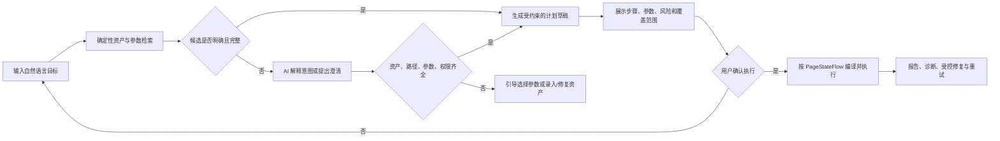

# 自由组合：对话式资产编排测试需求

## 1. 背景与目标

平台已有页面资产、页面能力、连接边、页面任务、元功能、组合用例和参数数据。它们能表达测试，但用户仍需要先理解资产结构，再手工编排执行计划。为降低这个门槛，新增独立入口 **自由组合**：用户用自然语言描述想验证的业务目标，系统将其编译为一个只引用现有资产的可执行测试计划。

示例：

```text
测试登录流程，循环 50 次。
使用教师账号 A，进入班级四十二号，创建课堂但不发布。
切换到账号 B 后，验证该账号看不到班级四十二号。
```

自由组合不是另一套录制或坐标执行器。它必须复用 PageStateFlow 资产模型和现有运行时：页面匹配、元素重定位、页面能力、连接边、PageTask、参数绑定、风险控制、AI 诊断和执行报告。任何计划都不得绕过资产规则直接向设备发送未经验证的坐标动作。

目标是让用户可以从业务语言开始，稳定地执行、循环、观察和修复基于资产的移动端测试；当资产或数据不完整时，系统应明确说明缺口并通过对话引导补齐。

## 2. 核心原则

1. **资产优先**：自由组合只编排已确认资产；运行时仍由语义/视觉/结构重定位决定点击点，禁止恢复 `region_center` 直接点击兜底。
2. **先确定性检索，后 AI 解释**：先按应用、名称、别名、标签、参数和页面关系检索候选资产；候选不唯一、意图复杂或缺口需要解释时，再调用 AI 生成受约束的结构化计划。
3. **计划可审阅、可追溯**：每条自然语言请求必须保留原始输入、解析结果、所用资产版本、参数选择、风险确认、编译结果和执行报告。
4. **缺口显式化**：没有页面资产、无可达路径、缺少必填参数、权限不满足或风险策略拒绝时，不生成“假成功”计划；应指出具体缺口和下一步操作。
5. **AI 受规则约束**：AI 可理解意图、解释失败、建议或自动修复符合规则的资产；不能直接控制设备，不能绕过资产质量门、风险门或应用范围隔离。
6. **通用于任意应用**：所有资产、自由组合会话、参数、元功能、组合用例和报告均必须带 `appPackage` / 被测应用标识，不以 ClassIn 页面名称或字段为前提。

## 3. 领域模型与边界

| 概念 | 定义 | 在自由组合中的职责 |
|---|---|---|
| 页面资产（PageModel） | 一个可识别的稳定页面状态及其页面锚点 | 确认起点、路径节点和目标页面 |
| 页面能力（PageElement / PageAbility） | 页面上的最小可执行动作，如点击、输入、勾选、滚动查找 | 自由组合可以直接引用的原子动作 |
| 连接边（PageTransition） | 由某个页面能力触发并被目标状态验证的转移 | 建立跨页面路径；由能力生成，不单独录制为无来源动作 |
| 页面任务（PageTask） | 页面内多步业务填写、检查或状态变更 | 表达“填写新建课堂表单”等复合页内工作 |
| 元功能（Meta Function） | 可复用的、有业务含义的资产步骤编排 | 优先复用，例如“账号密码登录”“创建课堂但不发布” |
| 组合用例（Composite Case） | 多个元功能的端到端测试定义 | 可被自由组合直接引用或保存为新用例 |
| 参数域（Parameter Domain） | 按业务场景归类的参数定义，如登录、班级目标、新建课堂 | 告知计划需要哪些字段及字段来源 |
| 数据记录（Data Record） | 某一参数域的一套具体值，如教师账号 A、课堂方案 B | 在执行前选取，多个记录可组合为一次运行数据 |
| 自由组合会话 | 用户、应用和对话上下文的记录 | 保存需求澄清、候选、确认和临时计划 |
| 临时计划 | 尚未保存为元功能或组合用例的已编译计划 | 可立即执行，也可一键沉淀为可复用资产用例 |

“原子能力”不是目标页面测试新增的数据，而是页面资产录入中已有的页面能力。自由组合只是在更上层按业务目标选择和组合它们。

## 4. 用户流程



### REQ-FC-001：独立入口与对话界面

平台必须新增“自由组合”入口。入口默认展示一个面向当前应用的对话框、最近会话、当前参数组合和最近计划摘要。

验收要点：

- 用户可以输入自然语言目标、次数、循环、期望状态和可选风险意图。
- 会话必须绑定目标应用；切换目标包后不得复用另一应用的页面资产或参数域。
- 系统消息必须区分“已理解”“需要选择”“缺少资产”“风险确认”“可以执行”“执行中”和“执行完成/暂停”。
- 对话不应暴露底层 locator 或内部节点 ID；需要调试时可进入高级详情查看资产引用。

### REQ-FC-002：受约束的意图解析与资产检索

系统必须把自然语言解析为受限计划 DSL，而不是由 AI 直接生成设备命令。解析结果至少包含：测试目标、目标应用、候选元功能/组合用例/页面能力、输入参数需求、执行次数、停止策略、风险意图和验证目标。

AI 可以作为编排助手，通过 MCP 调用系统提供的“资产候选检索”工具理解用户意图；它不直接读取数据库，更不能一次取得应用的全量资产。系统必须先按 `appPackage`、当前页面上下文、用户表达和允许范围检索并返回有限的脱敏候选摘要；AI 仅在需要时再读取单个候选的详细信息。这样既能利用 AI 处理同义词、歧义和跨功能组合，又不会把资产范围和执行权限交给模型。

候选优先级必须如下：

1. 完全匹配的、已启用的组合用例。
2. 可组合的已启用元功能。
3. 已确认页面资产上的页面能力、连接边和 PageTask 直接编译为临时计划。
4. 明确指出缺失页面资产、能力、连接边或任务，进入对话补齐流程。

验收要点：

- “登录流程”优先匹配“账号密码登录”元功能；不能匹配时才展开为登录页的页面能力和转移。
- 同名候选或不同业务语义的相似候选必须让用户确认，不能擅自选择。
- 用户说“建课页”时，候选检索应返回“新建课堂”和“新建公开课”等相关资产；若两者的参数或后续流程不同，AI 必须发起澄清，不能按名称相似度自行选择。
- 计划只能引用 active 且质量校验通过的资产；deprecated、disabled 或缺少来源能力的连接边不得进入计划。
- 解析与编译结果必须记录所引用资产的版本，保证可复现和可审计。
- AI 只能引用 MCP 已返回的候选 ID，或要求补充信息；不得编造页面、能力、连接边、参数字段、定位策略或点击坐标。

### REQ-FC-003：缺口对话与资产录入引导

当意图无法被现有资产完整表达时，系统必须说明缺的是哪一类资产，而不是用坐标或猜测动作补齐。

缺口类型至少包括：页面未录入、页面能力未录入、连接边不可达、PageTask 缺失、页面验证缺失、参数缺失、数据记录不满足、权限不满足、风险动作未确认。

验收要点：

- 缺页面或能力时，提供跳转到对应“资产录制”页面的上下文入口，并带入当前应用、截图和缺口描述。
- 缺参数时，在对话内请求用户选择数据记录或补充字段，而不是在每次执行页重复填写散落的 key/value。
- 用户完成录入、修复或保存参数后，可回到同一会话重新编译；原始需求不丢失。

### REQ-FC-004：计划预览与显式确认

任何计划在执行前必须展示可读预览。预览应使用业务名称表达步骤，同时保留展开的资产来源。

预览至少包含：

- 起点策略与首个可确认页面。
- 元功能、页面任务、页面能力和连接边的顺序。
- 每个动态参数的参数域、数据记录和实际值来源；敏感值默认脱敏。
- 单次、N 次、循环或定时策略，以及本轮/批次停止条件。
- 预计会变更的数据、页面状态和风险动作。
- 资产缺口、弱匹配、低置信元素或需要人工确认的警告。

用户可选择“立即执行”“保存为元功能草稿”“保存为组合用例草稿”或返回继续澄清。仅完成资产编译和风险确认的计划允许执行。

### REQ-FC-005：参数域、数据记录与运行数据组合

自由组合不得在执行面板维护独立参数真相源，必须复用参数中心的数据模型。

参数应按业务场景/页面簇定义参数域，而不是按单个临时用例分散保存。例如：

- 登录：账号、密码、身份/权限预期。
- 班级目标：班级名称、班级 ID、成员预期。
- 新建课堂：课堂名称、开始时间、时长、录制/功能开关等。

一次执行可从多个参数域选择兼容的数据记录，组成运行数据组合。例如“教师账号 A + 班级四十二号 + 课堂方案 B”。同名字段必须有明确的优先级和冲突提示。

验收要点：

- 对话可识别请求所需参数域，并推荐最近使用或默认的数据记录。
- 必填参数缺失时阻止执行；可选参数使用资产定义的默认值或显式“不设置”。
- 账号、密码、令牌等敏感字段在 UI、日志、报告和 AI 证据中按密级脱敏；原值不得回显。

### REQ-FC-006：循环执行与失败策略

自由组合支持单次、N 次、持续循环和后续调度策略。首次版本对“循环 50 次”采用如下默认策略：

| 失败分类 | 默认行为 |
|---|---|
| 资产/定位问题 | 采集证据，按资产修复规则调用 AI 诊断；若修复通过质量门，重试当前步骤/当前轮，最多 2 次 |
| 应用业务、崩溃、权限、环境问题 | 固化证据和报告，标记当前轮失败，继续后续轮次 |
| 同一分类失败连续 3 轮 | 暂停整个批次，等待人工处理或显式继续 |
| 用户主动停止 | 停止本批次后续轮次，保留当前步骤和已完成结果 |

循环状态必须能在刷新页面或重新进入执行结果后恢复，展示当前轮次、完成数、失败数、自动修复次数、暂停原因和下一步。

### REQ-FC-007：风险操作与发布确认

风险控制基于动作语义和实际影响，而非仅靠关键词。对删除、支付、退出登录、发布、提交、发送消息等动作，计划预览必须标明影响。

用户的明确业务意图可以授权风险操作。例如用户说“发布课堂”或在预览中勾选“允许发布”，系统应允许纳入计划；但在首次实际执行前必须展示二次确认：将执行的发布动作、目标应用/账号、可能产生的数据和是否可清理。

验收要点：

- “创建课堂但不发布”默认排除发布/提交边。
- “发布课堂”可执行，不应被危险词全局禁止；必须留存确认记录。
- 无法判断影响范围的动作应要求人工确认，不得由 AI 自动授权。

### REQ-FC-008：执行与验证

自由组合计划必须复用现有资产运行时：页面匹配、重定位、动作执行、目标页验证、状态等待、恢复策略、性能采样和异常采集。

执行过程中，每一个页面能力和连接边必须验证其自身预期；不能只因点击命令成功就判定业务成功。页面内同状态 Tab 切换应使用已定义的 Tab 恢复策略，不能用 Android back 误退出应用。

### REQ-FC-009：AI 诊断、自动修复与重试

AI 仅在解析歧义、用户主动请求或执行异常时介入。运行异常时，AI 可访问受控证据、当前设备观察和资产查询 MCP；它可在高置信情况下提出或执行资产 patch，但必须通过现有 schema、质量、dry-run、风险和回滚校验。

自动修复范围至少覆盖：

1. 页面匹配失败。
2. 元素语义/视觉/结构定位失败。
3. 连接边目标页验证失败。

自动修复成功后系统必须重试失败步骤，并将修复前后资产 diff、验证结论、重试结果写入报告。规则无法表达时，应记录为“规则缺口”，不得用坐标兜底伪造修复。

### REQ-FC-010：结果、报告和沉淀

每次自由组合执行都必须产出批次报告，至少展示：原始自然语言、解析计划、确认记录、参数组合（脱敏）、资产版本、每轮结果、失败分类、AI 诊断/修复、性能指标和证据链接。

临时计划成功后，用户可以将其保存为元功能或组合用例草稿。保存时只持久化资产引用和业务编排，不复制 locator、坐标或当次设备截图。

### REQ-FC-011：AI/MCP 工具边界

面板可执行的安全能力应以 MCP 方式对 AI 提供同等受控入口，包括：查询应用资产、查询参数域和脱敏数据记录、预检计划、编译临时计划、启动/停止批次、查询设备观察、查询报告、创建/验证/应用/回滚资产 patch。

其中资产查询必须拆成受控的候选检索和按需详情读取：`search_asset_candidates` 用于按应用和意图返回有限候选，`get_asset_detail` 用于读取已选候选的详情，`search_parameter_records` 用于查询可用的脱敏参数记录，`compile_free_plan` 和 `validate_free_plan` 用于由系统生成并校验计划。AI 负责解释意图、调用这些工具、排序候选和提出澄清问题；系统负责资产真相、候选范围、规则校验、风险门、计划编译、设备执行和审计。

MCP 必须遵守应用隔离、权限、风险确认、参数脱敏和审计要求。AI 不能使用未公开的驱动命令直接操作设备，也不能绕过候选检索直接获取全量资产或写入未验证的资产变更。

## 5. 首版交互与技术建议

首版建议采用“AI 经 MCP 的检索增强受限规划”，而不是让大模型端到端规划：

1. AI 解析用户表达，确定应用和初始意图，并调用 `search_asset_candidates`。
2. MCP 服务按应用隔离、上下文和权限检索元功能、组合用例、页面名称、别名、PageTask、参数域和边关系，只返回有限候选摘要。
3. AI 基于候选集排序、组合或发起澄清；需要细节时调用 `get_asset_detail`，随后调用 `compile_free_plan` 生成严格 JSON 计划 DSL。
4. 服务端重新校验所有引用、路径、参数、风险和资产质量，再生成预览。
5. 用户确认后，由现有资产编译器和执行器执行。

名称精确、无歧义的常见请求可以走本地规则快速匹配，跳过模型调用；复杂表达、同义词、跨功能组合和缺口解释才交给 AI。无论走哪条路径，系统都必须避免模型“编造页面”或直接给出点击坐标。

这样简单请求可低延迟地走规则匹配；复杂表达、同义词、跨功能组合和缺口解释才使用 AI，同时避免模型“编造页面”或直接给出点击坐标。

首版范围包括：对话输入、资产检索、已有元功能/组合用例复用、临时资产编排、参数中心选择、计划预览、一次/N 次循环、风险二次确认、报告和资产修复回接。

不在首版一次性完成：跨应用联合流程、多人协作审批、CI 定时编排界面、自动清理所有业务数据、复杂角色授权体系。这些能力保留在后续阶段，但数据模型和审计字段需预留。

## 6. 交付策略：先完成闭环，再迭代模型

### 6.1 MVP 目标与边界

自由组合首版必须先交付一个真实可运行的垂直闭环：

```text
用户自然语言 -> 受控资产检索 -> 计划编译与校验 -> 用户确认 -> 真实设备执行 -> 报告与失败反哺
```

首版不以"统一领域模型完成"为前置条件。它直接复用既有的 `PageModel`、`PageElement`、`PageTransition`、`PageTask`、元功能、组合用例、参数域和数据记录；仅新增薄的编排对象（临时计划、会话和执行引用），不得复制 locator、截图或低层驱动动作。

首版必须做到：

1. 能将已支持的简单表达编译为已有元功能、组合用例，或由已确认页面能力/连接边/PageTask 组成的临时计划。
2. 能在歧义、缺资产、缺参数、风险操作四种情况停下来向用户澄清，而不是猜测或伪造步骤。
3. 能选择参数中心的数据记录，预览真实页面路径、参数、影响和循环策略，并在确认后调用现有执行器。
4. 能对每次执行保存计划快照、实际资产版本、参数记录引用、步骤结果和失败证据；资产修复仍由现有质量门和风险门控制。
5. 能从真实失败中沉淀可处理的反馈，不因某一个案例就临时扩展领域模型或增加坐标兜底。

首版明确不做：通用聊天代理直接控制设备、绕过 `compile_free_plan` 的任意步骤、自动发明页面/元素/参数、跨应用流程、复杂调度编排、自动数据回收和多人审批。用户请求不在资产能力范围内时，正确结果是解释缺口并引导录制，而不是尽力点击。

### 6.2 编译与执行的硬性门禁

无论计划来自本地规则还是 AI，服务端在预览和实际执行前都必须拒绝以下内容：

- 引用不存在、未确认、已废弃或不属于目标应用的资产。
- 没有来源 `PageElement` 的连接边，或目标页不可验证的跳转。
- 必填参数没有绑定到已选数据记录，或参数类型/作用域不匹配。
- 未经确认的危险动作；用户明确选择发布时仍必须在首次实际发布前二次确认。
- 模型直接给出的坐标点击、原始驱动命令或未经过质量门的 locator。
- 无法从当前页面或可验证恢复路径到达的计划步骤。

计划验证失败应返回结构化原因和下一步选项，例如选择候选页面、补充数据记录、录制缺失能力或调整风险授权；不得把验证失败伪装成可执行计划。

### 6.3 分阶段实现顺序

| 阶段 | 交付目标 | 必须完成 | 阶段退出条件 |
| --- | --- | --- | --- |
| FC-M0：计划契约 | 建立受约束编排边界 | 定义 `FreePlan`/会话/执行引用；复用现有计划编译与校验；支持 dry-run | 任意临时计划均可被确定性校验，并能说明引用了哪些资产和参数 |
| FC-M1：规则优先闭环 | 不调用 AI 也能跑常见流程 | 自然语言中的名称精确匹配；元功能/组合用例优先复用；临时计划预览、确认、单次执行 | "登录一次"、"进入指定班级"等已录入能力可以从输入到真实报告完整跑通 |
| FC-M2：受控 AI 理解与澄清 | 处理同义词、组合表达和歧义 | AI 仅通过候选检索 MCP 读取有限摘要；候选排序、澄清问答和缺口说明 | "建课页"等歧义表达必定要求选择候选，AI 不可直接编造资产 |
| FC-M3：数据与风险闭环 | 让计划可在真实测试数据下执行 | 参数中心的数据记录选择、缺参追问、影响预览、发布二次确认 | 同一计划切换不同账号/课堂数据后，资产路径不变而运行值和审计记录正确变化 |
| FC-M4：循环、失败与修复 | 支持稳定回归测试 | N 次循环、失败分类、AI 受控修复后重试、暂停/继续和报告汇总 | 资产问题通过质量门后可重试当前步骤；应用/环境问题保留证据并遵循批次策略 |
| FC-M5：由运行反馈演进 | 用真实问题决定下一项建模工作 | 统计未理解表达、候选冲突、缺资产、缺参数、修复失败和恢复失败 | 每个新增抽象都有可复现的运行证据与验收用例，而非为预期场景预建大模型 |

FC-M1 至 FC-M4 可以连续迭代，但每个阶段都必须保持前一阶段可运行，不做只能在最终大版本一起验收的大型重构。

### 6.4 反馈驱动的模型演进

自由组合运行时应把以下信息以结构化事件写入报告和待办：未识别意图、候选歧义、资产缺口、参数缺口、计划校验失败、目标页验证失败、定位失败、恢复失败和 AI patch 校验失败。产品和研发据此决定下一步是补资产别名、补参数域、补定位策略、补恢复规则，还是扩展计划 DSL。

新增领域抽象前必须满足两个条件：同类问题在不同流程中重复出现，且无法只通过补资产、补别名或补参数域解决。这样既避免为单个 ClassIn 页面写死逻辑，也避免在尚无真实证据时设计一个永远做不完的通用模型。

## 7. 验收场景

### AC-FC-001：登录循环

用户输入“测试登录流程，循环 50 次”。系统识别登录元功能，要求选择登录数据记录，展示 50 轮与默认失败策略；确认后执行。发生一次应用异常时，该轮失败并继续；同一异常连续 3 轮时暂停批次。

### AC-FC-002：资产直接临时组合

用户输入“从主页进入班级四十二号，再进入聊天”。系统找不到完整元功能，但能找到主页列表项、班级详情和聊天连接边；生成临时计划，允许立即执行或保存为“进入指定班级聊天”元功能草稿。

### AC-FC-003：缺资产

用户输入“进入班级后发起投票”，但班级详情没有“发起投票”能力或连接边。系统说明缺口，跳转资产录制时带入班级详情上下文；用户保存并通过质量门后返回会话继续编译。

### AC-FC-004：参数缺失

用户输入“创建课堂但不发布”，选择的数据记录没有开始时间。系统只询问“新建课堂”参数域中的开始时间或让用户选择另一套课堂方案，补齐后再允许执行。

### AC-FC-005：明确发布

用户输入“创建并发布课堂”。计划预览明确显示发布的账号、课堂名称和影响；用户二次确认后才执行发布边，报告保存确认记录。

### AC-FC-006：资产自动修复

运行中元素无法重定位。系统采集证据并调用 AI；AI 生成的 locator patch 通过资产质量、dry-run 和风险验证后自动应用，重试当前步骤并在报告展示修复 diff。若不通过，当前轮失败且报告标记规则缺口或资产问题。

## 8. 非阻塞开放项

1. 多用户角色、审批和审计的授权模型。
2. 账号密码、令牌等敏感运行数据的加密、轮换和外部密钥管理方案。
3. 发布类数据的自动清理、回收与脏数据对账策略。
4. 长周期循环、定时任务、CI 触发的并发配额、设备池和通知策略。
5. AI 规划和诊断的成本、限流、模型降级与可观测性指标。

这些问题不阻塞自由组合首版：首版可先在单用户、单应用、人工确认风险操作的环境下运行。

## 9. 关联需求

- [资产驱动测试产品形态](asset-driven-testing-requirements.md)：页面资产、参数域/数据记录、元功能、组合用例、资产巡检和 AI/MCP 的基础需求。
